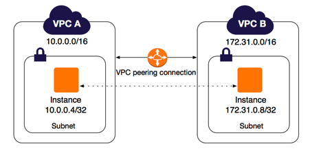
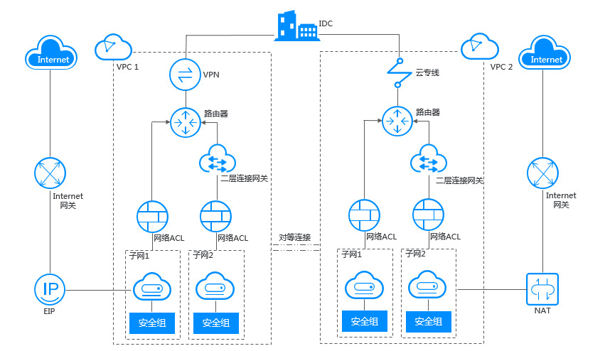

# VPC

以下参考华为云的VPC 产品架构：

**VPC组成部分**

每个虚拟私有云VPC由一个私网网段、路由表和至少一个子网组成。

私网网段：用户在创建虚拟私有云VPC时，需要指定虚拟私有云VPC使用的私网网段。当前虚拟私有云VPC支持的网段有10.0.0.0/8\~24、172.16.0.0/12\~24和192.168.0.0/16\~24。

子网：云资源（例如云服务器、云数据库等）必须部署在子网内。所以，虚拟私有云VPC创建完成后，您需要为虚拟私有云VPC划分一个或多个子网，子网网段必须在私网网段内。更多信息请参考子网。

路由表：在创建虚拟私有云VPC时，系统会自动生成默认路由表，默认路由表的作用是保证了同一个虚拟私有云VPC下的所有子网互通。当默认路由表中的路由策略无法满足应用（比如未绑定弹性公网IP的云服务器需要访问外网）时，您可以通过创建自定义路由表来解决。更多信息请参考VPC内自定义路由示例和VPC外自定义路由示例。

**安全**

安全组与网络ACL（Access Control List）用于保障虚拟私有云VPC内部署的云资源的安全。安全组类似于虚拟[防火墙](https://www.huaweicloud.com/product/waf.html "防火墙")，为同一个VPC内具有相同安全保护需求并相互信任的云资源提供访问策略，更多信息请参考安全组简介；您可以为具有相同网络流量控制的子网关联同一个网络ACL，通过设置出方向和入方向规则，对进出子网的流量进行精确控制，更多信息请参考网络ACL简介。

**VPC连接**

华为云提供了多种VPC连接方案，以满足用户不同场景下的诉求。具体应用场景及连接方案请参见应用场景。

通过VPC对等连接功能，实现同一区域内不同VPC下的私网IP互通。

通过EIP或NAT网关，使得VPC内的云服务器可以与公网Internet互通。

通过虚拟专用网络VPN、云连接或者云专线将VPC和您的数据中心连通。

## 参考

*   [https://www.huaweicloud.com/zhishi/1584598122547.html](https://www.huaweicloud.com/zhishi/1584598122547.html "https://www.huaweicloud.com/zhishi/1584598122547.html")
