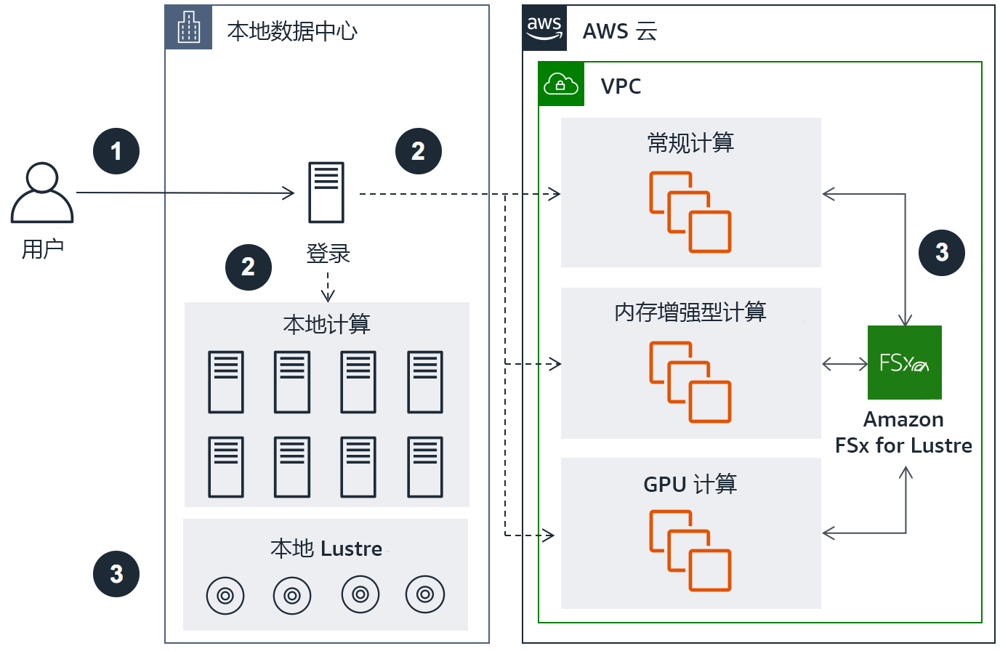
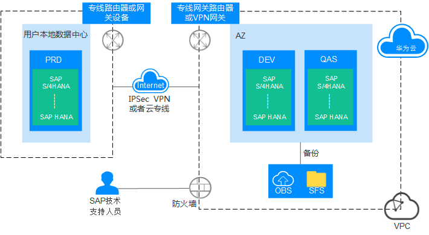

# 混合部署

## 参考架构

下图为将不同环境隔离开，本地是生产环境，公有云是其他环境

## 参考

*   [https://docs.aws.amazon.com/zh\_cn/wellarchitected/latest/high-performance-computing-lens/hybrid-deployment.html](https://docs.aws.amazon.com/zh_cn/wellarchitected/latest/high-performance-computing-lens/hybrid-deployment.html "https://docs.aws.amazon.com/zh_cn/wellarchitected/latest/high-performance-computing-lens/hybrid-deployment.html")
