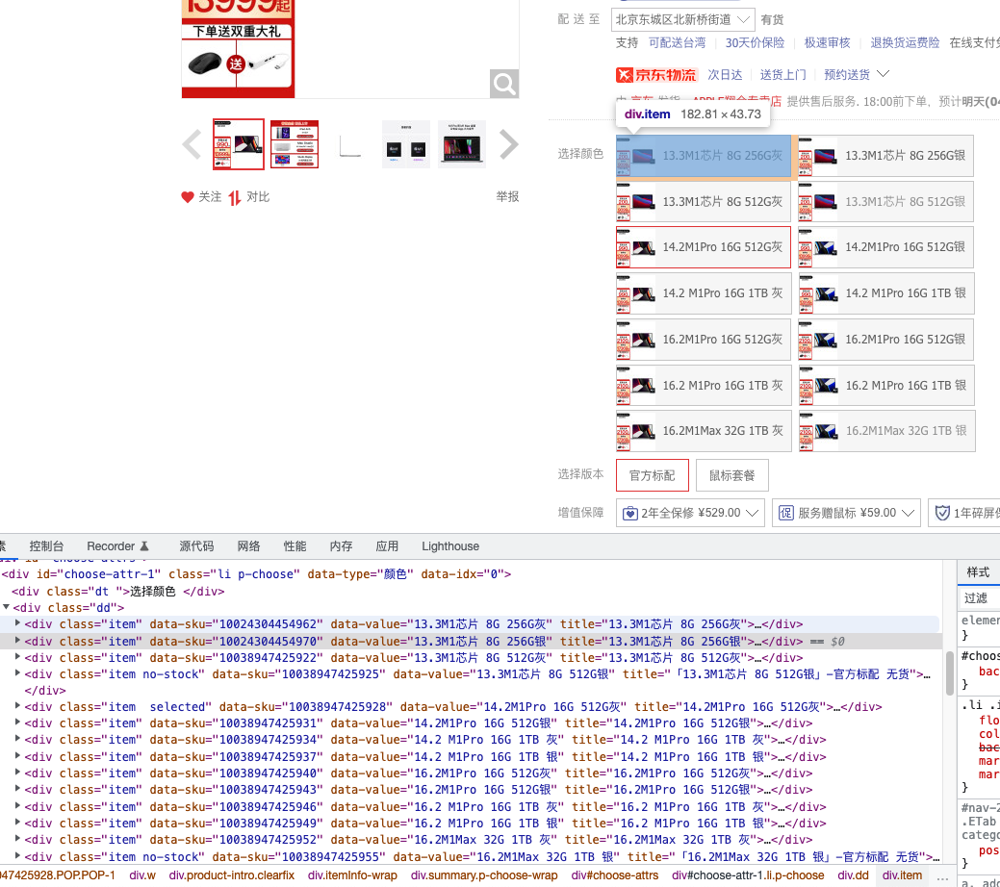
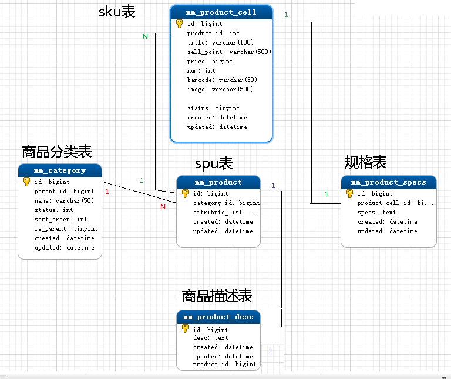

# 电商黑话

## SPU

先说一下类目：类目是一个树状结构的系统，大体上可以分成4-5级。如手机->智能手机->苹果手机类目，在这里面，手机是一级类目，苹果手机是三级类目，也是叶子类目。

SPU = Standard Product Unit （标准化产品单元）,SPU是商品信息聚合的最小单位，是一组可复用、易检索的标准化信息的**集合**，该集合描述了一个产品的**基本特性**。因此在电商类产品库建立时，通常会根据SPU来建立。

我们拿京东举例，搜一款产品，比如 `macbook pro 16寸M1芯片`：

京东的`spu` 应该是和商家绑定的，也就是每一个商家有自己一套`spu`，可以通过上图看到，相同的产品，不同商家的`spu` 不一样。

### SPU 属性

不会影响到库存和价格的属性, 又叫关键属性

## SKU

SKU=stock keeping unit(库存量单位) SKU即库存进出计量的单位（买家购买、商家进货、供应商备货、工厂生产都是依据SKU进行的）。

SKU是**物理上不可分割的最小存货单元。也就是说一款商品，可以**根据SKU来确定具体的货物存量。

同样以京东举例，还是搜索  `macbook pro 16寸M1芯片` 进入到商品详情，可以看到不同颜色、内存等属于不同的 `sku`

**从广义上讲，类目>SPU>SKU**

对于同一个商品spu，多个sku的相同属性仅在数据表中存一条记录，这就是spu表，各个sku的不同属性均在数据表中存一条记录，这就是sku表。

### SKU的组合

*   如一件M码（四个尺码：S码、M码、L码、X码）的粉色（三种颜色：粉色、黄色、黑色）Zara女士风衣，其中M码、粉色就是一组SKU的组合。SKU在生成时, 会根据属性生成相应的笛卡尔积，根据一组SKU可以确定商品的库存情况，那么上面的Zara女士风衣一共有4 \* 3 = 12个SKU组合。

*   M码+粉色这两个属性组合被称为一组SKU、因为SKU是物理上不可分割的最小存货单元，单凭尺寸或者颜色是没有办法确认这款商品的库存情况。

*   同理商家进货补货也是通过SKU来完成的，试问淘宝店家跟供货商说我要100件红色女士风衣？供应商知道该怎么给他备货吗？显然是不知道的。因为还欠缺了另外的一个销售属性【尺码】。

### SKU 属性

会影响到库存和价格的属性, 又叫销售属性

### 单品&#x20;

国人对于SKU的另外一种叫法。

### SKU和商品之间的关系

*   SKU（或称商品SKU）指的是商品子实体。

*   商品SPU和商品SKU是包含关系，一个商品SPU包含若干个商品SKU子实体，商品SKU从属于商品SPU。

*   SKU不是编码，每个SKU包含一个唯一编码，即SKU Code，用于管理。

*   商品本身也有一个编码，即Product Code，但不作为直接库存管理使用

## 参考&#x20;

*   [https://blog.51cto.com/u\_15287666/3021182](https://blog.51cto.com/u_15287666/3021182 "https://blog.51cto.com/u_15287666/3021182")

*   [https://www.cnblogs.com/lingyejun/p/9569563.html](https://www.cnblogs.com/lingyejun/p/9569563.html "https://www.cnblogs.com/lingyejun/p/9569563.html")

*   [http://www.woshipm.com/pd/4625140.html](http://www.woshipm.com/pd/4625140.html "http://www.woshipm.com/pd/4625140.html")

*   [https://segmentfault.com/a/1190000040855949](https://segmentfault.com/a/1190000040855949 "https://segmentfault.com/a/1190000040855949")
