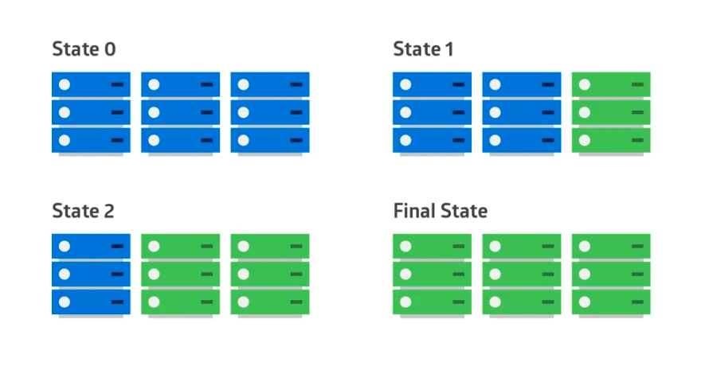
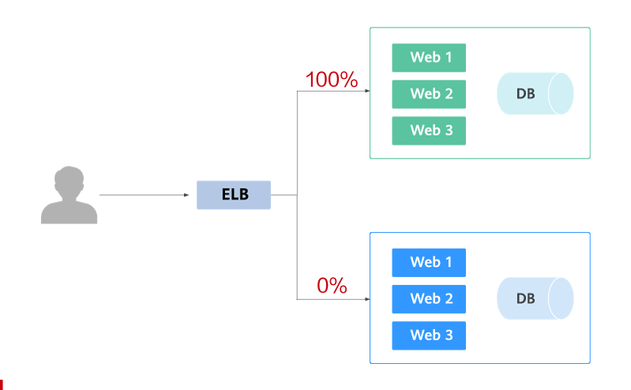
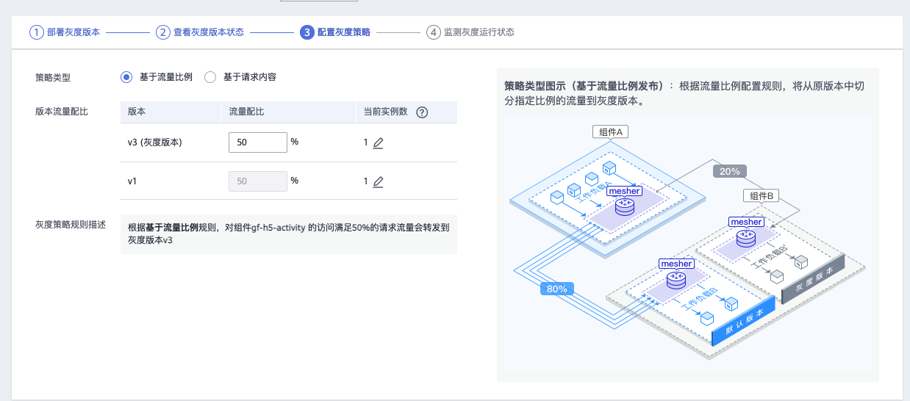
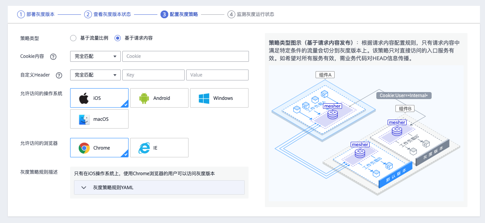
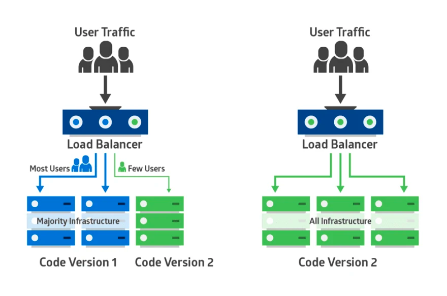
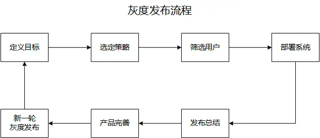

# 发布策略

## 滚动部署

在滚动部署中，应用的新版本逐步替换旧版本。实际的部署发生在一段时间内。在此期间，新旧版本会共存，而不会影响功能和用户体验。这个过程可以更轻易的回滚和旧组件不兼容的任何新组件。

下图显示了该部署模式：旧版本显示为蓝色，新版本显示为绿色，它们部署在集群中的每一台服务器上。



应用程序套件升级是一个滚动部署的典型例子。如果原始应用部署在容器中，升级可以一次处理一个容器。修改每个容器从应用供应商的站点上下载最新的镜像。如果其中的一个应用存在兼容性问题，旧的镜像可以重新创建这个容器。在这种情况下，套件的新旧版本应用可以共存，直到每个应用都更新完毕。

**但是滚动升级有一个问题，在开始滚动升级后，流量会直接流向已经启动起来的新版本，但是这个时候，新版本是不一定可用的，比如需要进一步的测试才能确认。那么在滚动升级期间，整个系统就处于非常不稳定的状态，如果发现了问题，也比较难以确定是新版本还是老版本造成的问题。**

**为了解决这个问题，我们需要为滚动升级实现流量控制能力。**

## 蓝绿发布

蓝绿发布提供了一种零宕机的部署方式。不停老版本，部署新版本进行测试，确认OK，将流量切到新版本，然后老版本同时也升级到新版本。始终有两个版本同时在线，有问题可以快速切换。

**蓝绿发布的特点：**

在部署应用的过程中，应用始终在线。并且新版本上线过程中，不会修改老版本的任何内容，在部署期间老版本状态不受影响。只要老版本的资源不被删除，可以在任何时间回滚到老版本。

以下示意图可描述灰度发布的大致流程：先切分20%的流量到新版本，若表现正常，逐步增加流量占比，继续测试新版本表现。若新版本一直很稳定，那么将所有流量都切分到新版本，并下线老版本。


_txQnH2GbRK.gif)

切分20%的流量到新版本后，新版本出现异常，则快速将流量切回老版本。



**蓝绿部署要求在升级过程中，同时运行两套程序，对硬件的要求就是日常所需的二倍，比如日常运行时，需要10台服务器支撑业务，那么使用蓝绿部署，你就需要购置二十台服务器。**

### 为什么还需要蓝绿

有了灰度发布之后，为什么还需要蓝绿发布呢？主要有如下几点考虑：

*   应用在生产环境全量发布后，发现故障时回滚时间慢。当线上核心应用存在几十上百的服务实例时，应用实例分批滚动回滚，部分业务应用启动时间需要几分钟，导致整个回滚过程的时间可能超过十分钟，甚至几十分钟。

*   灰度发布期间能发现的问题有限。如数据库慢查问题、死锁问题等，10%流量很难发现，可能只会在100%流量中才容易暴露。

*   灰度发布成功后，仍然需要进行全量发布，在此过程中仍有较多不确定性，如因一些未预料的异常导致发布失败等。

对于上面几个问题，使用蓝绿发布系统都可以较好地解决：

*   蓝绿发布期间，流量全部切至新集群时，原稳定集群继续保持在线，若新集群有问题，可通过流量控制秒级切回至原稳定集群，没有应用启动以及其他等待时间。

*   蓝绿发布期间，新集群规模与原稳定集群规模一致，即使是瞬时大流量也没有问题。

*   蓝绿发布期间，新集群承载全站流量，容易验证各种场景，如数据库死锁等并发问题。

*   蓝绿发布新集群验证完成后，已经处于正常服务状态，不会再引入不确定性的变更操作。

## 金丝雀发布（canary）

在生产环境上引一部分实际流量对一个新版本进行测试，测试新版本的性能和表现，在保证系统整体稳定运行的前提下，尽早发现新版本在实际环境上的问题。

> 为什么叫金丝雀发布呢，是因为金丝雀对矿场中的毒气比较敏感，所以在矿场开工前工人们会放一只金丝雀进去，以验证矿场是否存在毒气，这便是金丝雀发布名称的由来。

**金丝雀发布的特点：**

通过在线上运行的服务中，新加入少量的新版本的服务，然后从这少量的新版本中快速获得反馈，根据反馈决定最后的交付形态。

下图为华为云的金丝雀发布界面：





步骤一：将流量从待部署节点移出，更新该节点服务到待发布状态，将该节点称为金丝雀节点；

步骤二：根据不同策略，将流量引入金丝雀节点。策略可以根据情况指定，比如随机样本策略（随机引入）、狗粮策略（就是内部用户或员工先尝鲜）、分区策略（不同区域用户使用不同版本）、用户特征策略（这种比较复杂，需要根据用户个人资料和特征进行分流，类似于千人千面）；

步骤三：金丝雀节点验证通过后，选取更多的节点称为金丝雀节点，重复步骤一和步骤二，直到所有节点全部更新

金丝雀部署和蓝绿有点像，但是它更加规避风险。你可以阶段性的进行，而不用一次性从蓝色版本切换到绿色版本。

采用金丝雀部署，你可以在生产环境的基础设施中小范围的部署新的应用代码。一旦应用签署发布，只有少数用户被路由到它。最大限度的降低影响。如果没有错误发生，新版本可以逐渐推广到整个基础设施。下图示范了金丝雀部署：



### 金丝雀和蓝绿的对比

| 名称    | 特点                                        | 优势                                      | 劣势                                            |
| ----- | ----------------------------------------- | --------------------------------------- | --------------------------------------------- |
| 蓝绿部署  | 同时存在两个集群，两个集群中只有一个集群真正提供服务，另外一个集群测试、验证或待命 | 服务文档，版本回退简单，适用于各种场景的升级，大版本不兼容升级的或迭代兼容升级 | 浪费硬件资源，需要同时有两个集群，如果集群比较大，比如有1000个节点，这种方式几乎不可用 |
| 金丝雀部署 | 逐点部署，逐步替换线上服务                             | 小步快跑，快速迭代                               | 只能适用于兼容迭代的方式，如果是大版本不兼容的场景，就没办法使用这种方式了         |

## 灰度发布

灰度发布是迭代的软件产品在生产环境安全上线的一种重要手段。

灰度发布，也叫金丝雀发布。是指在黑与白之间，能够平滑过渡的一种发布方式。AB test就是一种灰度发布方式，让一部分用户继续用A，一部分用户开始用B，如果用户对B没有什么反对意见，那么逐步扩大范围，把所有用户都迁移到B上面来。灰度发布可以保证整体系统的稳定，在初始灰度的时候就可以发现、调整问题，以保证其影响度，而我们平常所说的金丝雀部署也就是灰度发布的一种方式。



## A/B Test

**A/B测试和蓝绿发布、滚动发布以及金丝雀发布，完全是两回事。**

蓝绿发布、滚动发布和金丝雀是发布策略，目标是确保新上线的系统稳定，关注的是新系统的BUG、隐患。

A/B测试是效果测试，同一时间有多个版本的服务对外服务，这些服务都是经过足够测试，达到了上线标准的服务，有差异但是没有新旧之分（它们上线时可能采用了蓝绿部署的方式）。

**A/B测试关注的是不同版本的服务的实际效果，譬如说转化率、订单情况等。**

A/B测试时，线上同时运行多个版本的服务，这些服务通常会有一些体验上的差异，譬如说页面样式、颜色、操作流程不同。相关人员通过分析各个版本服务的实际效果，选出效果最好的版本。


## 实现

### kubernetes

**官方的金丝雀发布方式**

[**https://kubernetes.io/zh/docs/concepts/cluster-administration/manage-deployment/#canary-deployments**](https://kubernetes.io/zh/docs/concepts/cluster-administration/manage-deployment/#canary-deployments "https://kubernetes.io/zh/docs/concepts/cluster-administration/manage-deployment/#canary-deployments")

**Deployment滚动更新策略实现金丝雀发布**

利用Deployment的滚动更新策略maxSurge和maxUnavailable设置最大可超期望的节点数和最大不可用节点数可实现简单的金丝雀发布。

`rollingUpdate.maxSurge`最大可超期望的节点数，百分比 10% 或者绝对数值 5

`rollingUpdate.maxUnavailable`最大不可用节点数，百分比或者绝对数值

```yaml
apiVersion: extensions/v1beta1
kind: Deployment
metadata:
    name: demo-deployment
    namespace: default
spec:
  replicas: 10
  selector:
    matchLabels:
      name: hello-deployment
  strategy:
    type: RollingUpdate
    rollingUpdate:
      maxSurge: 10%
      maxUnavailable: 0     
  template:
    metadata:
      labels:
        name: demo-deployment
    spec:
      containers:
      - name: webserver
        image: nginx:1.14
        ports:
        - containerPort:80
 
```

**Ingress-Nginx配置Ingress Annotations实现金丝雀发布**

Ingress-Nginx 支持配置 Ingress Annotations 来实现不同场景下的金丝雀发布。Nginx Annotations 支持以下 4 种 Canary 规则：

*   `nginx.ingress.kubernetes.io/canary-by-header`：基于 Request Header 的流量切分，适用于灰度发布以及 A/B 测试。当 Request Header 设置为 always时，请求将会被一直发送到 Canary 版本；当 Request Header 设置为 never时，请求不会被发送到 Canary 入口；对于任何其他 Header 值，将忽略 Header，并通过优先级将请求与其他金丝雀规则进行优先级的比较。

*   `nginx.ingress.kubernetes.io/canary-by-header-value`：要匹配的 Request Header 的值，用于通知 Ingress 将请求路由到 Canary Ingress 中指定的服务。当 Request Header 设置为此值时，它将被路由到 Canary 入口。该规则允许用户自定义 Request Header 的值，必须与上一个 annotation (即：canary-by-header）一起使用。

*   `nginx.ingress.kubernetes.io/canary-weight`：基于服务权重的流量切分，**适用于蓝绿部署**，权重范围 0 - 100 按百分比将请求路由到 Canary Ingress 中指定的服务。权重为 0 意味着该金丝雀规则不会向 Canary 入口的服务发送任何请求。权重为 100 意味着所有请求都将被发送到 Canary 入口。

*   `nginx.ingress.kubernetes.io/canary-by-cookie`：基于 Cookie 的流量切分，适用于灰度发布与 A/B 测试。用于通知 Ingress 将请求路由到 Canary Ingress 中指定的服务的cookie。当 cookie 值设置为 always时，它将被路由到 Canary 入口；当 cookie 值设置为 never时，请求不会被发送到 Canary 入口；对于任何其他值，将忽略 cookie 并将请求与其他金丝雀规则进行优先级的比较。


`注意`：金丝雀规则按优先顺序进行如下排序：`canary-by-header` - > `canary-by-cookie` - > `canary-weight`很显然

`canary-weight`是一种随机策略。

`canary-by-cookie`和`canary-by-header-value`适合后端金丝雀发布实现

`canary-by-cookie`适合前端金丝雀发布实现。

```yaml
apiVersion: extensions/v1beta1
kind: Ingress
metadata:
  name: demo-canary
  annotations:    
    kubernetes.io/ingress.class: nginx
    nginx.ingress.kubernetes.io/canary: "true"
    nginx.ingress.kubernetes.io/canary-by-header: "canary"
    nginx.ingress.kubernetes.io/canary-by-cookie: "canary"
spec:
  rules:
  - host: demo-api.fulu.com
    http:
      paths:
      - backend:
          serviceName: demo-api-canary
          servicePort: 80

```

**具体流程**

*   如果是第一次发布，必须是正常版本。

*   如果发布金丝雀版本，则先检测是否有`-canary`后缀的ingress、service、deployment，如果有则替换金丝雀版本的镜像，如果没有则创建`-canary`后缀的ingress、service、deployment。

*   如果发布正常版本，则先检测是否有`-canary`后缀的ingress、service、deployment，如果有则先删除它们，再替换正常版本的镜像。 &#x20;

    

**蓝绿部署实现：**[**https://www.cnblogs.com/itzgr/p/14602827.html**](https://www.cnblogs.com/itzgr/p/14602827.html "https://www.cnblogs.com/itzgr/p/14602827.html")

**以上这些方式只是实现了一种非常简单的金丝雀发布流程，是没有办法做更精细，比如说按用户信息去灰度的规则的。对于同一个用户，也有可能一次请求到了金丝雀中，下一次请求又到了正式环境中。假如需要更加精细的灰度规则，可以考虑采用spring cloud, istio等工具**

### istio

**Kubernetes 中的金丝雀部署**

假设我们有一个已部署的 **helloworld** 服务 **v1** 版本，我们想要测试（或简单上线）新版本 **v2**。使用 Kubernetes，您可以通过简单地更新服务的 [Deployment](https://kubernetes.io/docs/concepts/workloads/controllers/deployment/ "Deployment") 中的镜像并自动进行部署来[上线](https://kubernetes.io/docs/concepts/workloads/controllers/deployment/#updating-a-deployment "上线")新版本的 **helloworld** 服务。如果我们特能够小心保证在启动并且在仅启动一个或两个 v2 副本[暂停](https://kubernetes.io/docs/concepts/workloads/controllers/deployment/#pausing-and-resuming-a-deployment "暂停")上线时有足够的 **v1** 副本运行，则能够保持金丝雀发布对系统的影响非常小。后续我们可以观察效果，或在必要时进行[回滚](https://kubernetes.io/docs/concepts/workloads/controllers/deployment/#rolling-back-a-deployment "回滚")。最好，我们也能够对 Deployment 设置 [HPA](https://kubernetes.io/docs/concepts/workloads/controllers/deployment/#scaling-a-deployment "HPA")，在上线过程中减少或增加副本以处理流量负载时，也能够保持副本比例一致。

尽管这种机制能够很好工作，但这种方式只适用于部署的经过适当测试的版本，也就是说，更多的是蓝/绿发布，又称红/黑发布，而不是 “蜻蜓点水“ 式的金丝雀部署。实际上，对于后者（例如，并没有完全准备好或者无意对外暴露的版本），Kubernetes 中的金丝雀部署将使用具有[公共 pod 标签](https://kubernetes.io/docs/concepts/cluster-administration/manage-deployment/#using-labels-effectively "公共 pod 标签")的两个 Deployment 来完成。在这种情况下，我们不能再使用自动缩放器，因为是有由两个独立的自动缩放器来进行控制，不同负载情况下，副本比例（百分比）可能与所需的比例不同。

无论我们使用一个或者两个部署，使用 Docker，Mesos/Marathon 或 Kubernetes 等容器编排平台进行的金丝雀发布管理都存在一个根本问题：使用实例扩容来管理流量；版本流量分发和副本部署在上述平台中并独立。所有 pod 副本，无论版本如何，在 `kube-proxy` 循环池中都被一视同仁地对待，因此管理特定版本接收的流量的唯一方法是控制副本比例。以小百分比维持金丝雀流量需要许多副本（例如，1％ 将需要至少 100 个副本）。即使我们可以忽略这个问题，部署方式功能仍然非常有限，因为它只支持简单（随机百分比）金丝雀部署。如果我们想根据某些特定规则将请求路由到金丝雀版本上，我们仍然需要另一种解决方案。

**使用 Istio，流量路由和副本部署是两个完全独立的功能。服务的 pod 数量可以根据流量负载灵活伸缩，与版本流量路由的控制完全正交。这在自动缩放的情况下能够更加简单地管理金丝雀版本。事实上，自动缩放管理器仍然独立运行，其在响应因流量路由导致的负载变化与其他原因导致负载变化的行为上没有区别。**

Istio 的[路由规则](https://istio.io/latest/zh/docs/concepts/traffic-management/#routing-rules "路由规则")也带来了其他的便利；你可以轻松实现细粒度控制流量百分比（例如，路由 1％ 的流量而不需要 100 个 pod），当然也可以使用其他规则来控制流量（例如，将特定用户的流量路由到金丝雀版本）。作为展示，让我们看一下采用这种方式部署 **helloworld** 服务的简单便捷。

首先我们定义 **helloworld** 服务，和普通 **Kubernetes** 服务一样，如下所示：

```yaml
apiVersion: v1
kind: Service
metadata:
name: helloworld
labels:
  app: helloworld
spec:
  selector:
    app: helloworld
  ...
 
```

然后我们添加 2 个 Deployment，分别为版本 **v1** 和 **v2**，这两个版本都包含服务选择标签 `app：helloworld`

```yaml
kind: Deployment
metadata:
  name: helloworld-v1
spec:
  replicas: 1
  template:
    metadata:
      labels:
        app: helloworld
        version: v1
    spec:
      containers:
      - image: helloworld-v1
        ...
---
apiVersion: extensions/v1beta1
kind: Deployment
metadata:
  name: helloworld-v2
spec:
  replicas: 1
  template:
    metadata:
      labels:
        app: helloworld
        version: v2
    spec:
      containers:
      - image: helloworld-v2
        ...

```

需要注意的是，这与使用普通 Kubernetes 进行[金丝雀部署](https://kubernetes.io/docs/concepts/cluster-administration/manage-deployment/#canary-deployments "金丝雀部署")的方式完全相同，但是在 Kubernetes 方式下控制流量分配需要调整每个 Deployment 的副本数目。例如，将 10％ 的流量发送到金丝雀版本（v2），v1 和 v2 的副本可以分别设置为 9 和 1。

但是在[启用 Istio](https://istio.io/latest/zh/docs/setup/ "启用 Istio") 的集群中，我们可以通过设置路由规则来控制流量分配。如将 10％ 的流量发送到金丝雀版本本，我们可以使用 `kubectl` 来设置以下的路由规则：

```yaml
kubectl apply -f - <<EOF
apiVersion: networking.istio.io/v1alpha3
kind: VirtualService
metadata:
  name: helloworld
spec:
  hosts:
    - helloworld
  http:
  - route:
    - destination:
        host: helloworld
        subset: v1
        weight: 90
    - destination:
        host: helloworld
        subset: v2
        weight: 10
---
apiVersion: networking.istio.io/v1alpha3
kind: DestinationRule
metadata:
  name: helloworld
spec:
  host: helloworld
  subsets:
  - name: v1
    labels:
      version: v1
  - name: v2
    labels:
      version: v2
EOF
 
```

当规则设置生效后，Istio 将确保只有 10% 的请求发送到金丝雀版本，无论每个版本的运行副本数量是多少。

以上是使用istio 进行的金丝雀部署，当然蓝绿也是类似的。

### spring cloud&#x20;

spring cloud gateway也可以实现灰度发布，另外还有一款 spring cloud 的增强组件，可以实现灰度、蓝绿等功能（Discovery: [https://github.com/Nepxion/Discovery](https://github.com/Nepxion/Discovery "https://github.com/Nepxion/Discovery")）

### 网关

利用云原生网关比如 APISIX ：

*   [https://apisix.apache.org/zh/docs/apisix/plugins/traffic-split/#蓝绿发布](https://apisix.apache.org/zh/docs/apisix/plugins/traffic-split/#蓝绿发布 "https://apisix.apache.org/zh/docs/apisix/plugins/traffic-split/#蓝绿发布")

*   [https://apisix.apache.org/zh/docs/apisix/plugins/traffic-split/#灰度发布](https://apisix.apache.org/zh/docs/apisix/plugins/traffic-split/#灰度发布 "https://apisix.apache.org/zh/docs/apisix/plugins/traffic-split/#灰度发布")

## 参考

*   [https://cloud.tencent.com/developer/article/1835861](https://cloud.tencent.com/developer/article/1835861 "https://cloud.tencent.com/developer/article/1835861")

*   [https://www.infoq.cn/article/lei4vsfpiw5a6en-aso4](https://www.infoq.cn/article/lei4vsfpiw5a6en-aso4 "https://www.infoq.cn/article/lei4vsfpiw5a6en-aso4")

*   [https://zhuanlan.zhihu.com/p/42671353](https://zhuanlan.zhihu.com/p/42671353 "https://zhuanlan.zhihu.com/p/42671353")

*   [https://www.cnblogs.com/fulu/p/15648351.html](https://www.cnblogs.com/fulu/p/15648351.html "https://www.cnblogs.com/fulu/p/15648351.html")

*   [https://tech.youzan.com/gray-deloyments-and-blue-green-deployments-practices-in-youzan/](https://tech.youzan.com/gray-deloyments-and-blue-green-deployments-practices-in-youzan/ "https://tech.youzan.com/gray-deloyments-and-blue-green-deployments-practices-in-youzan/")

*   [https://cloud.tencent.com/developer/article/1835861](https://cloud.tencent.com/developer/article/1835861 "https://cloud.tencent.com/developer/article/1835861")

*   [https://istio.io/latest/zh/blog/2017/0.1-canary/](https://istio.io/latest/zh/blog/2017/0.1-canary/ "https://istio.io/latest/zh/blog/2017/0.1-canary/")

*   [https://www.zerchin.xyz/2020/08/10/K8s-1-18-6版本基于-ingress-nginx-实现金丝雀发布（灰度发布）](https://www.zerchin.xyz/2020/08/10/K8s-1-18-6版本基于-ingress-nginx-实现金丝雀发布（灰度发布）/ "https://www.zerchin.xyz/2020/08/10/K8s-1-18-6版本基于-ingress-nginx-实现金丝雀发布（灰度发布）")

*   [https://www.cnblogs.com/Courage129/p/14498788.html](https://www.cnblogs.com/Courage129/p/14498788.html "https://www.cnblogs.com/Courage129/p/14498788.html")

*   [https://cloud.tencent.com/developer/article/1620795](https://cloud.tencent.com/developer/article/1620795 "https://cloud.tencent.com/developer/article/1620795")
