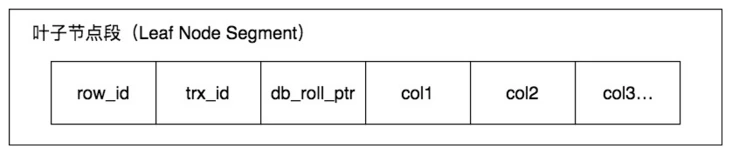
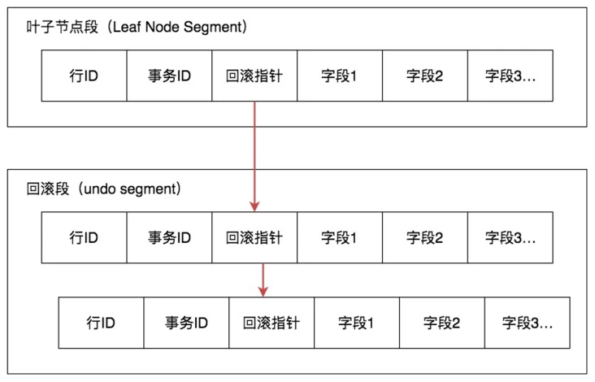
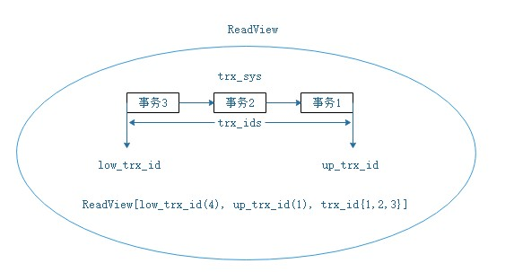
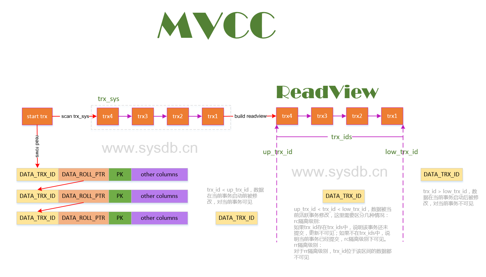

# MVCC

> Multiversion concurrency control (MCC or MVCC), is a concurrency control method commonly used by database management systems to provide concurrent access to the database and in programming languages to implement transactional memory

翻译过来就是：多版本并发控制（MCC 或 MVCC）是一种并发控制方法，通常被数据库管理系统用来提供对数据库的并发访问，并以编程语言来实现事务存储。

**简单来说就是数据库用来控制并发的一种方法。每个数据库对于 MVCC 的实现可能不一样。**

以我们常用的 MySQL 来说，MySQL 的 InnoDB 引擎实现了 MVCC 。

### MVCC 能解决什么问题

MVCC 主要解决事务并发时数据一致性的问题

具体来说：

*   **读写之间阻塞的问题**

    *   通过 MVCC 可以让读写互相不阻塞，即读不阻塞写，写不阻塞读，这样就可以提升事务并发处理能力。

    *   提高并发的演进思路：

        *   普通锁，只能串行执行；

        *   读写锁，可以实现读读并发；

        *   数据多版本并发控制，可以实现读写并发。

*   **降低了死锁的概率**

    *   因为 InnoDB 的 MVCC 采用了乐观锁的方式，读取数据时并不需要加锁，对于写操作，也只锁定必要的行。

*   **解决一致性读的问题**

    *   一致性读也被称为**快照读**，当我们查询数据库在某个时间点的快照时，只能看到这个时间点之前事务提交更新的结果，而不能看到这个时间点之后事务提交的更新结果。

### 快照读与当前读

**快照读（SnapShot Read）** 是一种**一致性不加锁的读**，是 **InnoDB 并发如此之高的核心原因之一**。

> 这里的**一致性**是指，事务读取到的数据，要么是**事务开始前就已经存在的数据**，要么是**事务自身插入或者修改过的数据**。

不加锁的简单的 SELECT 都属于**快照读**，例如：

`SELECT * FROM t WHERE id=1`&#x20;

与 **快照读** 相对应的则是 **当前读**，**当前读**就是读取最新数据，而不是历史版本的数据。加锁的 SELECT 就属于当前读，例如：

```sql
SELECT * FROM t WHERE id=1 LOCK IN SHARE MODE;

SELECT * FROM t WHERE id=1 FOR UPDATE; 
```

### InnoDB 是如何实现的 MVCC

首先看下 MySQL 的官方文档，我对比了 5.1、5.6、5.7 三个版本的 [文档](https://dev.mysql.com/doc/refman/5.7/en/innodb-multi-versioning.html "文档") ，对 MVCC 这部分的描述，几乎是相同的。


根据文档很明显是在每条数据增加三个隐藏列：

*   6 字节的 DB\_TRX\_ID 字段，表示最近一次插入或者更新该记录的事务 ID。

*   7 字节的 DB\_ROLL\_PTR 字段，指向该记录的 rollback segment 的 undo log 记录。

*   6 字节的 DB\_ROW\_ID，当有新数据插入的时候会自动递增。当表上没有用户主键的时候，InnoDB 会自动产生聚集索引，包含 DB\_ROW\_ID 字段。




这里我补充一张包含 rollback segment 的 MySQL 内部结构图  ，更多内部结构，请参考 [从  MySQL InnoDB 物理文件格式深入理解索引](../索引/从%20%20MySQL%20InnoDB%20物理文件格式深入理解索引/从%20%20MySQL%20InnoDB%20物理文件格式深入理解索引.md "从  MySQL InnoDB 物理文件格式深入理解索引")


#### 版本链

**innoDB 是如何存储记录的多个版本的？**

*   InnoDB 将行记录快照保存在了 Undo Log 里，我们可以在回滚段中找到它们



*   每开启一个事务，我们都会从数据库中获得一个事务 ID（也就是事务版本号），这个事务 ID 是自增长的，通过 ID 大小，我们就可以判断事务的时间顺序。

*   每条记录都有 DB\_ROLL\_PTR 隐藏字段，指向该记录的 rollback segment 的 undo log 记录

*   每条 undo 日志都有一个 roll\_pointer（回滚指针） 属性，那么所有的版本都会被 roll\_pointer 属性连接成一个链表，我们把这个链表称之为**版本链**，版本链的头节点就是当前记录最新的值。

#### ReadView

> Read view lists the trx ids of those transactions for which a consistent read should not see the modifications to the database.

什么是 Read View？说白了 Read View 就是 **事务进行快照读操作的时候**生产的**读视图**，在当前事务**执行快照读**的那一刻，会生成数据库系统当前的一个快照，记录并维护系统当前活跃事务的 ID（当每个事务开启时，都会被分配一个 ID，这个 ID 是默认递增的，所以事务越新，ID 越大）

readView 的组成（ID 越小，事务开始的越早；ID 越大，事务开始的越晚）：

*   low\_limit\_id：high water mark，大于等于 view->low\_limit\_id 的事务对于 view 都是不可见的

*   up\_limit\_id：low water mark，小于 view->up\_limit\_id 的事务对于 view 一定是可见的

*   low\_limit\_no：trx\_no 小于 view->low\_limit\_no 的 undo log 对于 view 是可以 purge 的

*   rw\_trx\_ids：读写事务数组

```c
/** ReadView constructor */
ReadView::ReadView()
    : m_low_limit_id(),
      m_up_limit_id(),
      m_creator_trx_id(),
      m_ids(),
      m_low_limit_no() {
  ut_d(::memset(&m_view_list, 0x0, sizeof(m_view_list)));
  ut_d(m_view_low_limit_no = 0);
}
 
```

这里需要注意 low 是高水位 up 是低水平，跟直觉是相反的。

**Read View** 主要是用来做**可见性判断**的，即当我们**某个事物执行快照读的时候**，**对读取的该记录创建一个 Read View 视图**，把它当作条件，用来**判断当前事务能够看到哪个版本的数据**，既可能是当前最新的数据（也就是该快照），也可能是该行记录的 undo log 日志里的某个版本的数据。

R**ead View 遵循一个可见性算法：**

readview 规则：

*   trx\_id < view->up\_limit\_id 的记录对于当前 read view 是一定可见的；

*   trx\_id >= view->low\_limit\_id 的记录对于当前 read view 是一定不可见的；

如果 trx\_id 落在、[up\_limit\_id, low\_limit\_id)，需要在活跃读写事务数组查找 trx\_id 是否存在，如果存在，记录对于当前 read view 是不可见的。

如果记录对于 view 不可见，需要通过记录的 DB\_ROLL\_PTR 指针遍历 history list（版本链）构造当前 view 可见版本数据。


**“记录对于当前 readView 可见” 这句话的意思是 记录对事务 A 可见。**

如果 **DB\_TRX\_ID** 跟 **Read View** 的属性**做了某些比较之后不符合可见性**，那就通过 **DB\_ROLL\_PRT** 回滚指针去取出 **undo log** 中的 **DB\_TRX\_ID** 再比较，也就是说遍历 **undo log** 链表的 **DB\_TRX\_ID** 找到特定条件的事务 ID 的版本，那么这个 **DB\_TRX\_ID** 所在的旧记录就是当前事务能看见的最新老版本。

readview 的生成总结：

**在 RC 隔离级别下，是每个 SELECT 都会获取最新的 read view；而在 RR 隔离级别下，则是当事务中的第一个 SELECT 请求才创建 read view**

注意：

*   readview 是与 SQL 绑定的，而并不是事务，所以即使在同一个事务中，每次 SQL 启动时构造的`ReadView`的`up_trx_id`和`low_trx_id`也都是不一样的

*   不同的事务隔离级别下，生成`ReadView`的时机则各不相同

    *   repetable read

        *   每个事务首次执行`SELECT`语句时，会将当前系统所有活跃事务拷贝到一个列表中生成`ReadView`

        *   每个事务后续的`SELECT`操作复用其之前生成的`ReadView`

        *   `UPDATE,DELETE,INSERT`对一致性读`snapshot`无影响

    *   read committed

        *   每次 SELECT 执行，都会重新将当前系统中的所有活跃事务拷贝到一个列表中生成 ReadView

通过隐藏列和版本链，MySQL 可以将数据恢复到指定版本；但是具体要恢复到哪个版本，则需要根据 ReadView 来确定。所谓 ReadView，是指事务（记做事务 A）在某一时刻给整个事务系统（trx\_sys）打快照，之后再进行读操作时，会将读取到的数据中的事务 id 与 trx\_sys 快照比较，从而判断数据对该 ReadView 是否可见，即对事务 A 是否可见。（[参考](https://www.cnblogs.com/kismetv/p/10331633.html "参考")）



**至此我们发现 MVCC 就是、基于隐藏字段、undo\_log 链和 ReadView 来实现的。**



### Read committed 中的 MVCC

InnoDB 只会查找版本早于当前事务版本的数据行（也就是，行的版本号小于或是等于事务的系统版本 号），这样可以确保数据读取的行，要么是在事务开始前已经存在的，要么是事务自身插入或修改过的。**因此不会产生脏读**。

Read committed 隔离级别下出现不可重复读是由于 read view 的生成机制造成的。在 Read committed 级别下，只要当前语句执行前已经提交的数据都是可见的。在每次语句执行的过程中，都关闭 read view, 重新创建当前的一份 read view。这样就可以根据当前的全局事务链表创建 read view 的事务区间。简单说就是在 Read committed 隔离级别下，MVCC 在每次 select 时生成一个快照版本，所以每次 select 都会读到不同的版本数据，**所以会产生不可重复读**。

### Repeatable read 中的 MVCC

Repeatable read 隔离级别解决了不可重复读的问题，一个事务中多次读取不会出现不同的结果，保证了可重复读。前文中我们说 Repeatable read 有两种实现方式，一种是悲观锁的方式，相对的 MVCC 就是乐观锁的方式。

Repeatable read 隔离级别能解决不可重复读根本原因其实就是 read view 的生成机制和 Read committed 不同。

*   Read committed  ：只要是当前语句执行前已经提交的数据都是可见的。

*   Repeatable read ： 只要是当前事务执行前已经提交的数据都是可见的。

不像 Read committed，**在 Repeatable read 的隔离级别下，创建事务的时候，就生成了当前的 global read view, 一直维持到事务结束。这样就能实现可重复读。**

#### 查询（SELECT）

InnoDB 会根据以下两个条件检查每行记录：

1.  InnoDB 只查找版本早于当前事务版本的数据行（也就是，行的系统版本号小于或等于事务的系统版本号），这样可以**确保事务读取的行，要么是在事务开始前已经存在的，要么是事务自身插入或者修改过的**。

2.  行的删除版本要么未定义，要么大于当前事务版本号。这可以确保**事务读取到的行，在事务开始之前未被删除**。

只有符合上述两个条件的记录，才能返回作为查询结果。

#### 插入（INSERT）

InnoDB 为新插入的每一行保存当前系统版本号作为行版本号。

#### 删除（DELETE）

InnoDB 为删除的每一行保存当前系统版本号作为行删除标识。 &#x20;
删除在内部被视为更新，行中的一个特殊位会被设置为已删除。

#### 更新（UPDATE）

InnoDB 为插入一行新记录，保存当前系统版本号作为行版本号，同时保存当前系统版本号到原来的行作为行删除标识。

### 有了 MVCC 后的锁的使用

*   MVCC + 悲观锁 MVCC 解决读写冲突，悲观锁解决写-写冲突。

*   MVCC + 乐观锁 MVCC 解决读写冲突，乐观锁解决写-写冲突。

## 总结

**MVCC 就是基于隐藏字段、undo_log 链和 ReadView 来实现的。**

**多版本并发控制（MVCC）** 在一定程度上实现了**读写并发**，它只在 **可重复读（REPEATABLE READ）** 和 **提交读（READ COMMITTED）** 两个隔离级别下工作。其他两个隔离级别都和 MVCC 不兼容，因为 **未提交读（READ UNCOMMITTED）**，总是读取最新的数据行，而不是符合当前事务版本的数据行。而 **可串行化（SERIALIZABLE）** 则会对所有读取的行都加锁。

## 参考

*   [https://segmentfault.com/a/1190000037557620](https://segmentfault.com/a/1190000037557620 "https://segmentfault.com/a/1190000037557620")

*   [http://mysql.taobao.org/monthly/2018/03/01/](http://mysql.taobao.org/monthly/2018/03/01/ "http://mysql.taobao.org/monthly/2018/03/01/")
