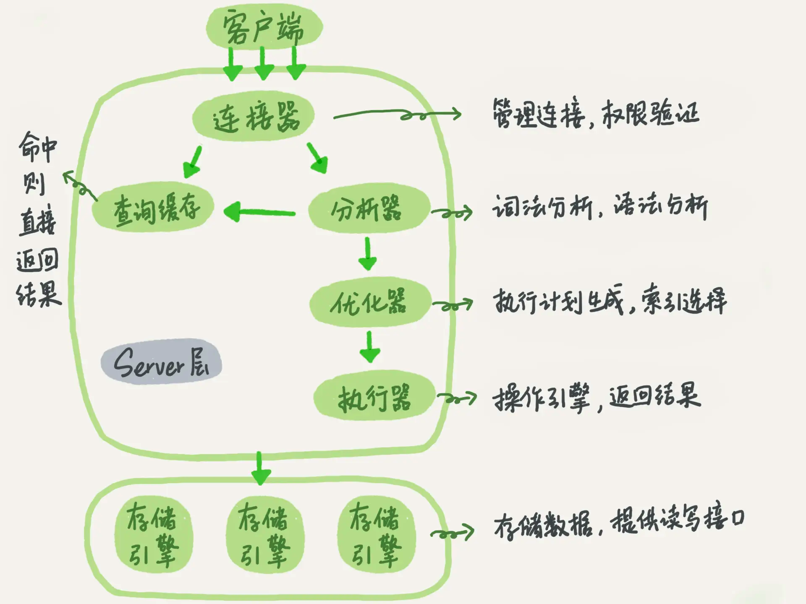

# MySQL

## 架构

InnoDB storage engine architecture. [https://dev.mysql.com/doc/refman/8.0/en/innodb-architecture.html](https://dev.mysql.com/doc/refman/8.0/en/innodb-architecture.html "https://dev.mysql.com/doc/refman/8.0/en/innodb-architecture.html") &#x20;

mysql 逻辑架构图

[幻读](幻读/幻读.md "幻读")

[MVCC](MVCC/MVCC.md "MVCC")

[索引](索引/索引.md "索引")

[日志](日志/日志.md "日志")

[SQL](SQL/SQL.md "SQL")

[性能优化](性能优化/性能优化.md "性能优化")

[锁](锁/锁.md "锁")

[archery mysql审核系统](archery%20mysql审核系统/archery%20mysql审核系统.md "archery mysql审核系统")
