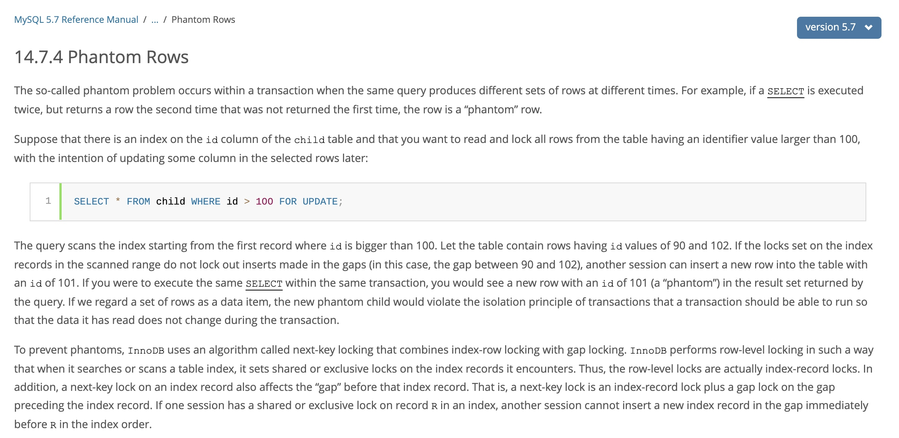
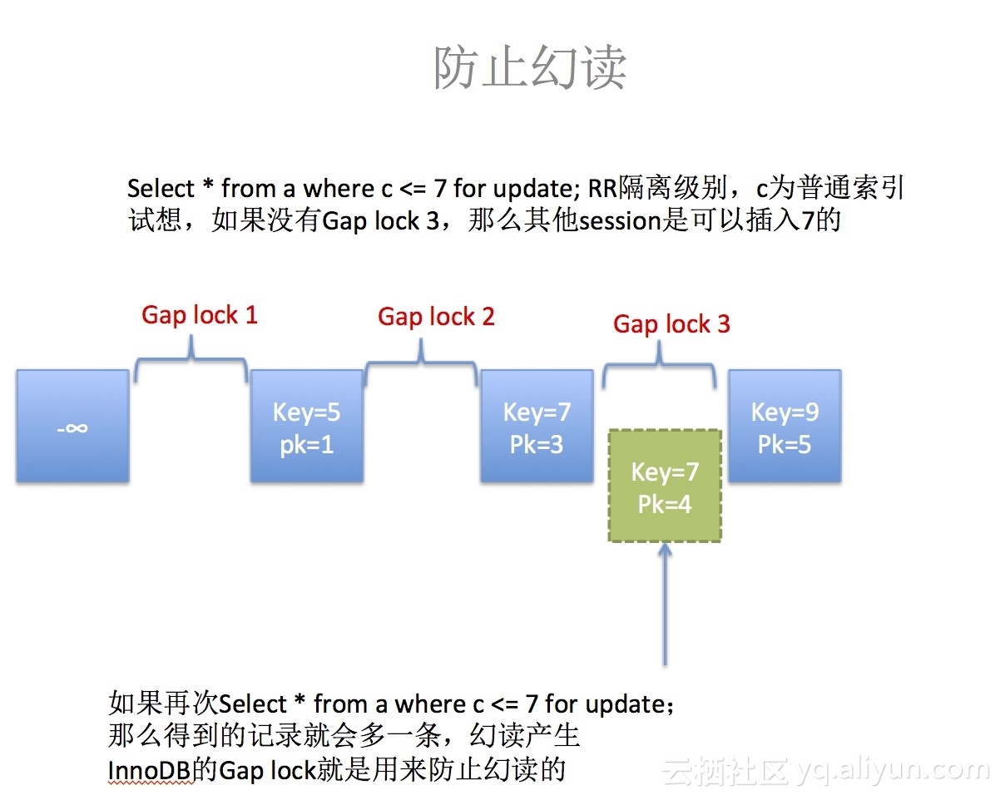

# 幻读

## 什么是幻读&#x20;

幻读 ：是指当某个事务在读取某个范围内的记录时，另外一个事务又在该范围内插入了新的记录，当之前的事务再次读取该范围内的记录时，会产生幻行（Phantom Row）

不同隔离级别下的并发事务可能出现的问题：

**不可重复读重点在于update和delete，而幻读的重点在于insert**

## 解决幻读问题

为了解决**当前读**中的幻读问题，MySQL事务使用了 `next-key lock` 。Repeatable read 通过 next-key lock 机制避免了幻读现象。

InnoDB存储引擎有3种行锁的算法，分别是：

*   Record Lock: 单个记录上的锁

*   Gap Lock: 间隙锁，锁定一个范围，但不包括记录本身

*   Next-Key Lock: Gap Lock + Record Lock

### gap lock

只在REPEATABLE READ或以上的隔离级别下的特定操作才会取得gap lock或nextkey lock

gap lock的意义只在于阻止区间被插入，因此是可以共存的。一个事务获取的gap lock不会阻止另一个事务获取同一个gap的gap lock。共享和排他的gap lock是没有区别的。他们相互不冲突，且功能相同。

举例：gap锁是会锁住一定范围内的记录，这个时候如果要insert 且落在这个范围内，就会阻塞这个session，需要等待锁释放。等待之前导致gap lock的语句释放锁，如果之前的语句长时间没有释放锁，会导致锁超时 `Lock wait timeout exceeded try restarting transaction`

### next-key lock

**next-key lock 是行锁的一种，实现相当于 record lock(记录锁) + gap lock(间隙锁)；其特点是不仅会锁住记录本身( record lock 的功能)，还会锁定一个范围( gap lock 的功能)。**

**当InnoDB扫描索引记录的时候，会首先对索引记录加上行锁（Record Lock），再对索引记录两边的间隙加上间隙锁（Gap Lock）。加上间隙锁之后，其他事务就不能在这个间隙修改或者插入记录。**

**当查询的索引含有唯一属性的时候，Next-Key Lock 会进行优化，将其降级为Record Lock，即仅锁住索引本身，不是范围。**

### 为什么Mysql在 Repeatable Read 隔离级别下不存在幻读？&#x20;

MySQL通过乐观锁为理论基础的MVCC（多版本并发控制 multiversion concurrency control ）和Next-Key锁（Next-Key锁是行锁和GAP间隙锁的合并）来避免。

### MVCC➕Next-key-Lock 防止幻读

`InnoDB`存储引擎在 RR 级别下通过 `MVCC`和 `Next-key Lock` 来解决幻读问题：

\*\*1、执行普通 \*\*\*\*\*\***，此时会以 \*\*\*\*\*\*\*\* 快照读的方式读取数据**

在快照读的情况下，RR 隔离级别只会在事务开启后的第一次查询生成 `Read View` ，并使用至事务提交。所以在生成 `Read View` 之后其它事务所做的更新、插入记录版本对当前事务并不可见，实现了可重复读和防止快照读下的 “幻读”

**2、执行 select...for update/lock in share mode、insert、update、delete 等当前读**

在当前读下，读取的都是最新的数据，如果其它事务有插入新的记录，并且刚好在当前事务查询范围内，就会产生幻读！`InnoDB` 使用 [Next-key Lock (opens new window)](https://dev.mysql.com/doc/refman/5.7/en/innodb-locking.html#innodb-next-key-locks "Next-key Lock (opens new window)") 来防止这种情况。当执行当前读时，会锁定读取到的记录的同时，锁定它们的间隙，防止其它事务在查询范围内插入数据。只要我不让你插入，就不会发生幻读

### 总结

mysql repeatable 隔离级别只解决了“快照读”的幻读问题，而“当前读” 如update 等并没有解决，需要手动加如： select for update 才能解决，解决的机制就是 next-key lock

在 UPDATE 或者 SELECT ... FOR UPDATE 的时候，innodb 引擎实际执行的是当前读，在扫描过程中加上行锁和区间锁（gap locks，next-key locks），相当于变相提升到了 serializable 隔离级别
