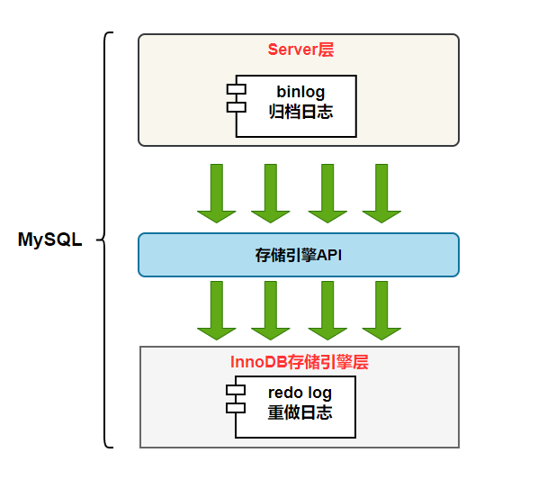
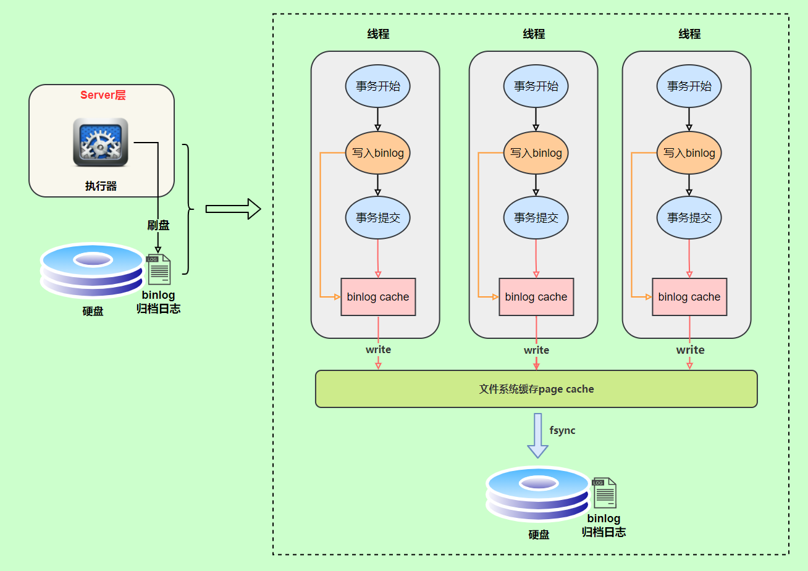
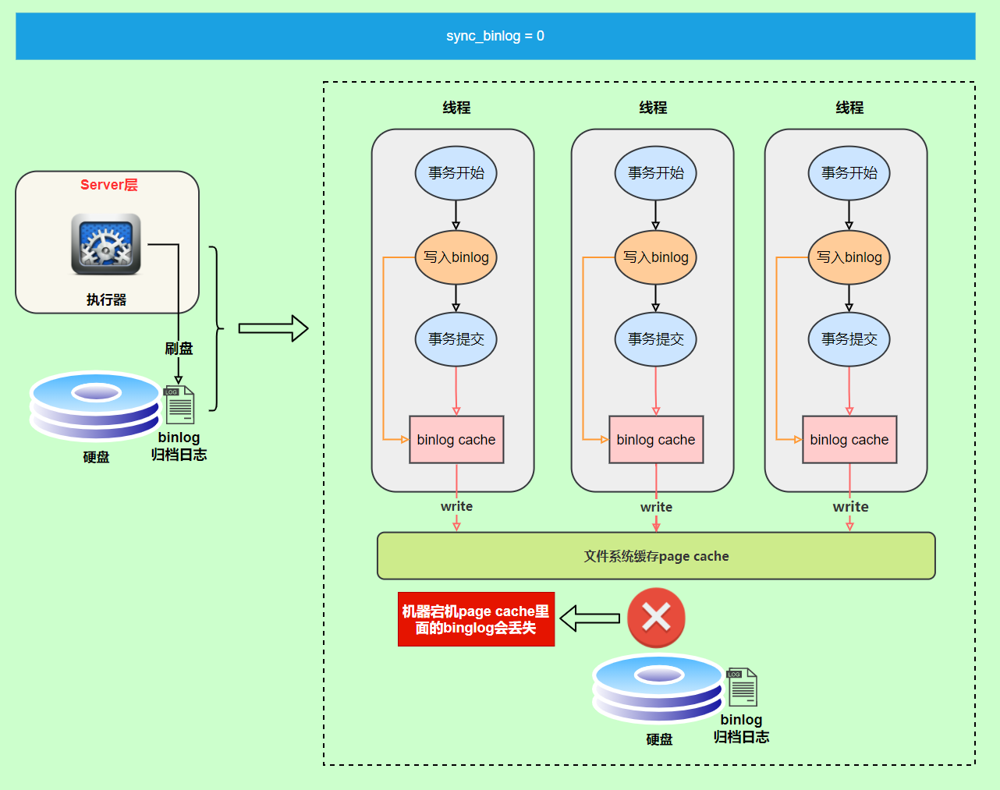
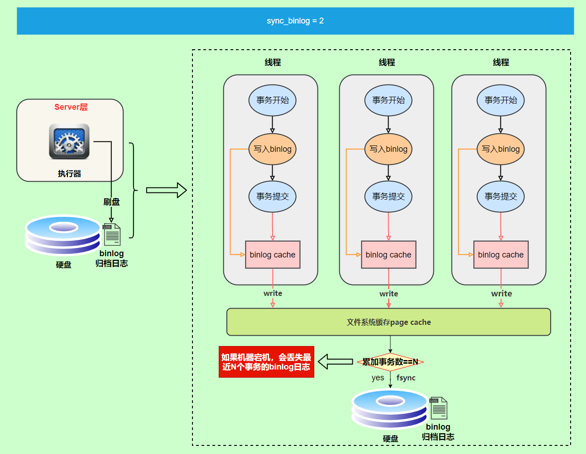

# 日志

*   redolog

*   undolog

*   binlog

## binlog&#x20;

`MySQL`数据库的**数据备份、主备、主主、主从**都离不开`binlog`，需要依靠`binlog`来同步数据，保证数据一致性。

`binlog` 日志有三种格式，可以通过`binlog_format`参数指定。

*   **statement**

*   **row**

*   **mixed**

指定`statement`，记录的内容是`SQL`语句原文，比如执行一条`update T set update_time=now() where id=1`，记录的内容如下。

同步数据时，会执行记录的`SQL`语句，但是有个问题，`update_time=now()`这里会获取当前系统时间，直接执行会导致与原库的数据不一致。

为了解决这种问题，我们需要指定为`row`，记录的内容不再是简单的`SQL`语句了，还包含操作的具体数据，记录内容如下。

`row`格式记录的内容看不到详细信息，要通过`mysqlbinlog`工具解析出来。

`update_time=now()`变成了具体的时间`update_time=1627112756247`，条件后面的@1、@2、@3 都是该行数据第 1 个\~3 个字段的原始值（**假设这张表只有 3 个字段**）。

这样就能保证同步数据的一致性，通常情况下都是指定为`row`，这样可以为数据库的恢复与同步带来更好的可靠性。

但是这种格式，需要更大的容量来记录，比较占用空间，恢复与同步时会更消耗`IO`资源，影响执行速度。

所以就有了一种折中的方案，指定为`mixed`，记录的内容是前两者的混合。

`MySQL`会判断这条`SQL`语句是否可能引起数据不一致，如果是，就用`row`格式，否则就用`statement`格式。

### 写入机制

binlog的写入时机也非常简单，事务执行过程中，先把日志写到binlog cache，事务提交的时候，再把binlog cache写到binlog文件中。&#x20;

因为一个事务的binlog不能被拆开，无论这个事务多大，也要确保一次性写入，所以系统会给每个线程分配一个块内存作为binlog cache。

&#x20;我们可以通过binlog\_cache\_size参数控制单个线程 binlog cache 大小，如果存储内容超过了这个参数，就要暂存到磁盘（Swap）。&#x20;

binlog日志刷盘流程如下：

*   **上图的 write，是指把日志写入到文件系统的 page cache，并没有把数据持久化到磁盘，所以速度比较快**

*   **上图的 fsync，才是将数据持久化到磁盘的操作**

`write`和`fsync`的时机，可以由参数`sync_binlog`控制，默认是`0`。

为`0`的时候，表示每次提交事务都只`write`，由系统自行判断什么时候执行`fsync`。

虽然性能得到提升，但是机器宕机，`page cache`里面的 binlog 会丢失。

为了安全起见，可以设置为`1`，表示每次提交事务都会执行`fsync`，就如同**binlog 日志刷盘流程**一样。

最后还有一种折中方式，可以设置为`N(N>1)`，表示每次提交事务都`write`，但累积`N`个事务后才`fsync`。

在出现`IO`瓶颈的场景里，将`sync_binlog`设置成一个比较大的值，可以提升性能。

同样的，如果机器宕机，会丢失最近`N`个事务的`binlog`日志

## 一些区别

### redolog 和 undolog的区别

*   undo log属于逻辑日志，它记录的是sql执行相关的信息。当发生回滚时，InnoDB会根据undo log的内容做与之前相反的工作

*   redo log是物理日志，内容基于磁盘的Page

### redo log 和 binlog的区别

1.  作用不同：redo log是用于crash recovery的，保证MySQL宕机也不会影响持久性；binlog是用于point-in-time recovery的，保证服务器可以基于时间点恢复数据，此外binlog还用于主从复制。

2.  层次不同：redo log是InnoDB存储引擎实现的，而binlog是MySQL的服务器层(可以参考文章前面对MySQL逻辑架构的介绍)实现的，同时支持InnoDB和其他存储引擎。

3.  内容不同：redo log是物理日志，内容基于磁盘的Page；binlog的内容是二进制的，根据binlog\_format参数的不同，可能基于sql语句、基于数据本身或者二者的混合。

4.  写入时机不同：binlog在事务提交时写入；redo log的写入时机相对多元：

    1.  前面曾提到：当事务提交时会调用fsync对redo log进行刷盘；这是默认情况下的策略，修改innodb\_flush\_log\_at\_trx\_commit参数可以改变该策略，但事务的持久性将无法保证。

    2.  除了事务提交时，还有其他刷盘时机：如master thread每秒刷盘一次redo log等，这样的好处是不一定要等到commit时刷盘，commit速度大大加快。

[https://www.cnblogs.com/kismetv/p/10331633.html](https://www.cnblogs.com/kismetv/p/10331633.html "https://www.cnblogs.com/kismetv/p/10331633.html")

## 一些问题

### 为什么只用redo log 或者 undo log不行？

*   只有undo log，没有redo log：如果脏数据尚未刷入磁盘，服务器宕机了，会丢失保存在缓存中的已经提交的数据，无法保证持久性。**必须保证在提交事务前完成刷脏**，但这样会损害性能。(一般在空闲时刷脏，实时刷脏io开销较大)

*   只有redo log，没有undo log：**无法随心所欲地在事务提交前刷脏**，即：如果刷脏完成后尚未commit时，服务器崩了；redo log未commit，需要回滚数据，但这部分数据是无法完成回滚的

### 为什么有了binlog还要有redo log？

1.  binlog会记录所有与MySQL数据库有关的日志记录，包括InnoDB, MyISAM，Heap等其他存储引起的日志。而redo log只记录innodb引擎本身的日志。

2.  binlog记录的是关于一个事务的具体操作内容，即该日志是逻辑日志。而redolog记录的是关于每个页的更改的物理情况。

3.  写入时间不同。binlog仅在事务提交前提交，只写磁盘一次，不论这个事务有多大。而redolog在事务进行过程中会不停的写入

它们分工是不同的。binlog用来做[数据](https://so.csdn.net/so/search?q=数据\&spm=1001.2101.3001.7020 "数据")归档，但不具备崩溃恢复的能力，也就是说如果系统突然崩溃，重启后可能会有部分数据丢失。[innodb](https://so.csdn.net/so/search?q=innodb\&spm=1001.2101.3001.7020 "innodb")将所有对页面的修改操作写入一个专门的文件，并在数据库启动时从此文件进行恢复操作。

## 参考

*   [https://javaguide.cn/database/mysql/mysql-logs/#binlog](https://javaguide.cn/database/mysql/mysql-logs/#binlog "https://javaguide.cn/database/mysql/mysql-logs/#binlog")
