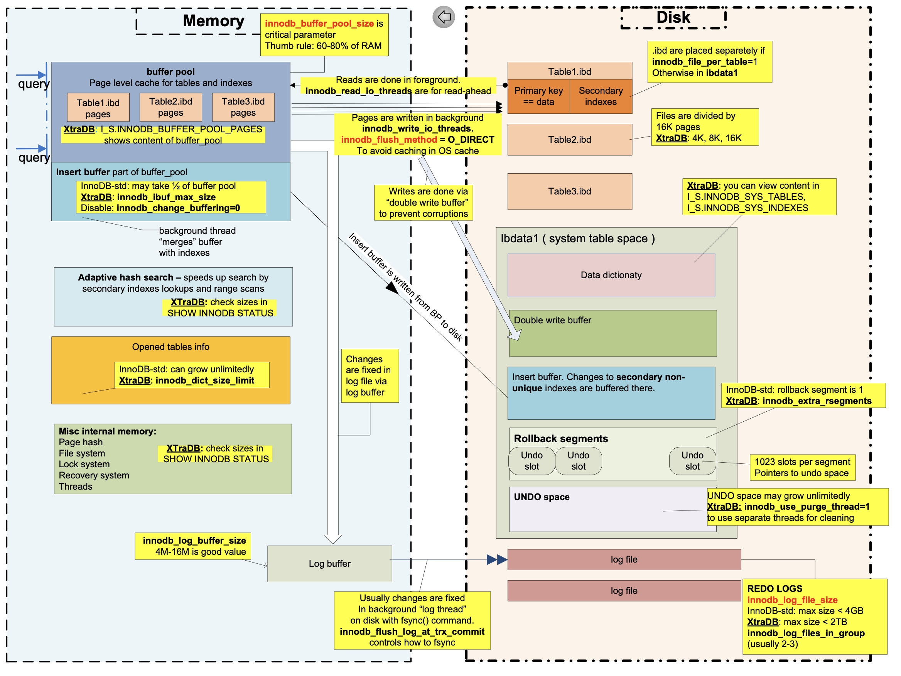

# 从  MySQL InnoDB 物理文件格式深入理解索引

​                                                                          &#x20;

## InnoDB物理文件的基本结构

InnoDB的物理文件有很多种，包括：

*   系统表空间（system tablespace）文件以ibdata1、ibdata2等命名，包括

    *   元数据数据字典（表、列、索引等）

    *   double write buffer

    *   插入缓冲索引页（change buffer）

    *   系统事务信息（sys\_trx）默认包含undo回滚段（rollback segment）。

*   用户表空间 innodb\_file\_per\_table=true时，一个表对应一个独立的文件，文件以db\_name/table\_name.ibd命名。行存储在这类文件。另外还有5.7之后引入General Tablespace，可以将多个表放到同一个文件里面。

*   redo log。文件以ib\_logfile0、ib\_logfile1命名，滚动写入。主要满足`ACID`特性中的`Durablity`特性，保证数据的可靠性，同时把随机写变为内存写加文件顺序写，提高了MySQL的写吞吐。



另外还可能存在临时表空间文件、undo独立表空间等。

MySQL一次IO的最小单位是**页**（page），也可以理解为一次原子操作都是以page为单位的，默认大小**16k**。

刚刚列出的所有物理文件结构上都是以Page构成的，只是page内部的结构不同。

每个page包括最前面的38个字节的FilHeader，和结尾的8个字节的FilTrailer组成。


## 表空间的格式

除了redo log以外，刚刚提到的表空间，包括：

*   系统表空间

*   用户表空间

*   undo独立表空间

*   临时表空间

他们的格式都是一样的，只是里面的page各有不同。本文主要介绍独立**用户表空间**的结构，进而深入解析索引。

表空间（tablespace）有一个32位的spaceid，用户表空间物理上是由page连续构成的，每个page的序号是一个32位的uint，page 0位于文件物理偏移量0处，page 1位于16384偏移量处。**由此推出InnoDB单表最大2^32 \* 16k = 64T。**

表的所有行数据都存在页类型为INDEX的索引页（page）上，为了管理表空间，还需要很多其他的辅助页，例如文件管理页FSP\_HDR/XDES、插入缓冲IBUF\_BITMAP页、`INODE页`等。

2009年，INNOBASE分享了关于InnoDB的物理结构，里面一张广为流传的图如下。


segment和extent是InnoDB内部用于分配管理页的逻辑结构，用于分配与回收页，对于写入数据的性能至关重要。

但这张图有所局限性，**可能会产生误解**：

*   图中是**系统表空间**，因此存在rollback segment，独立表空间则没有。

*   leaf node segment实际是InnoDB的inode概念，一个segment可能包含最多32个碎片page、0个extent（用于小表优化），或者是非常多的extent，我猜测作者图中画了4个extent是在描述表超过32MB大小的时候一次申请4个extent。

*   个extent在默认16k的page大小下，由64个page组成，page大小由UNIV\_PAGE\_SIZE定义，所以extent不一定由64个page组成。

**如果你觉得这几点不明白，那么坚持往下读。**

# 文件管理页

文件管理页的页类型是FSP\_HDR和XDES（extent descriptor），用于分配、管理extent和page。

默认一个extent（1MB大小）管理64个物理连续的page（16k），extent是InnoDB高效分配扩容page的机制。如果page更小（例如8k，4k），则仍然要保证extent最小1M，page数就会相应变多；如果page变大（例如32k），则仍然是64个page。

FSP\_HDR/XDES页在表空间中的位置，和内部结构如下。


FSP\_HDR页都是page 0，XDES页一般出现在page 16384, 32768等固定的位置。一个FSP\_HDR或者XDES页大小同样是16K，容量限制所能管理的extent必定是有限的，一般情况下，每个extent都有一个占40字节的XDES entry描述维护，因此1个FSP\_HDR页最多管理256个extent（也就是256M，16384个page）。那么随着表空间文件越来越大，就需要更多的XDES页。

XDES entry存储所管理的extent状态：

1.  FREE（空）

2.  FREE\_FRAG（至少一个被占用）

3.  FULL\_FRAG（满）

4.  归某个segment管理的信息

XDES entry还存储了每个extent内部page是否free（有空间）信息（用bitmap表示）。XDES entry组成了一个双向链表，同一种extent状态的首尾连在一起，便于管理。FSP\_HDR和XDES的唯一区别，FSP Header只有在page 0 FSP\_HDR中有值。


而FSP Header里面最重要的信息就是四个链表头尾数据（FLST\_BASE\_NODE结构，FLST意思是first and last），FLST\_BASE\_NODE如下。


1.  当一个Extent中所有page都未被使用时，挂在FSP\_FREE list base node上，可以用于随后的分配

2.  有一部分page被写入的extent，挂在FREE\_FRAG list base node上

3.  全满的extent，挂在FULL\_FRAG list base node上

4.  归属于某个segment时候挂在FSEG list base node上

当InnoDB写入数据的时候，会从这些链表上分配或者回收extent和page，这些extent也都是在这几个链表上移动的。

# INODE页

一般而言，INODE一定会出现在文件的page 2上，如果管理的索引过多，才会分配更多的INODE页。夹在page 2 INODE页和page 0 FSP\_HDR中间IBUF\_BITMAP页暂不展开。

INODE页结构如下：


segment是表空间管理的逻辑单位。INODE页就是用于管理segment的，每个Inode entry负责一个segment。

下面会讲到，MySQL的数据是按照B+ tree聚簇索引（clustered index）组织数据的，每个B+ tree使用两个segment来管理page，分别是：

*   leaf node segment（叶子节点segment）

*   non-leaf node segment（非叶子节点segment）。

这两个segment的Inode entry地址记录在B+ tree的root page中FSEG\_HEADER里面，而root page又被分配在non-leaf segment第一个碎片页上（fragment array）。

一个segment由32个碎片页（fragment array），FSEG\_FREE、FSEG\_NOT\_FULL、FSEG\_FULL组成，这些信息记录在Inode entry里，可以简单理解为**Inode就是segment元信息的载体**。

FREE、NOT\_FULL、FULL三个FLST\_BASE\_NODE对象和FSP\_HDR/XDES页里面的FSP\_FREE、FREE\_FRAG、FULL\_FRAG、FSEG概念类似。这些链表被InnoDB使用，用于高效的管理页分配和回收。

至于碎片页上（fragment array），用于优化小表空间分配，先从全局的碎片分配Page，当fragment array填满（32个槽位）时，之后每次分配一个完整的Extent，如果表大于32MB，则一次分配4个extent。

因此可以回答INNOBASE图里面的segment概念了，只不过segment可能包含0或者多个（非常多的）extent。

# 把segment、extent、page概念串联起来

如下图所示 对照JCole博客的图可以更好的理解。


# INDEX数据索引页

## B+树聚簇索引

索引（index）用于快速定位数据，对于InnoDB来说，主键和非主键都是索引，一切数据都存储在INDEX索引页中，**索引即数据，数据即索引**。

试想下，加速查询的方法很多，可以是：

1.  哈希索引（hash），点查性能很好，需要解决冲突，区间查询也不友好。MySQL只有自适应的哈希索引，数据组织的索引不会采用哈希索引。

2.  有序数组（sorted array），更新麻烦，只适用于静态存储引擎。

3.  二叉查找树（binary search tree），查询复杂度是O(logN)，为了保持这棵树是平衡二叉树，更新的时间复杂度也是O(logN)。

下图展示了各个存储介质的访问时延，从内存100ns，到NVME SSD 16us，到机械磁盘3-10ms，二叉查找树最大的问题就在于随机IO，所以在机械盘时代，解决的思路就是减少随机IO，自然而然想到的就是增加树的高度。因此InnoDB采用N叉平衡树组织索引和数据。


4\. N叉数

减少树的高度和随机IO次数，例如当N=1200，树的高度可以控制在4层，管理1200^3=17亿行。一般根节点在内存，所以最多3次磁盘IO。不仅减少了随机IO次数还保证了查询的稳定性，所以说这种数据结构是一种scales nicely的解决方案。

5\. 新模型

一些新的存储数据结构采用LSM-tree、跳表skiplist等不在本文讨论范围内。

既然多叉树可以满足查询性能，下面再来看索引和数据是否有必要放在一起呢？索引的组织形式可以是聚簇（clustered）和非聚簇（unclustered）的。

clustered index将数据按照索引的顺序存储。通常来讲，索引和数据在一起，找到了索引也就找到了数据（但不一定强求）。


unclustered index则将数据与索引分开结构，索引指向了具体的记录。索引相近的记录，在物理文件上相距可能很远。


**一张MySQL表只有一个聚簇索引，聚簇索引可以看做主键**，如果建表没有指定主键默认采用第一个NOT NULL UNIQUE INDEX当主键，否则默认6字节的ROW ID做主键。总之InnoDB必须有一个primary key。聚簇索引通常就是B+树（B+ tree）结构，如下图所示。


使用B+树聚簇索引（B+ tree clustered index）的好处在于：

1.  数据和索引顺序一致，充分利用磁盘顺序IO性能普遍高于随机IO的特性。

2.  对于局部性查询也会大有裨益。

3.  采用B+树，叶子节点（leaf node）存储数据，非叶子节点（non-leaf node）只是索引，这样非叶子节点就会足够的小，因此数据很“热”，便于更好的缓存。

4.  对于覆盖索引，可以直接利用叶子节点的主键值。

**二级索引，就可以理解为非聚簇索引，也是一颗B+树**，**只不过这棵树的叶子节点是指向聚簇索引主键的，可以看做“行指针”，因此查询的时候需要“回表”。另外一些数据库采用堆表（heap）的方式组织数据和索引**。

假设存在一张表，没有任何索引，B+树有三层，按照自增主键插入，可以用[alibaba/innodb-java-reader](https://github.com/alibaba/innodb-java-reader "alibaba/innodb-java-reader")工具生成innodb file LSN heatmap，即page的热力图，按照page被更新的LSN（Logical Sequence Number）由小到大，由蓝变红，如下图所示。


可以看出level2的root page总是红色的，因为插入会频繁访问root page，叶子节点由蓝变红，符合自增主键顺序写入的特性，这也间接证明了自增主键的优势，充分利用利用顺序IO，避免B+树频繁分裂合并。灰色圈出来的两个page是level=1的非叶子节点，有两个，右侧节点从左侧分裂而来，因此持续一直“热”到写入结束。

把这个物理文件的变为逻辑的B+树结构，如下图所示：


## 索引页结构

索引页包含的信息如下：

*   主键、二级索引、行和列

    B+树的每个节点都是一个INDEX索引页，其结构都是相同的。

    对于聚簇索引，非叶子节点包含主键和child page number，叶子节点包含主键和具体的行；

    对于非聚簇索引，也就是二级索引，非叶子节点包含二级索引和child page number，叶子节点包含二级索引和主键值。

    行是由列组成的，各种列类型（column types）经过encoding编码后才组成了一行。

*   高效检索的数据结构

    B+树结构可以用于快速做point-query和range-query，索引页中必定包含高效检索的数据结构，实际使用的就是sorted array和singly-linked-list，页内支持二分查找。同一层的页之间是double-linked-list双向链接的。

*   支持OLTP数据库特性相关信息

InnoDB在读写方面，支持事务、行锁、`MVCC`非锁定一致性读，`ACID`特性，crash recovery特性等，**在索引页里同样包含一些属性支持这些特性**。

索引页物理结构如下图所示：


Index header包含了页的一些元数据。

*   Num of directory slots：page directory slots个数，用于二分查找检索初始化sorted array size使用。

*   Heap top position：页把插入的数据看做数组，用于记录已使用空间的末尾，从这个位置到page directory都是free space。

*   Num of heap records & page format：低15位表示Num of heap records，最高的一位表示类型，也就是record format，包括COMPACT、REDUNDANT等，下文会提到。

*   First garbage record offset、Garbage space：表示删除数据singly-linked-list的起始record和空间占用。

*   Last insertion position：最后插入数据的位置，用户快速顺序写入。

*   Page direction：插入方向，插入的数据与Last insertion position比的相对方位，包括LEFT、RIGHT、NO\_DIRECTION等。

*   Num of inserts in page direction：同一方向连续插入的记录数。

*   Num of records：未删除的记录数，剔除掉infimum和supremum记录。

*   Max trx. id：最大事务id，用于支持MVCC。

*   age level：B+树层数，叶子节点为0，非叶子节点递增。

*   Index id：索引id。

FSEG header包含了指向叶子节点和非叶子节点的Inode entry的数据：Inode spaceid、Inode page no.、Inode offset。

infimum和supremum是system records，用于起始记录和结束记录，对用户不可见，把真正的record按照升序串起来成为单链表。这两个record和普通的record结构一样，都包含record header和body，只不过它们的body分别是“infimum\0”和“supremum”字符串，不像真正的record由主键、所有列的值等组成。例如图中的物理视图，表示按自增主键顺序插入的16条记录，它们的长度可能不一样，比如包含了varchar类型的列。把他们转化为逻辑视图，他们是一个有序单链表（sorted singly linked list），头尾就是infimum和supremum记录，串起来的指针在record header里面，record header有2字节的next record offset指向下一条记录的相对物理偏移量。

通过这个有序单链表InnoDB就有能力在某个页中做检索查询，给定一个key，从infimum顺序查找，直到到supremum结束，时间复杂度O(N)。

那么有没有什么加速的办法呢？答案是利用page directory。

page directory从Fil Trailer开始从后往前写，里面包含槽位slots，每个slot 2个字节，存储了某些record在该页中的物理偏移量，例如图中最后面是infimum record的offset，最前面是supremum record的offset，中间从后往前是r4，r8，r12 record的offset，一般总是每隔4-8个record添加一个slot，这样slots就等同于一个稀疏索引（sparse index），加速页内查询的办法就是通过二分查找，查询key的时间复杂度可以降为O(logN)，由于页都在内存里面，所以查询性能可控，内存访问延迟100ns左右，如果在CPU缓存中则可能更快。

在heap top position和page directory中间的都是free space，用于record和slot从两端填充进去，对于删除的记录只是标记删除，实际空间回收再利用会延后进行。

## 索引页案例

把宏观的B+树和微观的页结构以一个案例说明下：

假设有如下的几条数据，

```纯文本
id,VALUE 100,a 199,b 200,c 299,d 300,e 400,f 500,g 550,h 600,i 650,j ...
```

一颗的B+树聚簇索引如下图所示，3层的B+树，非叶子节点的record由主键和child page number组成，主键是child page number中最小的主键值；叶子节点的record由主键和行组成。


微观上把每个页节点内部展开成由infimum和supermum连接起来的有序单链表，结构如下。每层的页通过Fil Header相互连接。


这个案例图实际上想呼应丁奇老师[《MySQL实战45讲](https://time.geekbang.org/column/intro/139?code=4WJqZ1Li-NcKqeoaSUYtndaTkiX07wVYoGc8y9Fh9z8= "《MySQL实战45讲")》里的第五讲索引里面的图。


这张图是一张局部图，非叶子节点每个记录后面的小窄条，都可以看做是node pointer，指向child page number。绝大部分资料实际都应该画了B+树上的一部分，图中300后面的指针实际是300这个记录的node pointer，其叶子节点的元素都不小于300这个值。而前面实际还应该画出一个小于等于100的值，它的node pointer才指向100的那个叶子节点。

## Row Format

下面介绍具体每一行的结构。InnoDB有如下4种row format，下图来自[MySQL官方文档](https://dev.mysql.com/doc/refman/5.7/en/innodb-row-format.html "MySQL官方文档")。


row format可通过innodb\_default\_row\_format参数指定，也可以在建表的时候指定。

```纯文本
CREATE TABLE tab (   id INT,   str VARCHAR(50) ) ENGINE=InnoDB ROW_FORMAT=DYNAMIC;
```

REDUNDANT是比较老的格式，流行的版本中5.6默认是COMPACT，COMPACT比REDUNDANT要更节省空间，大概在20%左右。5.7版本DYNAMIC是默认格式，DYNAMIC在变长存储上做了更大的空间优化，对于VARBINARY, VARCHAR, BLOB和TEXT类型更友好，下面会更详细展开。COMPRESSED是压缩页。

下面的介绍都是基于COMPACT及其之后格式的。

row的格式在上面图中简单介绍过，由可选的两个标识+record header+body组成，具体如下。


1.  Nullable field bitmap：可选标识，表明哪些列是NULL，如果没有nullable字段，就不存在。很多文章都没说清楚这部分，画个图就明白了，一个字节能表示8个nullable字段，超过8个字段就扩充到低字节。如下图所示，18个字段，9个可为空，如果其中某3个实际为空，则两个字节存储如图。


2\.  Variable field lengths：可选标识，变长字段长度，如果没有变长字段，就不存在。每个变长字段都用1-2个字节表示长度，根据列定义顺序逆序存放，其算法很多书里都提过，但是都有些省略，具体解析过程可以参考rem0rec.cc。如果小于等于127，则1个字节；大于127，低字节下一位的表示是否有overflow page存储，剩余6位和高字节的8位，按照大尾端encoding组成变长长度。

3\. record header：固定5个字节长度。

*   Info Flags：1个字节。低4位表示是否min\_rec或者deleted。高4位表示num of records owned，与上面提到的page directory呼应，如果被page directory slot指向，则有值。

*   2个大尾端字节：低三位表示类型， 包括普通记录REC\_STATUS\_ORDINARY=0，非叶子节点记录REC\_STATUS\_NODE\_PTR=1，起始虚拟记录REC\_STATUS\_INFIMUM=2，终点虚拟记录REC\_STATUS\_SUPREMUM=3。高5位表示heap no，即顺序位置。

*   2字节next record offset： 直接定位到下一个record的数据部分，也就是主键偏移量，而不是record header。

可以看出如果表结构没有变长字段，没有nullable字段，则不会存在冗余信息。5个字节长度的record header是必须有的，上面提到的infimum和supremum也是一种特殊的row，只不多对用户不可见。

4\. 索引：序列化后存储于此，例如int类型索引主键就占用4个字节。

*   对于聚簇索引的叶子节点，存储行。

*   对于二级索引的叶子节点，存储行的主键值。

*   对于聚簇索引和二级索引的非叶子节点，存储child page最小的key。

*   上面提到的infimum和supremum中就只存字符串在行数据里。

5\. 6字节事务ID和7字节回滚指针：

&#x20;    这两个值用来支持MVCC机制，事务ID是实现事务隔离级别的基础，而通过回滚指针指向undo log，可实现非锁定一致性读。

6\. 非主键列的数据：

*   对于聚簇索引的叶子节点，是按照表结构定义排列的columns，每种column类型都有自己的encoding方法。

*   对于二级索引的叶子节点，是行的主键值。

*   对于聚簇索引和二级索引的非叶子节点，是child page number。

每一列的解析在DataTypeHandler.cc源码里可以找到，有encoding和decoding的方法。比如int比较简单4个字节，对于varchar、text需要按照列或者表的charset encoding出来，对于varbinary、blob就是裸的二进制数据，对于datatime等时间相关的有相应的机制去做序列化。

对于变长字段，MySQL有一套规则可以存储在overflow page中，这个page是BLOB类型，也就是不在行所在的page中存储，这样可以优化空间，在索引页中存储最有价值的行信息，而不是在B+ tree中节点充斥着很大的列，进一步提高索引的存储效率；另外还支持了存储大于一页16k大小的数据。

一般情况下，对于变长字段，如果大于768字节，则启用off-page策略，索引页存储前768字节，然后外加20字节pointer信息包含space id，overflow page number，offset和存放在overflow page的字节数。对于DYNAMIC则做的更加极致，即可以做fully off-page，只存20字节的pointer信息，也可以对于小数据<=40 bytes 做inline，不off-page。overflow page是一个单链表，每个BLOB page都存储了一部分数据。在MySQL 8.0之后对于这个结构又做了进一步优化，可以随机访问大列的一部分，为此引入了LOB类型，感兴趣可以[参考链接](https://mysqlserverteam.com/mysql-8-0-innodb-introduces-lob-index-for-faster-updates/ "参考链接")。

# 总结

深入理解MySQL InnoDB表空间物理文件格式，对于更好的认识索引，有很大帮助。本文从独立表空间入手，展开介绍了extent、segment、inode等页管理和分配的概念，用实际的案例阐述了InnoDB B+树中每个节点的索引页结构，如何做点查和范围查询，索引页的内部结构，以及每个行的组成，查阅了不少资料以及MySQL源代码，[alibaba/innodb-java-reader](https://github.com/alibaba/innodb-java-reader "alibaba/innodb-java-reader") 这个开源项目，可以帮助读者更好的理解。
