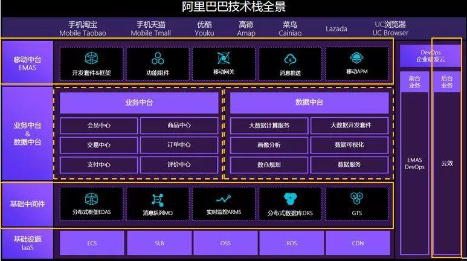
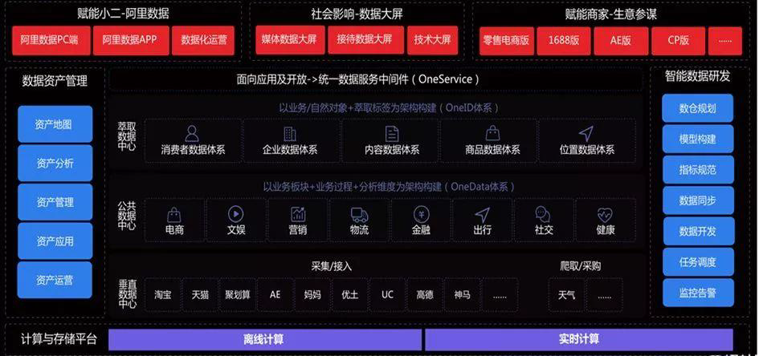
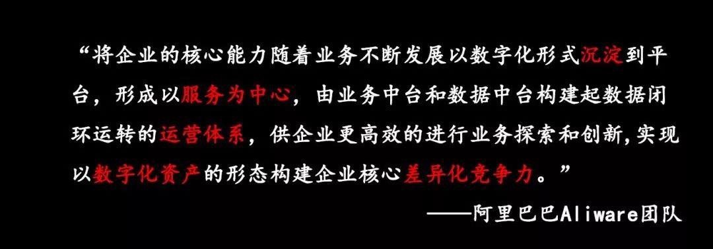
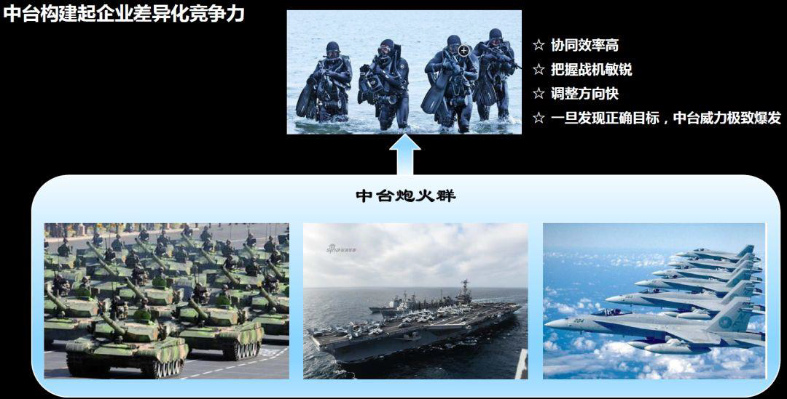
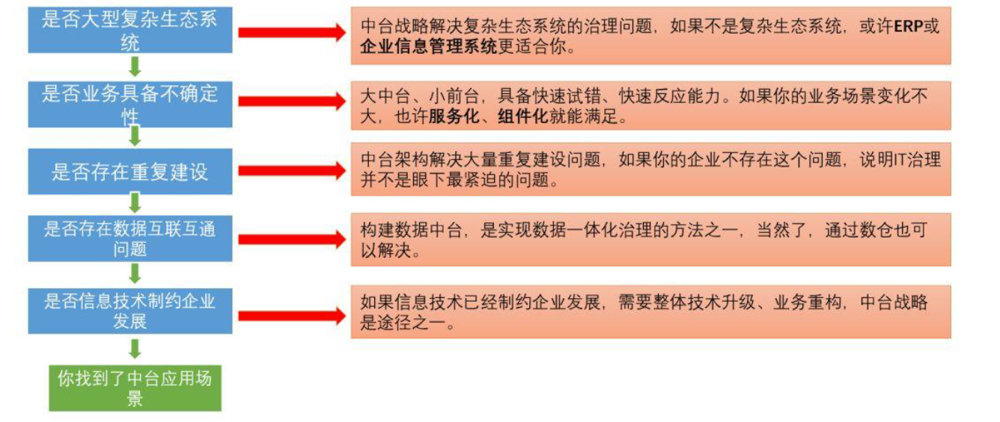
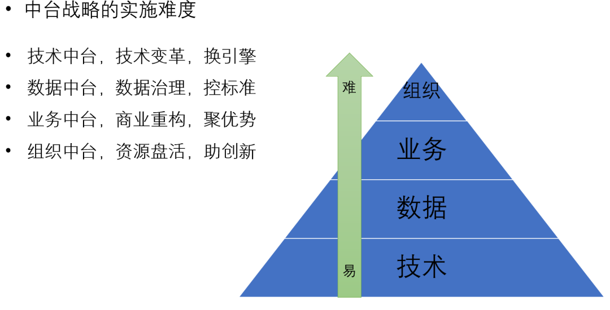

# 中台

## 架构图

**参考阿里巴巴（****大中台、小前台、轻后台****）**

阿里 **双中台**”**共同支撑的**“**大中台**+**小前台架构**”

学我者生 ，像我者死。商业上如此，技术上亦如此。

## 名词解释

*   能力地图：能够把公司业务生态中的能力全部呈现出来，今后所有的业务方需要做业务规划，业务创新，都可以到这儿来寻找需要的基础能力。

## 中台理解

*   **业务中台**将后台资源进行抽象包装整合，转化为前台友好的可重用共享的核心能力，实现了后端业务资源到前台易用能力的转化。

*   **数据中台**从后台及业务中台将数据流入，完成海量数据的存储、计算、产品化包装过程，构成企业的核心数据能力，为前台基于数据的定制化创新和业务中台基于数据反馈的持续演进提供了强大支撑。&#x20;

*   **技术中台**，就是将使用云或其他基础设施的能力，以及应用各种技术中间件的能力，进行整合和包装。过滤掉技术细节，提供简单一致、易于使用的应用技术基础设施的能力接口，助力前台和业务中台数据中台的快速建设

*   **移动中台**是构建在业务&数据中台之上，为更好更快地利用中台能力、快速迭代移动端产品，又生生地挤出（或是说沉淀）出了一个新的中台层。

**业务中台与数据中台相辅相成、互相支撑，一起构建起了战场强大的后方炮火群和雷达阵**。**移动中台建立在业务数据双中台之上，更靠近移动前端战场，我们可以类比成战场上的坦克群，近距离支撑一线战场。**

中台战略能解决未来问题，是一种能力沉淀，是企业数字化转型的最佳落地实践，可以让企业持续前进、加速奔跑。但在设计和实施的过程中要结合企业自身情况决策，不能盲从。

### 中台架构解决什么问题？

简单的说，中台架构是解决企业复杂生态协作问题的方法论。&#x20;

中台的目标，是通过中台治理的理念和方法，让企业降低成本，提升协作效率。&#x20;

中台的实现手段，是通过制定符合企业实际情况和文化的标准和规范。&#x20;

中台治理方法的原则：集中管控，分布式执行。

### 总结

*   技术中台提供了自建系统部分的技术支撑能力，帮助我们解决了基础设施，分布式数据库等底层技术问题，为前台特种兵提供了精良的武器装备。

*   移动中台提供了战场一线火力支援能力，帮助我们提供更加个性化的服务，增强用户体验，为战场提供了陆军支援能力，随机应变，所向披靡。

*   业务中台提供重用服务，例如用户中心，订单中心之类的开箱即用可重用能力，为战场提供了强大的后台炮火支援能力，随叫随到，威力强大

*   数据中台提供了数据分析能力，帮助我们从数据中学习改进，调整方向，为战场提供了强大及时的雷达监测能力，帮助我们掌控战场。

*   研发中台提供了自建系统部分的管理和技术实践支撑能力，帮助我们快速搭建项目，管理进度，测试，持续集成，持续交付，是前台特种兵的训练基地及快速送达战场的机动运输部队

*   组织中台为我们的项目提供投资管理、风险管理、资源调度等，是战场的指挥部，战争的大脑，指挥前线，调度后方。

## 业务中台

业务中台也不是什么都做，除了有基本的基础服务和服务能力外，还要定义中台的边界。业务中台需要能够对接能力，同时又服务好能力使用方，而自己并不负责实现具体的业务。

## 数据中台

阿里巴巴的数据处理经历了四个阶段，分别是：&#x20;

一. 数据库阶段，主要是OLTP（联机事务处理）的需求；&#x20;

二. 数据仓库阶段，OLAP（联机分析处理）成为主要需求；&#x20;

三. 数据平台阶段，主要解决BI和报表需求的技术问题；&#x20;

四. 数据中台阶段，通过系统来对接OLTP（事务处理）和OLAP（报表分析）的需求，强调数据业务化的能力。

### 数据中台的建设步骤

第一，组织架构升级。比如以前负责数据的部门或团队往往缺乏话语权，面对业务需求往往是被动的接受的角色，这让一切数据中台的想法化为泡影，需要为数据中台团队授权。&#x20;

第二，工作方式的改变。现在很多企业的数据团队的主要工作内容就是项目管理、需求管理等等，当一个项目完成后又投入到下一个项目，做好一个需求后又开始负责下一个需求，这样的工作确实非常锻炼人的组织、协调能力，但这样能力的提升与工作时间的长短并不是呈线性增长的，虽然增加了项目和需求管理经验，但并不能在某一个专业领域得到知识和经验的沉淀，随着时间的流逝，越来越多的人会失去最初的工作积极性和创造性，事实上，数据人员只有深入的研究业务、数据和模型，端到端的去实践，打造出数据中台，才是最大的价值创造，才能使得持续创新成为可能

第三，角色的转换。数据中台的团队要从传统的支撑角色逐步向运营转变，不仅在数据上，在业务上也要努力赶超业务人员，中台人员要逐步建立起对于业务的话语权，不仅仅是接受需求的角色，更要能提出合理的建议，能为业务带来新的增长点，比如数据驱动营销。

第四，适合企业特点。好的中台是当你深入了解业务、产品、系统、组织，而且不仅了解今天在哪里，还要了解过去是怎么演变而来，未来又会怎么演化。只有当了解所有的东西之后，才能做出较好的中台架构设计。

## 技术中台

技术中台，就是将使用云或其他基础设施的能力，以及应用各种技术中间件的能力，进行整合和包装。过滤掉技术细节，提供简单一致、易于使用的应用技术基础设施的能力接口，助力前台和业务中台数据中台的快速建设

## 移动中台

移动中台是构建在业务&数据中台之上，为更好更快地利用中台能力、快速迭代移动端产品，又生生地挤出（或是说沉淀）出了一个新的中台层。

移动中台不仅提供前端技术框架，还支持后台系统快速搭建，通过场景化组件体系，提供三深三式设计框架、场景组件、适合供应链系统的组件解决方案

## 研发中台

研发中台，主要关注与开发效能管理，软件开发是一项工程，涉及到管理、流程、测试、团队协作等方面。如何将企业的开发流程最佳实践沉淀成可重用的 “能力”，从而助力创新性应用的快速开发迭代，是很多企业在做的事情。

如果说技术中台为前台应用提供了基础设施重用的能力，那研发中台就为前台应用提供了流程和质量管控以及持续交付的能力。

## 中台建设

*   找切入点，解决具体业务问题

*   明确目标、范围

### 建设流程

*   规划

*   建设&#x20;

*   治理&#x20;

*   进化

如何建设中台？

*   领域分析，考虑领域边界，建立领域模型

*   服务粒度

*   关键场景

如何管控中台？

*   服务变更

*   链路监控

*   容量预测

### 如何判断一个企业要不要上中台？

参照“美国国家标准技术研究院”的技术战略选择分析流程图，来给企业来做个诊断，如下图所示：

### 各中台实施难易度分析&#x20;

技术中台、数据中台、业务中台、组织中台，在整个中台建设实施过程中的难易度

### 有哪些坑

第一，组织架构不匹配中台架构

第二，需求治理缺失，大量浪费资源（**建立以价值为导向的需求管理闭环**）

第三，中台部渐渐脱离一线业务，成为鸡肋中台

第四，一把手不重视中台建设

第五，幻想着中台战略一步到位

第六，认为中台包治百病 （**中台建设，首先要定义问题，越聚焦越能够产生好的效果**）

## 实践

基于业务领域封装

## 总结

**企业中台的技术本质是共性和个性的分离**

共性体现在中台架构层：共性业务抽象、业务逻辑解耦、业务数据隔离、分布式技术架构等特点。&#x20;

个性化体现在前端应用：快速组合服务、个性业务扩展、灵活业务适应

一切业务数据化，一切数据业务化，对外的体现是业务和数据双中台。
