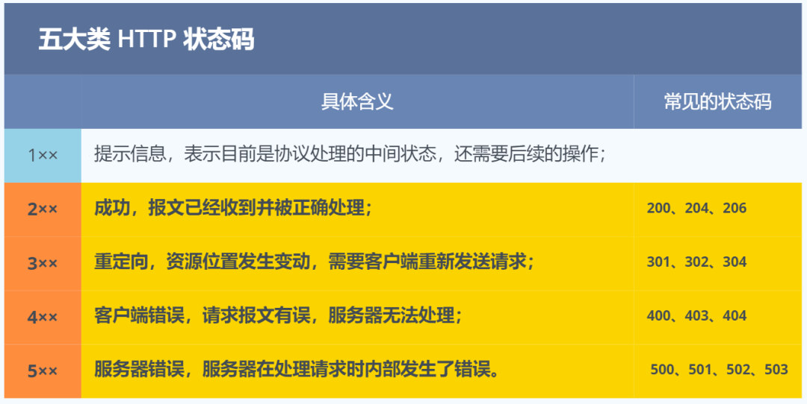
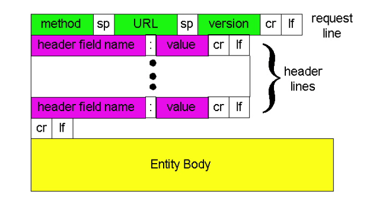
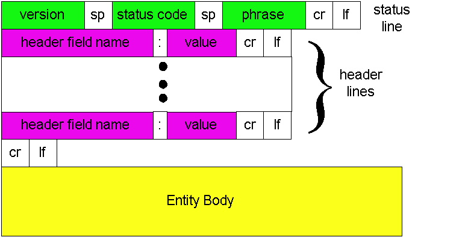
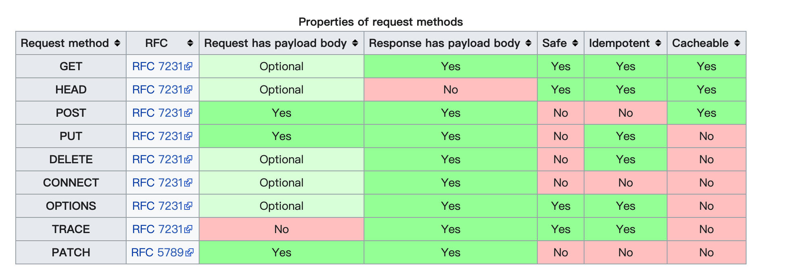
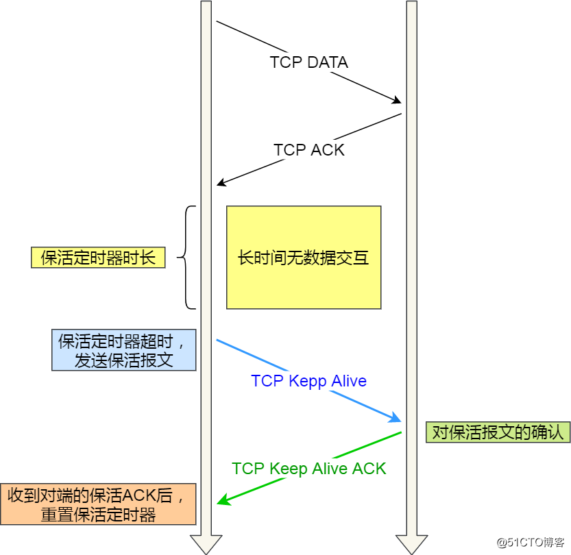
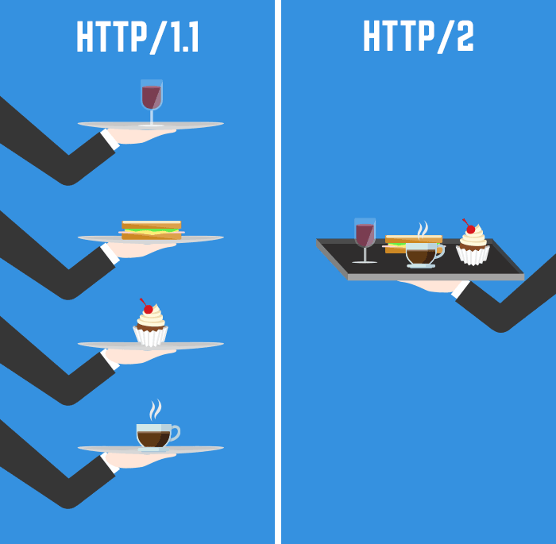
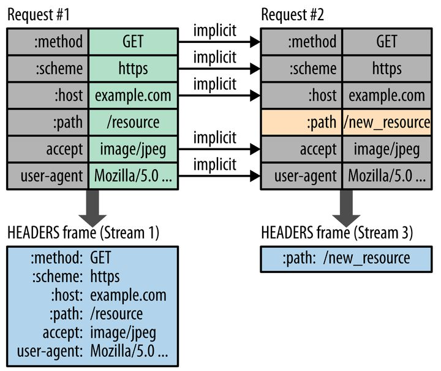
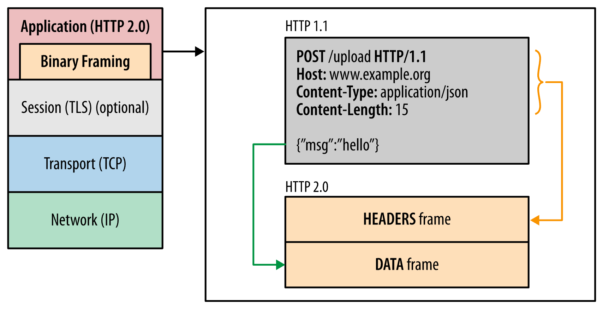
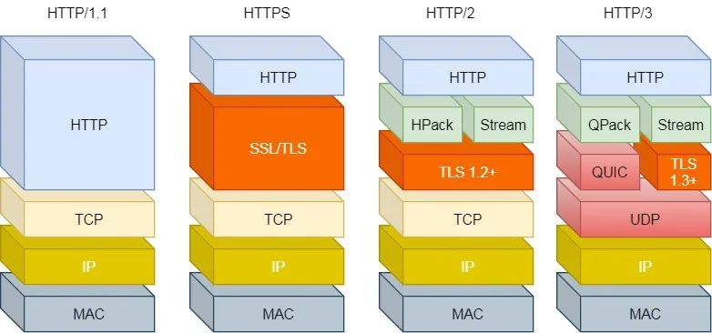
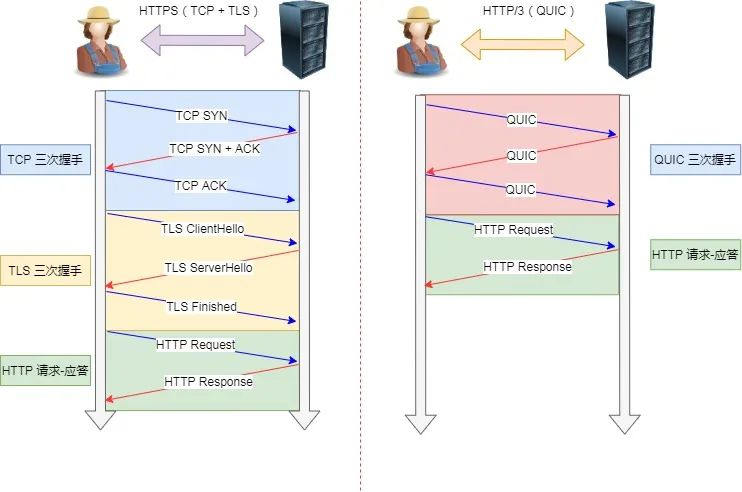

# HTTP

## 定义

> **超文本传输协议**（英语：**H**yper**T**ext **T**ransfer **P**rotocol，缩写：**HTTP**）是一种用于分布式、协作式和[超媒体](https://zh.wikipedia.org/wiki/超媒體 "超媒体")信息系统的[应用层](https://zh.wikipedia.org/wiki/应用层 "应用层")[协议](https://zh.wikipedia.org/wiki/网络传输协议 "协议")。HTTP是[万维网](https://zh.wikipedia.org/wiki/全球資訊網 "万维网")的数据通信的基础。
>
> 设计HTTP最初的目的是为了提供一种发布和接收[HTML](https://zh.wikipedia.org/wiki/HTML "HTML")页面的方法。通过HTTP或者[HTTPS](https://zh.wikipedia.org/wiki/HTTPS "HTTPS")协议请求的资源由[统一资源标识符](https://zh.wikipedia.org/wiki/统一资源标志符 "统一资源标识符")（Uniform Resource Identifiers，URI）来标识。
>
> HTTP的发展是由[蒂姆·伯纳斯-李](https://zh.wikipedia.org/wiki/提姆·柏內茲-李 "蒂姆·伯纳斯-李")于1989年在[欧洲核子研究组织](https://zh.wikipedia.org/wiki/歐洲核子研究組織 "欧洲核子研究组织")（CERN）所发起。HTTP的标准制定由[万维网协会](https://zh.wikipedia.org/wiki/万维网联盟 "万维网协会")（World Wide Web Consortium，W3C）和[互联网工程任务组](https://zh.wikipedia.org/wiki/互联网工程任务组 "互联网工程任务组")（Internet Engineering Task Force，IETF）进行协调，最终发布了一系列的[RFC](https://zh.wikipedia.org/wiki/RFC "RFC")，其中最著名的是1999年6月公布的 [RFC 2616](https://tools.ietf.org/html/rfc2616 "RFC 2616")，定义了HTTP协议中现今广泛使用的一个版本——HTTP 1.1。
>
> 2014年12月，[互联网工程任务组](https://zh.wikipedia.org/wiki/互联网工程任务组 "互联网工程任务组")（IETF）的Hypertext Transfer Protocol Bis（httpbis）工作小组将[HTTP/2](https://zh.wikipedia.org/wiki/HTTP/2 "HTTP/2")标准提议递交至[IESG](https://zh.wikipedia.org/w/index.php?title=IESG\&action=edit\&redlink=1 "IESG")进行讨论 于2015年2月17日被批准。 HTTP/2标准于2015年5月以RFC 7540正式发表，取代HTTP 1.1成为HTTP的实现标准。

HTTP 协议是一个**双向协议**。理解「超文本」，它就是**超越了普通文本的文本**，它是文字、图片、视频等的混合体最关键有超链接，能从一个超文本跳转到另外一个超文本

## 状态码

*   1 消息类 这一类型的状态码，代表请求已被接受，需要继续处理。

*   2 成功类 这一类型的状态码，代表请求已成功被服务器接收、理解、并接受

*   3 重定向 这类状态码代表需要客户端采取进一步的操作才能完成请求

*   4 请求错误 这类的状态码代表了客户端看起来可能发生了错误，妨碍了服务器的处理

*   5 服务器错误 这类状态码代表了服务器在处理请求的过程中有错误或者异常状态发生&#x20;



## 常见字段

[https://en.wikipedia.org/wiki/List\_of\_HTTP\_header\_fields](https://en.wikipedia.org/wiki/List_of_HTTP_header_fields "https://en.wikipedia.org/wiki/List_of_HTTP_header_fields")

| 首部字段名             | 说明            |
| ----------------- | ------------- |
| Cache-Control     | 控制缓存的行为       |
| Connection        | 逐挑首部、连接的管理    |
| Date              | 创建报文的日期时间     |
| Pragma            | 报文指令          |
| Trailer           | 报文末端的首部一览     |
| Transfer-Encoding | 指定报文主体的传输编码方式 |
| Upgrade           | 升级为其他协议       |
| Via               | 代理服务器的相关信息    |
| Warning           | 错误通知          |

### 请求首部字段(request header)

| 首部字段名               | 说明                                |
| ------------------- | --------------------------------- |
| Accept              | 用户代理可处理的媒体类型                      |
| Accept-Charset      | 优先的字符集                            |
| Accept-Encoding     | 优先的内容编码                           |
| Accept-Language     | 优先的语言（自然语言）                       |
| Authorization       | Web认证信息                           |
| Expect              | 期待服务器的特定行为                        |
| From                | 用户的电子邮箱地址                         |
| Host                | 请求资源所在服务器                         |
| If-Match            | 比较实体标记（ETag）                      |
| If-Modified-Since   | 比较资源的更新时间                         |
| If-None-Match       | 比较实体标记（与 If-Macth 相反）             |
| If-Range            | 资源未更新时发送实体 Byte 的范围请求             |
| If-Unmodified-Since | 比较资源的更新时间(与 If-Modified-Since 相反) |
| Max-Forwards        | 最大传输逐跳数                           |
| Proxy-Authorization | 代理服务器要求客户端的认证信息                   |
| Range               | 实体的字节范围请求                         |
| Referer             | 对请求中 URI 的原始获取方                   |
| TE                  | 传输编码的优先级                          |
| User-Agent          | HTTP 客户端程序的信息                     |

### 缓存请求指令

| 指令                | 参数  | 说明             |
| ----------------- | --- | -------------- |
| no-cache          | 无   | 强制向服务器再次验证     |
| no-store          | 无   | 不缓存请求或响应的任何内容  |
| max-age = \[秒]    | 必需  | 响应的最大Age值      |
| max-stale( =\[秒]) | 可省略 | 接收已过期的响应       |
| min-fresh = \[秒]  | 必需  | 期望在指定时间内的响应仍有效 |
| no-transform      | 无   | 代理不可更改媒体类型     |
| only-if-cached    | 无   | 从缓存获取资源        |
| cache-extension   | -   | 新指令标记（token）   |

### 缓存响应指令

| 指令               | 参数  | 说明                      |
| ---------------- | --- | ----------------------- |
| public           | 无   | 可向任意方提供响应的缓存            |
| private          | 可省略 | 仅向特定用户返回响应              |
| no-cache         | 可省略 | 缓存前必须先确认其有效性            |
| no-store         | 无   | 不缓存请求或响应的任何内容           |
| no-transform     | 无   | 代理不可更改媒体类型              |
| must-revalidate  | 无   | 可缓存但必须再向源服务器进行确认        |
| proxy-revalidate | 无   | 要求中间缓存服务器对缓存的响应有效性再进行确认 |
| max-age = \[秒]   | 必需  | 响应的最大Age值               |
| s-maxage = \[秒]  | 必需  | 公共缓存服务器响应的最大Age值        |
| cache-extension  | -   | 新指令标记（token）            |

### 响应首部字段（response header）

| 首部字段名              | 说明             |
| ------------------ | -------------- |
| Accept-Ranges      | 是否接受字节范围请求     |
| Age                | 推算资源创建经过时间     |
| ETag               | 资源的匹配信息        |
| Location           | 令客户端重定向至指定 URI |
| Proxy-Authenticate | 代理服务器对客户端的认证信息 |
| Retry-After        | 对再次发起请求的时机要求   |
| Server             | HTTP 服务器的安装信息  |
| Vary               | 代理服务器缓存的管理信息   |
| WWW-Authenticate   | 服务器对客户端的认证信息   |

## 报文格式

### http 请求报文通用格式

**HTTP 协议的请求报文和响应报文的结构基本相同**，由三大部分组成：

*   起始行（start line）：描述请求或响应的基本信息；

*   头部字段集合（header）：使用 key-value 形式更详细地说明报文；

*   消息正文（entity）：实际传输的数据，它不一定是纯文本，可以是图片、视频等二进制数据。



两者之间由空行（CR + LF）分割开。

**空行（CR + LF）**

*   CR（Carriage Return 回车符：16进制的 0x0d）

*   LF（Lind Feed 换行符：16进制的 0x0a）

更多信息可以参考： [https://developer.mozilla.org/zh-CN/docs/Web/HTTP/Messages](https://developer.mozilla.org/zh-CN/docs/Web/HTTP/Messages "https://developer.mozilla.org/zh-CN/docs/Web/HTTP/Messages")

### http 响应报文通用格式



## 方法

HTTP/1.1协议中共定义了八种方法（有时也叫“动作”），来表明Request-URL指定的资源不同的操作方式

HTTP1.0定义了三种请求方法： GET, POST 和 HEAD方法。

HTTP1.1新增了五种请求方法：OPTIONS, PUT, DELETE, TRACE 和 CONNECT 方法



| Request method | RFC                                                                                                                        | Request has payload body | Response has payload body | Safe | Idempotent | Cacheable |
| -------------- | -------------------------------------------------------------------------------------------------------------------------- | ------------------------ | ------------------------- | ---- | ---------- | --------- |
| GET            | [RFC](https://en.wikipedia.org/wiki/RFC_\(identifier\) "RFC") [7231](https://datatracker.ietf.org/doc/html/rfc7231 "7231") | Optional                 | Yes                       | Yes  | Yes        | Yes       |
| HEAD           | [RFC](https://en.wikipedia.org/wiki/RFC_\(identifier\) "RFC") [7231](https://datatracker.ietf.org/doc/html/rfc7231 "7231") | Optional                 | No                        | Yes  | Yes        | Yes       |
| POST           | [RFC](https://en.wikipedia.org/wiki/RFC_\(identifier\) "RFC") [7231](https://datatracker.ietf.org/doc/html/rfc7231 "7231") | Yes                      | Yes                       | No   | No         | Yes       |
| PUT            | [RFC](https://en.wikipedia.org/wiki/RFC_\(identifier\) "RFC") [7231](https://datatracker.ietf.org/doc/html/rfc7231 "7231") | Yes                      | Yes                       | No   | Yes        | No        |
| DELETE         | [RFC](https://en.wikipedia.org/wiki/RFC_\(identifier\) "RFC") [7231](https://datatracker.ietf.org/doc/html/rfc7231 "7231") | Optional                 | Yes                       | No   | Yes        | No        |
| CONNECT        | [RFC](https://en.wikipedia.org/wiki/RFC_\(identifier\) "RFC") [7231](https://datatracker.ietf.org/doc/html/rfc7231 "7231") | Optional                 | Yes                       | No   | No         | No        |
| OPTIONS        | [RFC](https://en.wikipedia.org/wiki/RFC_\(identifier\) "RFC") [7231](https://datatracker.ietf.org/doc/html/rfc7231 "7231") | Optional                 | Yes                       | Yes  | Yes        | No        |
| TRACE          | [RFC](https://en.wikipedia.org/wiki/RFC_\(identifier\) "RFC") [7231](https://datatracker.ietf.org/doc/html/rfc7231 "7231") | No                       | Yes                       | Yes  | Yes        | No        |
| PATCH          | [RFC](https://en.wikipedia.org/wiki/RFC_\(identifier\) "RFC") [5789](https://datatracker.ietf.org/doc/html/rfc5789 "5789") | Yes                      | Yes                       | No   | No         | No        |

## 无状态

http协议是无状态的，为了解决http stateless 无状态问题，引出了 cookie session 和token的解决方案，可以让请求和响应带有状态数据。

**cookie**

cookie是保存在本地终端的数据。cookie由服务器生成，发送给浏览器，浏览器把cookie以kv形式保存到某个目录下的文本文件内，下一次请求同一网站时会把该cookie发送给服务器。由于cookie是存在客户端上的，所以浏览器加入了一些限制确保cookie不会被恶意使用，同时不会占据太多磁盘空间，所以每个域的cookie数量是有限的。

**session**

session的中文翻译是“会话”，当用户打开某个web应用时，便与web服务器产生一次session。服务器使用session把用户的信息临时保存在了服务器上，用户离开网站后session会被销毁。这种用户信息存储方式相对cookie来说更安全，可是session有一个缺陷：如果web服务器做了负载均衡，那么下一个操作请求到了另一台服务器的时候session会丢失。

**token**

token的意思是“令牌”，是用户身份的验证方式，最简单的token组成:uid(用户唯一的身份标识)、time(当前时间的时间戳)、sign(签名，由token的前几位+盐以哈希算法压缩成一定长的十六进制字符串，可以防止恶意第三方拼接token请求服务器)。还可以把不变的参数也放进token，避免多次查库。

**token 认证**

这是一种 SPA 应用和 APP 经常使用的认证方法。它是一种无状态的认证方法。

客户端首先将用户信息发送给服务端，服务端根据用户信息+私钥生成一个唯一的 Token 并返回给客户端。Token 只保存在客户端，之后客户端的每个请求头中都携带 Token，而服务端只通过运算（无需查询）来验证用户。

优点：

*   Token 只保存在客户端，因此不影响服务端扩展性。

*   为用户生成的 Token 可以在多个客户端共用。

缺点：

*   Token 包含了用户的全部信息，不只是如 SessionID 类似的一个 ID 值，因此会增加每次请求包的大小。

目前使用较多的是基于[JWT](../JWT/JWT.md "JWT")(JSON Web Tokens) 的 Token 认证法。

**cookie 和session的区别**

1.  cookie数据存放在客户的浏览器上，session数据放在服务器上。&#x20;

2.  cookie不是很安全，别人可以分析存放在本地的COOKIE并进行COOKIE欺骗    考虑到安全应当使用session。

3.  session会在一定时间内保存在服务器上。当访问增多，会比较占用你服务器的性能    考虑到减轻服务器性能方面，应当使用COOKIE。

4.  单个cookie保存的数据不能超过4K，很多浏览器都限制一个站点最多保存20个cookie。

5.  建议将登陆信息等重要信息存放为SESSION    其他信息如果需要保留，可以放在COOKIE中

**token 和session的区别**

session 和 oauth token并不矛盾，作为身份认证 token安全性比session好，因为每个请求都有签名还能防止监听以及重放攻击，而session就必须靠链路层来保障通讯安全了。如上所说，如果你需要实现有状态的会话，仍然可以增加session来在服务器端保存一些状态     App通常用restful api跟server打交道。Rest是stateless的，也就是app不需要像browser那样用cookie来保存session,因此用session token来标示自己就够了，session/state由api server的逻辑处理。 如果你的后端不是stateless的rest api, 那么你可能需要在app里保存session.可以在app里嵌入webkit,用一个隐藏的browser来管理cookie session。

&#x20;Session 是一种HTTP存储机制，目的是为无状态的HTTP提供的持久机制。所谓Session 认证只是简单的把User 信息存储到Session 里，因为SID 的不可预测性，暂且认为是安全的。这是一种认证手段。 而Token ，如果指的是OAuth Token 或类似的机制的话，提供的是 认证 和 授权 ，认证是针对用户，授权是针对App 。其目的是让 某App有权利访问 某用户 的信息。这里的 Token是唯一的。不可以转移到其它 App上，也不可以转到其它 用户 上。 转过来说Session 。Session只提供一种简单的认证，即有此 SID，即认为有此 User的全部权利。是需要严格保密的，这个数据应该只保存在站方，不应该共享给其它网站或者第三方App。 所以简单来说，如果你的用户数据可能需要和第三方共享，或者允许第三方调用 API 接口，用 Token 。如果永远只是自己的网站，自己的 App，用什么就无所谓了。 &#x20;

&#x20;token就是令牌，比如你授权（登录）一个程序时，他就是个依据，判断你是否已经授权该软件；cookie就是写在客户端的一个txt文件，里面包括你登录信息之类的，这样你下次在登录某个网站，就会自动调用cookie自动登录用户名；session和cookie差不多，只是session是写在服务器端的文件，也需要在客户端写入cookie文件，但是文件里是你的浏览器编号.Session的状态是存储在服务器端，客户端只有session id；而Token的状态是存储在客户端。

**利用 Cookie 管理 Session**


### session

JavaEE规范中，session被定义为一个具体的接口，javax.servlet.http.HttpSession，这个接口最终由符合JavaEE规范的应用服务器来实现，如我们最常用的Tomcat、Weblogic、Websphere等，session通常是存储在服务器内存中的(也有其它存储方式，但这里只讨论这种情况)，也就是说session是服务器创建的，而不是浏览器创建的

**session的创建过程（tomcat）**

sessionId是tomcat加上去的， tomcat的ManagerBase类提供创建sessionid的方法：随机数+时间+jvmid；

**解决session相关问题的技术方案**

session一共有两个问题需要解决：&#x20;

1.  session的存储应该独立于web容器，也要独立于部署web容器的服务器

2.  如何进行高效的session同步。

在讲到解决这些问题之前，我们首先要考虑下session如何存储才是高效，是存在内存、文件还是数据库？文件和数据库的存储方式都是将session的数据固化到硬盘上，操作硬盘的方式就是IO，IO操作的效率是远远低于操作内存的数据，因此文件和数据库存储方式是不可取的，所以将session数据存储到内存是最佳的选择。因此最好的解决方案就是使用分布式缓存技术，例如：memcached和redis，将session信息的存储独立出来也是解决session同步问题的方法。

基于 Cookie 的 SessionID 易被截获生成 [CSRF](../../安全/CSRF/CSRF.md "CSRF") 攻击

[HTTP Basic, Session, Token 三种认证方法](https://www.atjiang.com/http-authentications-basic-session-token/ "HTTP Basic, Session, Token 三种认证方法")

### KeepAlive

**http的keep-alive有别于TCP的keep-alive。**

HTTP协议的Keep-Alive意图在于连接复用，同一个连接上串行方式传递请求-响应数据。在第一个 HTTP 请求完后，先不断开 TCP 连接，让后续的 HTTP 请求继续使用此连接。可以使用同一个 TCP 连接来发送和接收多个 HTTP 请求/应答，避免了连接建立和释放的开销，这个方法称为 HTTP 长连接。

从 HTTP 1.1 开始， 就默认是开启了 Keep-Alive，如果要关闭 Keep-Alive，需要在 HTTP 请求的包头里添加

```text
Connection:close
```

在客户端和服务端间的网络一切正常、且双方都没主动发起关闭连接的请求时，此TCP连接理论上可以永久保持。但是，网络情况是及其复杂的，**在双方长时间未通讯时，如何得知对方还活着？如何得知这个TCP连接是健康且具有通讯能力的？**

TCP的保活机制就是用来解决此类问题，这个机制我们也可以称作：keepalive。当客户端和服务端长达一定时间没有进行数据交互时，内核为了确保该连接是否还有效，就会发送探测报文，来检测对方是否还在线，然后来决定是否要关闭该连接。

如果两端的 TCP 连接一直没有数据交互，达到了触发 TCP 保活机制的条件，那么内核里的 TCP 协议栈就会发送探测报文。

如果对端程序是正常工作的。当 TCP 保活的探测报文发送给对端, 对端会正常响应，这样 TCP 保活时间会被重置，等待下一个 TCP 保活时间的到来。
如果对端主机崩溃，或对端由于其他原因导致报文不可达。当 TCP 保活的探测报文发送给对端后，石沉大海，没有响应，连续几次，达到保活探测次数后，TCP 会报告该 TCP 连接已经死亡。
所以，TCP 保活机制可以在双方没有数据交互的情况，通过探测报文，来确定对方的 TCP 连接是否存活，这个工作是在内核完成的。



## HTTP1.0

`HTTP1.0`默认是短连接，每次与服务器交互，都需要新开一个连接。

早期 HTTP/1.0 性能上的一个很大的问题，那就是每发起一个请求，都要新建一次 TCP 连接（三次握手），而且是串行请求，做了无畏的 TCP 连接建立和断开，增加了通信开销。

## HTTP1.1

为了解决HTTP1.0 TCP 连接问题，HTTP/1.1 提出了**长连接**的通信方式，也叫持久连接。这种方式的好处在于减少了 TCP 连接的重复建立和断开所造成的额外开销，减轻了服务器端的负载。

持久连接的特点是，只要任意一端没有明确提出断开连接，则保持 TCP 连接状态。


HTTP/1.1 采用了长连接的方式，这使得管道（pipeline）网络传输成为了可能。

即可在同一个 TCP 连接里面，客户端可以发起多个请求，只要第一个请求发出去了，不必等其回来，就可以发第二个请求出去，可以**减少整体的响应时间。**

但是服务器还是按照**顺序**，先回应 A 请求，完成后再回应 B 请求。要是 前面的回应特别慢，后面就会有许多请求排队等着。这称为「队头堵塞」。

&#x20;**Chrome有个机制，对于同一个域名，默认允许同时建立 6 个 TCP持久连接**，使用持久连接时，虽然能公用一个TCP管道，**但是在一个管道中同一时刻只能处理一个请求**，在当前的请求没有结束之前，其他的请求只能处于阻塞状态。

### 小结

*   最主要的是**默认持久连接**。只要客户端服务端任意一端没有明确提出断开TCP连接，就一直保持连接，可以发送多次HTTP请求。

*   其次就是**断点续传**（Chunked transfer-coding）。利用HTTP消息头使用分块传输编码，将实体主体分块传输。

但 HTTP/1.1 还是有性能瓶颈：

*   请求 / 响应头部（Header）未经压缩就发送，首部信息越多延迟越大。只能压缩 `Body` 的部分；

*   发送冗长的首部。每次互相发送相同的首部造成的浪费较多；

*   服务器是按请求的顺序响应的，如果服务器响应慢，会招致客户端一直请求不到数据，也就是队头阻塞；

*   没有请求优先级控制；

*   请求只能从客户端开始，服务器只能被动响应。

## HTTP2

RFC:

*   Hypertext Transfer Protocol version 2 - [RFC7540](https://datatracker.ietf.org/doc/html/rfc7540 "RFC7540")

*   HPACK - Header Compression for HTTP/2 - [RFC7541](https://datatracker.ietf.org/doc/html/rfc7541 "RFC7541")

HTTP/2 协议是基于 HTTPS 的，所以 HTTP/2 的安全性也是有保障的。




### HTTP/2 相比 HTTP/1.1 性能上的改进：

**头部压缩**

HTTP/2 会**压缩头**（Header）如果你同时发出多个请求，他们的头是一样的或是相似的，那么，协议会帮你**消除重复的部分**。

这就是所谓的 `HPACK` 算法：在客户端和服务器同时维护一张头信息表，所有字段都会存入这个表，生成一个索引号，以后就不发送同样字段了，只发送索引号，这样就**提高速度**了。



客户端发了两次请求，第一次请求有完整的http报文头部，第二次请求的时候只有一个path的字段不一样，但是这次报文头它只需要发送一个path的字段就好了，这样就大大减少了发送的量。这个的实现要求客户端和服务同时维护一个报文头表。上面提到的少了4kb的流量很可能是这个节省下来的。这个的意义还是很大的，因为动态请求有时候可能只需要发送几个字节的数据，但却需要发送一个几百个字节的报文头（500 \~ 800）

**二进制格式**

HTTP/2 不再像 HTTP/1.1 里的纯文本形式的报文，而是全面采用了**二进制格式。**

头信息和数据体都是二进制，并且统称为帧（frame）：**头信息帧和数据帧**。


这样虽然对人不友好，但是对计算机非常友好，因为计算机只懂二进制，那么收到报文后，无需再将明文的报文转成二进制，而是直接解析二进制报文，这**增加了数据传输的效率**。



**数据流**

HTTP/2 的数据包不是按顺序发送的，同一个连接里面连续的数据包，可能属于不同的回应。因此，必须要对数据包做标记，指出它属于哪个回应。

每个请求或回应的所有数据包，称为一个数据流（`Stream`）。

每个数据流都标记着一个独一无二的编号，其中规定客户端发出的数据流编号为奇数， 服务器发出的数据流编号为偶数

客户端还可以**指定数据流的优先级**。优先级高的请求，服务器就先响应该请求。


***多路复用***

HTTP/2 是可以在**一个连接中并发多个请求或回应，而不用按照顺序一一对应**。

移除了 HTTP/1.1 中的串行请求，不需要排队等待，也就不会再出现「队头阻塞」问题，**降低了延迟，大幅度提高了连接的利用率**。

多路复用，就是在一个 TCP 连接中可以存在多条流，也就是可以发送多个请求，服务端则可以通过帧中的标识知道该帧属于哪个流（即请求），通过重新排序还原请求。多路复用允许并发的发起多个请求，每个请求及该请求的响应不需要等待其他的请求或响应，避免了线头阻塞问题。这样某个请求任务耗时严重，不会影响到其它连接的正常执行,极大的提高传输性能。

举例来说，在一个 TCP 连接里，服务器收到了客户端 A 和 B 的两个请求，如果发现 A 处理过程非常耗时，于是就回应 A 请求已经处理好的部分，接着回应 B 请求，完成后，再回应 A 请求剩下的部分。


**服务器推送**

HTTP/2 还在一定程度上改善了传统的「请求 - 应答」工作模式，服务不再是被动地响应，也可以**主动**向客户端发送消息。

举例来说，在浏览器刚请求 HTML 的时候，就提前把可能会用到的 JS、CSS 文件等静态资源主动发给客户端，**减少延时的等待**，也就是服务器推送（Server Push，也叫 Cache Push）。

### 小结

在`HTTP1.1`提出了管线化(pipelining)理论，但是默认都是关闭的。而`HTTP/2`允许同时通过单一的TCP连接发起**多个的请求和响应消息**

不再以文本的方式传输，采用**二进制分帧层**，对头部进行了压缩，支持流的控制

## HTTP3

*   `HTTP1.x`和`HTTP/2`底层都是TCP，而`HTTP/3`底层是UDP。使用`HTTP/3`能够减少**RTT「往返时延」**（TCP三次握手，TLS握手）

HTTP/2 主要的问题在于：多个 HTTP 请求在复用一个 TCP 连接，下层的 TCP 协议是不知道有多少个 HTTP 请求的。

所以一旦发生了丢包现象，就会触发 TCP 的重传机制，这样在一个 TCP 连接中的**所有的 HTTP 请求都必须等待这个丢了的包被重传回来**。

*   HTTP/1.1 中的管道（ pipeline）传输中如果有一个请求阻塞了，那么队列后请求也统统被阻塞住了

*   HTTP/2 多请求复用一个TCP连接，一旦发生丢包，就会阻塞住所有的 HTTP 请求。

这都是基于 TCP 传输层的问题，所以 **HTTP/3 把 HTTP 下层的 TCP 协议改成了 UDP！**



UDP 发生是不管顺序，也不管丢包的，所以不会出现 HTTP/1.1 的队头阻塞 和 HTTP/2 的一个丢包全部重传问题。

大家都知道 UDP 是不可靠传输的，但基于 UDP 的 **QUIC 协议** 可以实现类似 TCP 的可靠性传输。

*   QUIC 有自己的一套机制可以保证传输的可靠性的。当某个流发生丢包时，只会阻塞这个流，**其他流不会受到影响**。

*   TLS 升级成了最新的 `1.3` 版本，头部压缩算法也升级成了 `QPack`。

*   HTTPS 要建立一个连接，要花费 6 次交互，先是建立三次握手，然后是 `TLS/1.3` 的三次握手。QUIC 直接把以往的 TCP 和 `TLS/1.3` 的 6 次交互**合并成了 3 次，减少了交互次数**。



所以， QUIC 是一个在 UDP 之上的**伪** TCP + TLS + HTTP/2 的多路复用的协议。

QUIC 是新协议，对于很多网络设备，根本不知道什么是 QUIC，只会当做 UDP，这样会出现新的问题。所以 HTTP/3 现在普及的进度非常的缓慢，不知道未来 UDP 是否能够逆袭 TCP。

## 参考

*   [https://hpbn.co/http2/](https://hpbn.co/http2/ "https://hpbn.co/http2/")

*   [https://zhuanlan.zhihu.com/p/29609078](https://zhuanlan.zhihu.com/p/29609078 "https://zhuanlan.zhihu.com/p/29609078")

*   [https://blog.51cto.com/u\_14888059/3812567](https://blog.51cto.com/u_14888059/3812567 "https://blog.51cto.com/u_14888059/3812567")

*   [https://blog.csdn.net/ghsau/article/details/13023425](https://blog.csdn.net/ghsau/article/details/13023425 "https://blog.csdn.net/ghsau/article/details/13023425")

*   [https://en.wikipedia.org/wiki/List\_of\_HTTP\_status\_codes](https://en.wikipedia.org/wiki/List_of_HTTP_status_codes "https://en.wikipedia.org/wiki/List_of_HTTP_status_codes")

*   [https://en.wikipedia.org/wiki/List\_of\_HTTP\_header\_fields](https://en.wikipedia.org/wiki/List_of_HTTP_header_fields "https://en.wikipedia.org/wiki/List_of_HTTP_header_fields")

*   [https://mp.weixin.qq.com/s/4epUWMCLpwCBxxQgEbL8gA](https://mp.weixin.qq.com/s/4epUWMCLpwCBxxQgEbL8gA "https://mp.weixin.qq.com/s/4epUWMCLpwCBxxQgEbL8gA")

*   [http://www.yaohaixiao.com/blog/understanding-http-messages/](http://www.yaohaixiao.com/blog/understanding-http-messages/ "http://www.yaohaixiao.com/blog/understanding-http-messages/")

*   [https://www.atjiang.com/http-authentications-basic-session-token/](https://www.atjiang.com/http-authentications-basic-session-token/ "https://www.atjiang.com/http-authentications-basic-session-token/")

*   [https://segmentfault.com/a/1190000020714686#articleHeader16](https://segmentfault.com/a/1190000020714686#articleHeader16 "https://segmentfault.com/a/1190000020714686#articleHeader16")

*   [http://www2.ic.uff.br/\~michael/kr1999/2-application/2\_02-http.htm](http://www2.ic.uff.br/\~michael/kr1999/2-application/2_02-http.htm "http://www2.ic.uff.br/\~michael/kr1999/2-application/2_02-http.htm")

[客户端请求的端口号是什么？](客户端请求的端口号是什么？/客户端请求的端口号是什么？.md "客户端请求的端口号是什么？")
