# HTTPS

> 超文本传输安全协议（英语：HyperText Transfer Protocol Secure，缩写：HTTPS；常称为HTTP over TLS、HTTP over SSL或HTTP Secure）是一种通过计算机网络进行安全通信的传输协议。HTTPS经由HTTP进行通信，但利用SSL/TLS来加密数据包。HTTPS开发的主要目的，是提供对网站服务器的身份认证，保护交换资料的隐私与完整性。这个协议由网景公司（Netscape）在1994年首次提出，随后扩展到互联网上。

*   HTTPS相关的 rfc是：[https://datatracker.ietf.org/doc/html/rfc2818](https://datatracker.ietf.org/doc/html/rfc2818 "https://datatracker.ietf.org/doc/html/rfc2818")

*   TLS 相关的 rfc是：

    *   [https://datatracker.ietf.org/doc/html/rfc5246](https://datatracker.ietf.org/doc/html/rfc5246 "https://datatracker.ietf.org/doc/html/rfc5246")

    *   [https://datatracker.ietf.org/doc/html/rfc8446](https://datatracker.ietf.org/doc/html/rfc8446 "https://datatracker.ietf.org/doc/html/rfc8446")

    *   [https://datatracker.ietf.org/doc/html/rfc6176](https://datatracker.ietf.org/doc/html/rfc6176 "https://datatracker.ietf.org/doc/html/rfc6176")

*   SSL 相关的 rfc 是: [https://datatracker.ietf.org/doc/html/rfc6101](https://datatracker.ietf.org/doc/html/rfc6101 "https://datatracker.ietf.org/doc/html/rfc6101")

## HTTP的问题

HTTP 在传输数据的过程中，所有的数据都是明文传输，不安全！

## HTTPS 原理

### TLS 握手过程

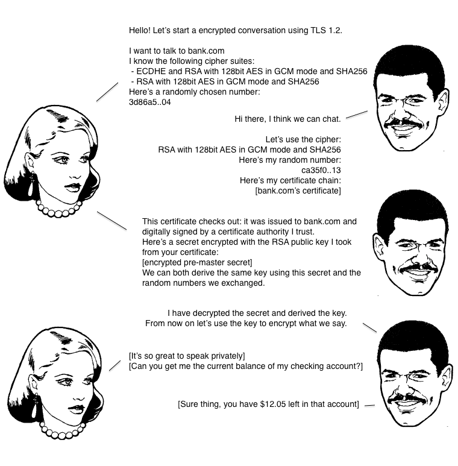

上图 是一个 TLS 握手的流程图，我们来解释一下。

第一步，爱丽丝给出协议版本号、一个客户端生成的随机数（Client random），以及客户端支持的加密方法。

第二步，鲍勃确认双方使用的加密方法，并给出数字证书（参考CA 认证）、以及一个服务器生成的随机数（Server random）。

第三步，爱丽丝确认数字证书有效，然后生成一个新的随机数（Premaster secret），并使用数字证书中的公钥，加密这个随机数，发给鲍勃。

&#x20;              发送内容包括：

&#x20;       （1）一个随机数（`pre-master key`）。**该随机数会被服务器公钥加密**。

&#x20;       （2）加密通信算法改变通知，表示随后的信息都将用「会话秘钥」加密通信。

&#x20;       （3）客户端握手结束通知，表示客户端的握手阶段已经结束。这一项同时把之前所有内容的发生的数据做个摘要[摘要算法](../../算法和数据结构/算法/摘要算法/摘要算法.md "摘要算法")，用来供服务端校验。

第四步，鲍勃使用自己的私钥，获取爱丽丝发来的随机数（即Premaster secret）。

&#x20;         然后，向客户端发生最后的信息：

&#x20; （1）加密通信算法改变通知，表示随后的信息都将用「会话秘钥」加密通信。

&#x20; （2）服务器握手结束通知，表示服务器的握手阶段已经结束。这一项同时把之前所有内容的发生的数据做个摘要[摘要算法](../../算法和数据结构/算法/摘要算法/摘要算法.md "摘要算法")，用来供客户端校验。

第五步，爱丽丝和鲍勃根据约定的加密方法，使用前面的三个随机数，生成"对话密钥"（session key），用来加密接下来的整个对话过程。

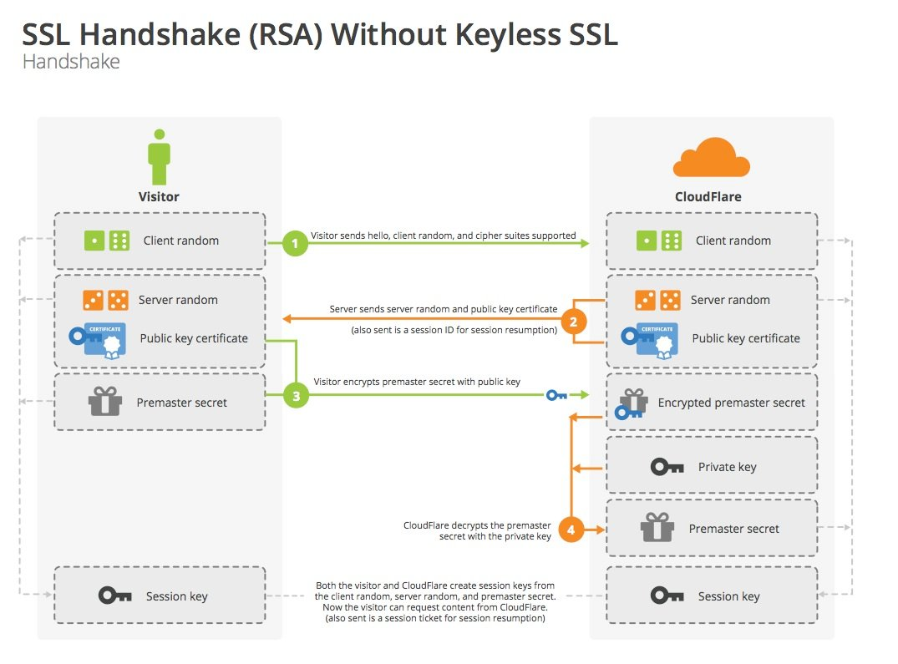

再用技术术语解释一遍：

**TLS 1.2 建立连接**

1.  客户端向服务端发送 Client Hello 消息，其中携带客户端支持的协议版本、加密算法、压缩算法以及**客户端生成的随机数**；

2.  服务端收到客户端支持的协议版本、加密算法等信息后；

    1.  向客户端发送 Server Hello 消息，并携带选择特定的协议版本、加密方法、会话 ID 以及**服务端生成的随机数**；

    2.  向客户端发送 Certificate 消息，即服务端的证书链，其中包含证书支持的域名、发行方和有效期等信息；

    3.  向客户端发送 Server Key Exchange 消息，传递**公钥**以及签名等信息；

    4.  向客户端发送可选的消息 CertificateRequest，验证客户端的证书；

    5.  向客户端发送 Server Hello Done 消息，通知服务端已经发送了全部的相关信息；

3.  客户端收到服务端的协议版本、加密方法、会话 ID 以及证书等信息后，验证服务端的证书；

    1.  向服务端发送 Client Key Exchange 消息，包含**使用服务端公钥加密后的随机字符串**，即预主密钥（Pre Master Secret）；

    2.  向服务端发送 Change Cipher Spec 消息，通知服务端后面的数据段会加密传输；

    3.  向服务端发送 Finished 消息，其中包含加密后的握手信息；

4.  服务端收到 Change Cipher Spec 和 Finished 消息后；

    1.  向客户端发送 Change Cipher Spec 消息，通知客户端后面的数据段会加密传输；

    2.  向客户端发送 Finished 消息，验证客户端的 Finished 消息并完成 TLS 握手；

**握手阶段有三点需要注意。**

> （1）生成对话密钥一共需要三个随机数。
>
> （2）握手之后的对话使用"对话密钥"加密（对称加密），服务器的公钥和私钥只用于加密和解密"对话密钥"（非对称加密），无其他作用。
>
> （3）服务器公钥放在服务器的数字证书之中。

HTTPS 采用的是**对称加密**和**非对称加密**结合的「混合加密」方式：

*   在通信建立前采用**非对称加密**的方式交换「会话秘钥」，后续就不再使用非对称加密。

*   在通信过程中全部使用**对称加密**的「会话秘钥」的方式加密明文数据。

#### CA 认证

服务端在使用HTTPS前，需要去认证的CA机构申请一份**数字证书**。数字证书里包含有证书持有者、证书有效期、**服务器公钥**等信息。

CA机构也有自己的一份公私钥，在发布数字证书之前，会用自己的私钥对这份数字证书进行加密。

等到客户端请求服务器的时候，服务端返回证书给客户端。

客户端用CA的公钥对证书解密（因为CA是工信机构，会内置到浏览器或操作系统中，所以客户端会有公钥）。

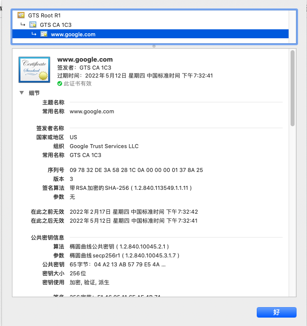

这个时候，客户端会判断这个**证书是否可信/有无被篡改**。

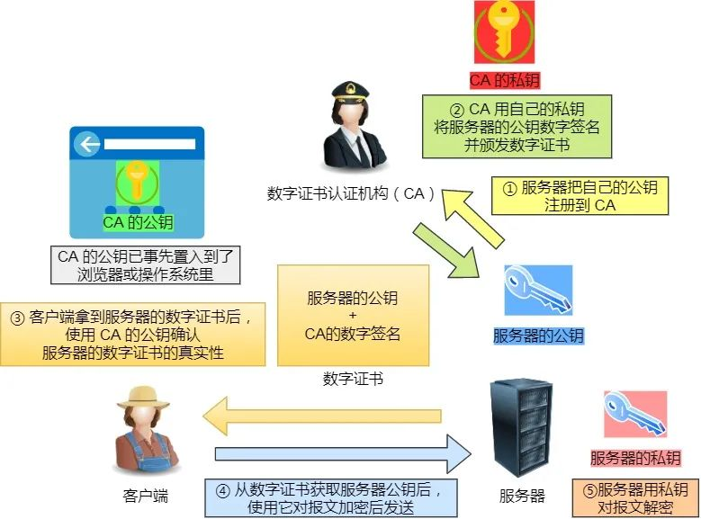

客户端发现证书是可信，然后解密出服务器的公钥。客户端生成一个**随机Key**，并用证书内的**公钥**进行加密，发送给服务端。

服务端收到消息，用自己的私钥解密，拿到客户端随机生成的Key，加密数据后返回给客户端。

客户端收到消息，就可以用之前生成的Key来解密服务端返回的数据了。

### TLS 1.3 的优化

在 TLS 1.2 中，我们需要 2-RTT 才能建立 TLS 连接[10](https://draveness.me/whys-the-design-https-latency/#fn:10 "10")，但是 TLS 1.3 通过优化协议，将两次往返延迟降低至一次，大幅度减少建立 TLS 连接所需要的时间，让客户端可以在 1-RTT 之后就能向服务端传输应用层数据。

这里就不展开介绍 TLS 1.3 建立连接的过程了，除了减少常规握手下的网络开销，TLS 1.3 还引入了 0-RTT 的连接建立过程；60% 的网络连接都是用户在第一次访问网站或者间隔一段时间后访问时建立的，剩下的 40% 可以通过 TLS 1.3 的 0-RTT 策略解决[11](https://draveness.me/whys-the-design-https-latency/#fn:11 "11")，然而该策略与 TFO 的实现原理比较相似，都是通过重用会话和缓存来实现的，所以存在一定的安全风险，使用时也应该结合业务的具体场景

## 和 HTTP的区别

### 内部协议不同

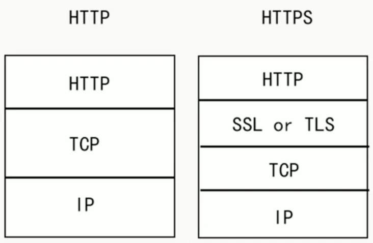

为什么是SSL or TLS ? 解释一下 SSL、TLS 的历史

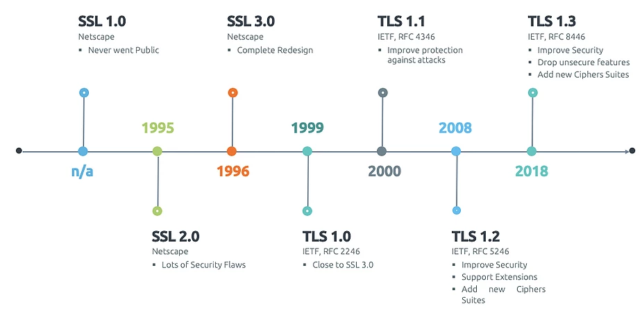

> 1995: SSL 2.0, 由Netscape提出，这个版本由于设计缺陷，并不安全，很快被发现有严重漏洞，已经废弃。
> 1996: SSL 3.0. 写成RFC，开始流行。目前(2015年)已经不安全，必须禁用。
> 1999: TLS 1.0. 互联网标准化组织ISOC接替NetScape公司，发布了SSL的升级版TLS 1.0版.
> 2006: TLS 1.1. 作为 RFC 4346 发布。主要fix了CBC模式相关的如BEAST攻击等漏洞
> 2008: TLS 1.2. 作为RFC 5246 发布 。增进安全性。目前(2015年)应该主要部署的版本，请确保你使用的是这个版本
> 2015之后: TLS 1.3，还在制订中，支持0-rtt，大幅增进安全性，砍掉了aead之外的加密方式

TLS 1.0通常被标示为SSL 3.1，TLS 1.1为SSL 3.2，TLS 1.2为SSL 3.3。由于SSL的2个版本都已经退出历史舞台了，一般所说的SSL就是TLS。

**通过上图能看出 HTTPS中在TCP之上又加了一层安全协议。** 算上TCP的三次握手，建立一个HTTPS连接需要共7次握手。

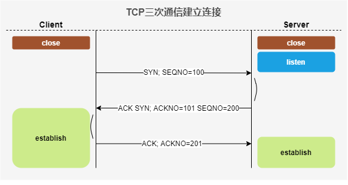

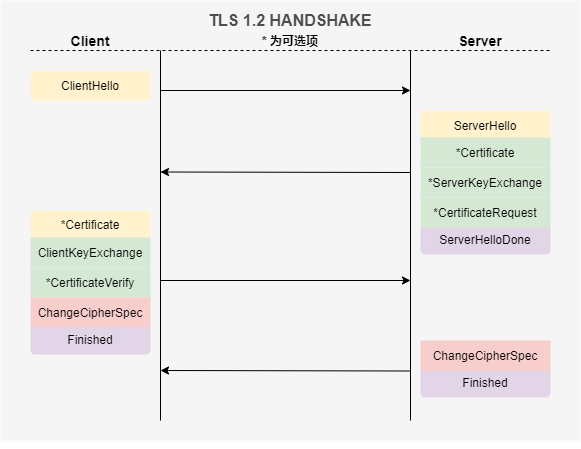

### 其他区别

*   最最重要的区别就是安全性，HTTP 明文传输，不对数据进行加密安全性较差。HTTPS (HTTP + SSL / TLS)的数据传输过程是加密的，安全性较好。

*   使用 HTTPS 协议需要申请 CA 证书，一般免费证书较少，因而需要一定费用。证书颁发机构如：Symantec、Comodo、DigiCert 和 GlobalSign 等。

*   HTTP 页面响应速度比 HTTPS 快，这个很好理解，由于加了一层安全层，建立连接的过程更复杂，也要交换更多的数据，难免影响速度。

*   由于 HTTPS 是建构在 SSL / TLS 之上的 HTTP 协议，所以，要比 HTTP 更耗费服务器资源。

*   HTTPS 和 HTTP 使用的是完全不同的连接方式，用的端口也不一样，前者是 443，后者是 80。

## HTTPS 的问题

*   在相同网络环境中，HTTPS 相比 HTTP 无论是响应时间还是耗电量都有大幅度上升。

*   HTTPS 的安全是有范围的，在黑客攻击、服务器劫持等情况下几乎起不到作用。

*   在现有的证书机制下，[中间人攻击](https://link.segmentfault.com/?enc=UJ/bkeguF0z3mwXcRoMOOw==.d343c5ia1FsF4PBRsWnBJwh2cksFLTridEVxkguW0ZeySduOWoqGo36Bexl54rEmGBxPqTMbngR2RSIgWA91Sg== "中间人攻击")依然有可能发生。

*   HTTPS 需要更多的服务器资源，也会导致成本的升高。

## 加密算法

HTTPS 采用的是**对称加密**和**非对称加密**结合的「混合加密」方式：

*   在通信建立前采用**非对称加密**的方式交换「会话秘钥」，后续就不再使用非对称加密。

*   在通信过程中全部使用**对称加密**的「会话秘钥」的方式加密明文数据。

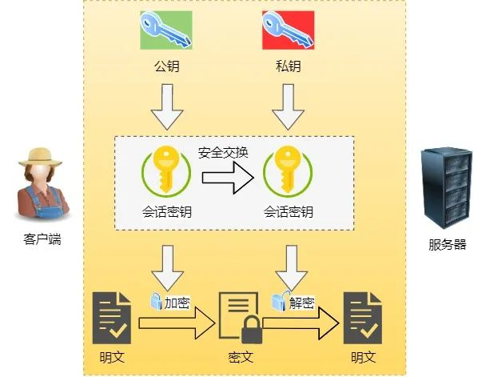

### 对称加密

对称加密，顾名思义就是加密和解密都是使用同一个密钥，常见的对称加密算法有 DES、3DES 和 AES 等

**优点**：算法公开，计算量小，体积小，速度快、效率高

**缺点**：数据加密传输前需要传输密钥，容易泄露。另外，每对用户每次使用对称加密算法时，都需要使用其他人不知道的唯一秘 钥，这会使得收、发双方所拥有的钥匙数量巨大，密钥管理成为双方的负担

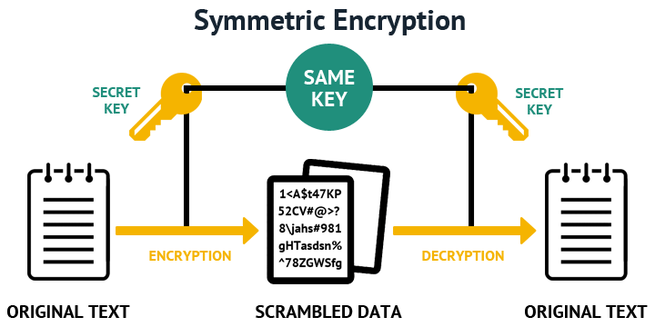

### 非对称加密

非对称加密，顾名思义，就是加密和解密需要使用两个不同的密钥：公钥（public key）和私钥（private key）。公钥与私钥是一对

如果用公钥对数据进行加密，只有用对应的私钥才能解密；如果用私钥对数据进行加密，那么只有用对应的公钥才能解密。

可以解决对称加密密钥泄露的问题，常见的非对称加密算法有：`RSA`、DSA、ECC、DH等

**优点**：算法公开，加密和解密使用不同的钥匙，私钥不需要通过网络进行传输，安全。

**缺点**：计算量比较大，加密和解密速度相比对称加密慢很多。

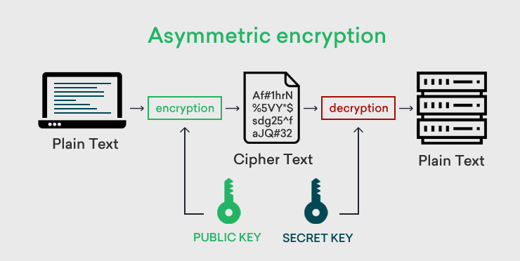

## 参考

*   [https://www.ruanyifeng.com/blog/2014/02/ssl\_tls.html](https://www.ruanyifeng.com/blog/2014/02/ssl_tls.html "https://www.ruanyifeng.com/blog/2014/02/ssl_tls.html")

*   [https://segmentfault.com/a/1190000021494676](https://segmentfault.com/a/1190000021494676 "https://segmentfault.com/a/1190000021494676")

*   [https://coolshell.cn/articles/11609.html](https://coolshell.cn/articles/11609.html "https://coolshell.cn/articles/11609.html")

*   [https://draveness.me/whys-the-design-https-latency/#fn:11](https://draveness.me/whys-the-design-https-latency/#fn:11 "https://draveness.me/whys-the-design-https-latency/#fn:11")

*   [https://blog.helong.info/blog/2015/09/06/tls-protocol-analysis-and-crypto-protocol-design/](https://blog.helong.info/blog/2015/09/06/tls-protocol-analysis-and-crypto-protocol-design/ "https://blog.helong.info/blog/2015/09/06/tls-protocol-analysis-and-crypto-protocol-design/")

*   [https://mp.weixin.qq.com/s/8TJ-NVK33UtUJ8QjpyZy4Q](https://mp.weixin.qq.com/s/8TJ-NVK33UtUJ8QjpyZy4Q "https://mp.weixin.qq.com/s/8TJ-NVK33UtUJ8QjpyZy4Q")

*   [https://mp.weixin.qq.com/s/4epUWMCLpwCBxxQgEbL8gA](https://mp.weixin.qq.com/s/4epUWMCLpwCBxxQgEbL8gA "https://mp.weixin.qq.com/s/4epUWMCLpwCBxxQgEbL8gA")
