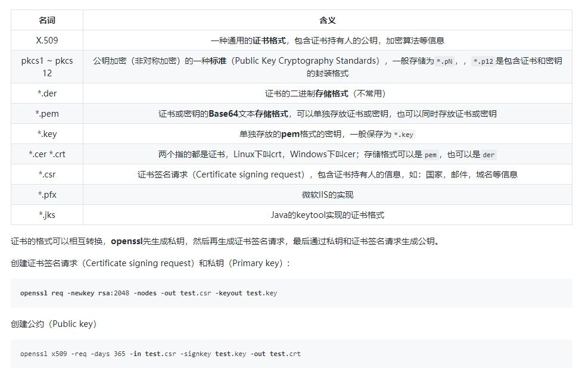
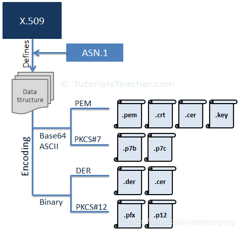

# SSL/TLS

### TLS 位于哪一层？

有争议，但按照OSI 7层划分的概念，TLS 和 SSL 协议可以分为两层。

*   &#x20;第一层由应用程序协议和三个握手协议组成：握手协议、更改密码规范协议和警报协议。

*   &#x20;第二层是记录协议。

**会话层的功能和表示层的功能正好和SSL记录协议和握手协议的功能一样，所以应该是在会话层和表示层**

参考：

*   [https://wentzwu.com/2020/08/21/what-osi-layer-does-tls-operate-and-why/](https://wentzwu.com/2020/08/21/what-osi-layer-does-tls-operate-and-why/ "https://wentzwu.com/2020/08/21/what-osi-layer-does-tls-operate-and-why/")

*   [https://docs.microsoft.com/zh-cn/windows-server/security/tls/transport-layer-security-protocol](https://docs.microsoft.com/zh-cn/windows-server/security/tls/transport-layer-security-protocol "https://docs.microsoft.com/zh-cn/windows-server/security/tls/transport-layer-security-protocol")

## 一些名词

### x.509

**X.509 是一种证书格式。**

对X.509证书来说，认证者总是CA或由CA指定的人，一份X.509证书是一些标准字段的集合，这些字段包含有关用户或设备及其相应公钥的信息。

x509证书一般会用到三类文件，key，csr，crt

*   证书(Certificate) - \*.cer \*.crt &#x20;

*   私钥(Private Key) - \*.key &#x20;

*   证书签名请求(Certificate signing request) - \*.csr

*   证书吊销列表(Certificate Revocation List) - \*.crl

*   key 为私钥文件

*   csr 是Certificate Signing Request的缩写，即证书签名请求，这不是证书，可以简单理解成公钥，生成证书时要把这个提交给权威的证书颁发机构。生成的csr文件交给CA签名后形成服务端自己的证书。

*   X.509的证书文件，一般以\*\*.crt**结尾(crt**即 certificate的缩写，即证书\*\*)

根据文件的内容编码格式，可以分为以下二种格式：

*   **PEM** - Privacy Enhanced Mail,打开看文本格式,以"-----BEGIN..."开头, "-----END..."结尾,内容是BASE64编码.  Apache和 NGINX服务器偏向于使用这种编码格式.

*   **DER** - Distinguished Encoding Rules,打开看是二进制格式,不可读.  Java和Windows服务器偏向于使用这种编码格式

以上三类（.crt  .key .csr）均可以使用这两种编码方式，因此 \*.pem和 \*.der(少见) 不一定是以上三种( Crt, Key,  CSR )中的某一种

如下图就展示了X.509证书的编码方式和文件扩展名。

## 参考

*   [https://www.cnblogs.com/yjmyzz/p/openssl-tutorial.html](https://www.cnblogs.com/yjmyzz/p/openssl-tutorial.html "https://www.cnblogs.com/yjmyzz/p/openssl-tutorial.html")

*   [https://help.aliyun.com/document\_detail/66710.html](https://help.aliyun.com/document_detail/66710.html "https://help.aliyun.com/document_detail/66710.html")

*   [https://www.digicert.com/kb/ssl-support/openssl-quick-reference-guide.htm](https://www.digicert.com/kb/ssl-support/openssl-quick-reference-guide.htm "https://www.digicert.com/kb/ssl-support/openssl-quick-reference-guide.htm")
