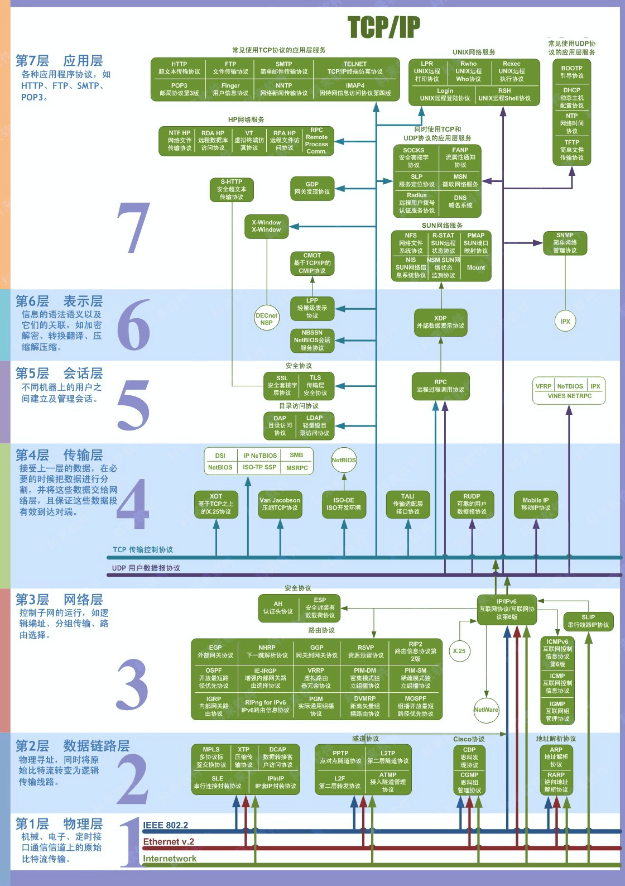
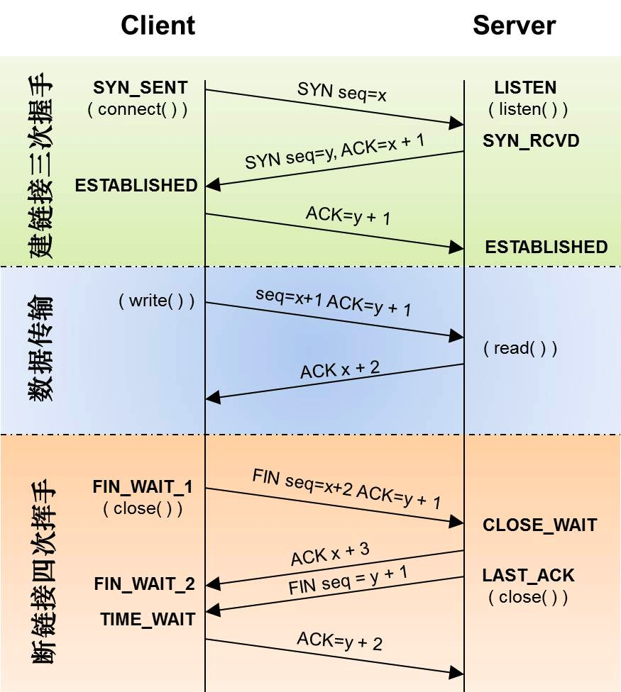
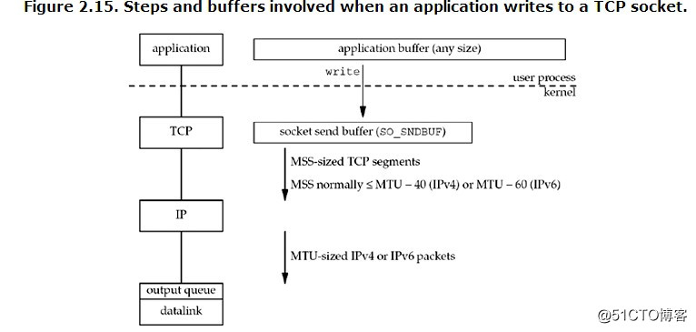

# TCP/IP





### 缓冲区



linux 下 socket 缓冲区大小的默认值在/proc 虚拟文件系统中有配置：

```bash
cat /proc/sys/net/ipv4/tcp_wmem
4096    16384    4194304
//第一个表示最小值，第二个表示默认值，第三个表示最大值。
//4kb, 16kb,   4M

```

```bash
cat /proc/sys/net/ipv4/tcp_rmem
4096    131072    6291456
 //第一个表示最小值，第二个表示默认值，第三个表示最大值。
//4kb,   128kb   6M
```

上面例子中，**读缓冲区**默认为 128kb，**写缓冲区**默认为 16kb；读缓冲区最大为 6M，写缓冲区最大为 4M

### Nagle 算法&#x20;

[TCP 问题整理](TCP%20问题整理/TCP%20问题整理.md "TCP 问题整理")
