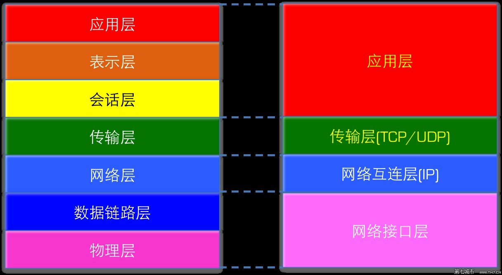

# 标准和协议

ISO/OSI 七层网络参考模型、TCP/IP 四层网络模

[科来《网络通讯协议图2022版》.pdf](file/科来《网络通讯协议图2022版》_8rvl9nphTZ.pdf)

[缓存一致性协议-MESI](缓存一致性协议-MESI/缓存一致性协议-MESI.md "缓存一致性协议-MESI")

[HTTPS](HTTPS/HTTPS.md "HTTPS")

[TCP/IP](TCP-IP/TCP-IP.md "TCP/IP")

[WebSocket(全双工)](WebSocket\(全双工\)/WebSocket\(全双工\).md "WebSocket(全双工)")

[HTTP](HTTP/HTTP.md "HTTP")

[JWT](JWT/JWT.md "JWT")

[SSL/TLS](SSL-TLS/SSL-TLS.md "SSL/TLS")
