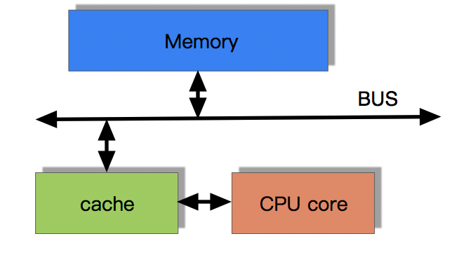
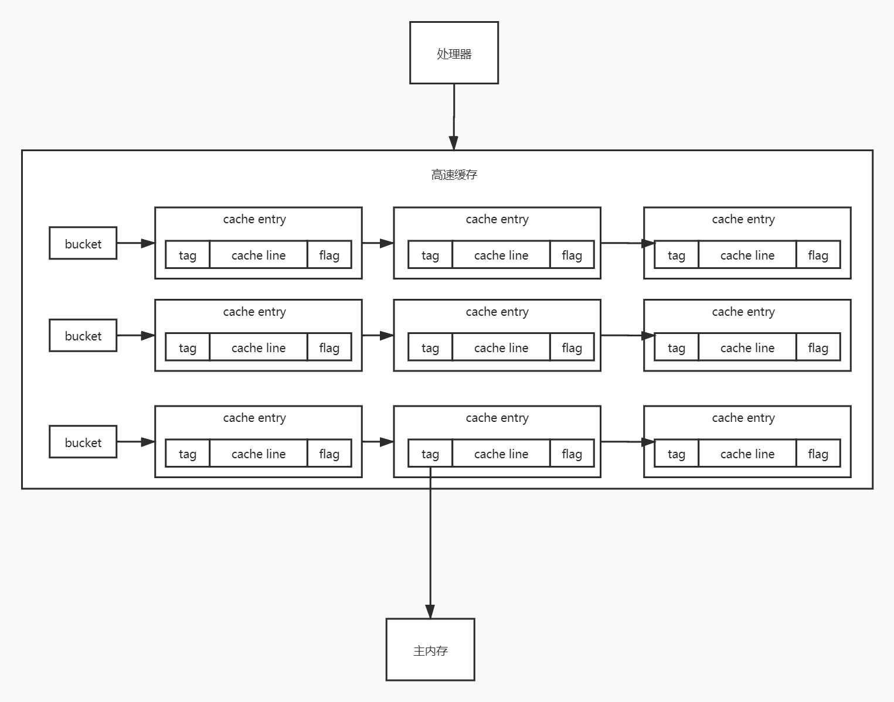
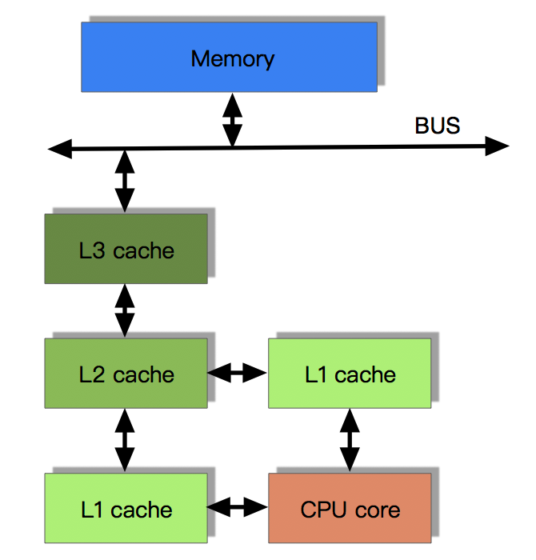
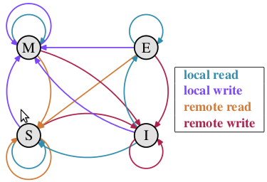
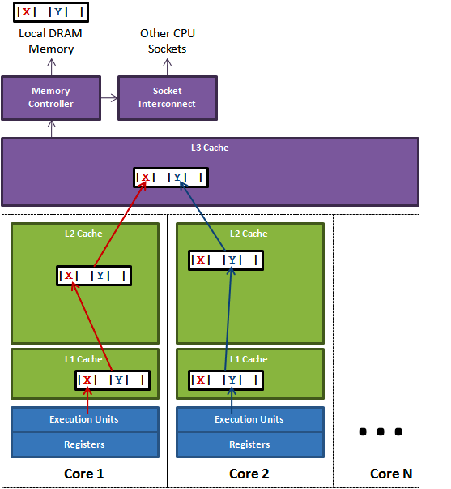

# 缓存一致性协议-MESI

## 背景

### 带有高速缓存的CPU执行计算的流程

1.  程序以及数据被加载到主内存

2.  指令和数据被加载到CPU的高速缓存

3.  CPU执行指令，把结果写到高速缓存

4.  高速缓存中的数据写回主内存



### 高速缓存的数据结构



高速缓存的底层数据结构其实是一个拉链散列表的结构，就是有很多的bucket，每个bucket挂了很多的`cache entry`，每个 `cache entry` 由三个部分组成： `tag` 、 `cache line` 、 `flag`&#x20;

*   **cache line** ：缓存的数据，可以包含多个变量的值

*   **tag** ：指向了这个缓存数据在主内存的数据的地址

*   **flag** ：标识了缓存行的状态，具体状态划分见下边MESI协议

**怎么在高速缓存中定位到这个变量呢？**

在处理器读写高速缓存的时候，实际上会根据变量名执行一个内存地址解码的操作，解析出来三个东西。 `index` , `tag` 和 `offerset` 。

*   **index** ：用于定位到拉链散列表中的某个 `bucket`&#x20;

*   **tag** ：用于定位 `cache entry`&#x20;

*   **offerset** ：用于定位一个变量在 `cache line` 中的位置

由于CPU的运算速度超越了1级缓存的数据I\O能力，CPU厂商引入了多级的缓存结构。



多核CPU的情况下有**多个一级缓存**，如何保证缓存内部数据的一致,不让系统数据混乱。

### 问题

**每个核都有自己私有的 L1,、L2 缓存。那么多线程编程时, 另外一个核的线程想要访问当前核内 L1、L2 缓存行的数据, 该怎么办呢？**

有人说可以通过第 2 个核直接访问第 1 个核的缓存行，这是当然是可行的，但这种方法不够快。跨核访问需要通过 Memory Controller（内存控制器，是计算机系统内部控制内存并且通过内存控制器使内存与 CPU 之间交换数据的重要组成部分），典型的情况是第 2 个核经常访问第 1 个核的这条数据，那么每次都有跨核的消耗。更糟的情况是，有可能第 2 个核与第 1 个核不在一个插槽内，况且 Memory Controller 的总线带宽是有限的，扛不住这么多数据传输。所以，**CPU 设计者们更偏向于另一种办法： 如果第 2 个核需要这份数据，由第 1 个核直接把数据内容发过去，数据只需要传一次。**

那么什么时候会发生缓存行的传输呢？答案很简单：当一个核需要读取另外一个核的脏缓存行时发生。但是前者怎么判断后者的缓存行已经被弄脏(写)了呢？这就需要了解MESI 协议了。

## MESI&#x20;

> **MESI协议**是一个基于失效的[缓存一致性](https://zh.wikipedia.org/wiki/缓存一致性 "缓存一致性")协议，是支持写回（write-back）缓存的最常用协议。也称作**伊利诺伊协议** (Illinois protocol，因为是在[伊利诺伊大学厄巴纳-香槟分校](https://zh.wikipedia.org/wiki/伊利诺伊大学厄巴纳-香槟分校 "伊利诺伊大学厄巴纳-香槟分校")被发明的[\[1\]](https://zh.wikipedia.org/wiki/MESI协议#cite_note-1 "\[1]"))。与写穿（write through）缓存相比，回写缓冲能节约大量带宽。总是有“脏”（dirty）状态表示缓存中的数据与主存中不同。MESI协议要求在缓存不命中（miss）且数据块在另一个缓存时，允许缓存到缓存的数据复制。与[MSI协议](https://zh.wikipedia.org/wiki/MSI协议 "MSI协议")相比，MESI协议减少了主存的事务数量。这极大改善了性能。[\[2\]](https://zh.wikipedia.org/wiki/MESI协议#cite_note-2 "\[2]")

### MESI协议缓存状态

MESI 是指4种状态的首字母。每个Cache line有4个状态，可用2个bit表示，它们分别是：

| 状态                  | 描述                                             |
| ------------------- | ---------------------------------------------- |
| M 修改 (Modified)     | 该Cache line有效，数据被修改了，和内存中的数据不一致，数据只存在于本Cache中。 |
| E 独享、互斥 (Exclusive) | 该Cache line有效，缓存行内容和内存中的一样，而且其它处理器都没有这行数据；     |
| S 共享 (Shared)       | 该Cache line有效，缓存行内容和内存中的一样, 有可能其它处理器也存在此缓存行的拷贝 |
| I 无效 (Invalid)      | 该Cache line无效。                                 |

这四个状态是如何转换的？

### MESI状态转换

*   初始：一开始时，缓存行没有加载任何数据，所以它处于 I 状态。

*   本地写（Local Write）：如果本地处理器写数据至处于 I 状态的缓存行，则缓存行的状态变成 M。

*   本地读（Local Read）：如果本地处理器读取处于 I 状态的缓存行，很明显此缓存没有数据给它。此时分两种情况：

    *   (1) 其它处理器的缓存里也没有此行数据，则从内存加载数据到此缓存行后，再将它设成 E 状态，表示只有我一家有这条数据，其它处理器都没有；

    *   (2) 其它处理器的缓存有此行数据，则将此缓存行的状态设为 S 状态。（备注：如果处于M状态的缓存行，再由本地处理器写入/读出，状态是不会改变的）

*   远程读（Remote Read）：假设我们有两个处理器 c1 和 c2，如果 c2 需要读另外一个处理器 c1 的缓存行内容，c1 需要把它缓存行的内容通过内存控制器 (Memory Controller) 发送给 c2，c2 接到后将相应的缓存行状态设为 S。在设置之前，内存也得从总线上得到这份数据并保存。

*   远程写（Remote Write）：其实确切地说不是远程写，而是 c2 得到 c1 的数据后，不是为了读，而是为了写。也算是本地写，只是 c1 也拥有这份数据的拷贝，这该怎么办呢？c2 将发出一个 `RFO` (Request For Owner) 请求，它需要拥有这行数据的权限，其它处理器的相应缓存行设为 I，除了它自已，谁不能动这行数据。这保证了数据的安全，同时处理 `RFO` 请求以及设置I的过程将给写操作带来很大的性能消耗。



### cache line&#x20;

缓存行通常是 64 字节（译注：本文基于 64 字节，其他长度的如 32 字节等不是本文讨论的重点），并且它有效地引用主内存中的一块地址。

一个 Java 的 long 类型是 8 字节，因此在一个缓存行中可以存 8 个 long 类型的变量。所以，如果你访问一个 long 数组，当数组中的一个值被加载到缓存中，它会额外加载另外 7 个，以致你能非常快地遍历这个数组。事实上，你可以非常快速的遍历在连续的内存块中分配的任意数据结构。而如果你在数据结构中的项在内存中不是彼此相邻的（如链表），你将得不到免费缓存加载所带来的优势，并且在这些数据结构中的每一个项都可能会出现缓存未命中。

### 伪共享（False Sharing）

如果存在这样的场景，有多个线程操作不同的成员变量，但是相同的缓存行，这个时候会发生什么？



上图中，一个运行在处理器 core1上的线程想要更新变量 X 的值，同时另外一个运行在处理器 core2 上的线程想要更新变量 Y 的值。

但是，这两个频繁改动的变量都处于同一条缓存行。两个线程就会轮番发送 RFO 消息，占得此缓存行的拥有权。当 core1 取得了拥有权开始更新 X，则 core2 对应的缓存行需要设为 I 状态。当 core2 取得了拥有权开始更新 Y，则 core1 对应的缓存行需要设为 I 状态(失效态)。

轮番夺取拥有权不但带来大量的 RFO 消息，而且如果某个线程需要读此行数据时，L1 和 L2 缓存上都是失效数据，只有 L3 缓存上是同步好的数据。从前一篇我们知道，读 L3 的数据非常影响性能。更坏的情况是跨槽读取，L3 都要 miss，只能从内存上加载。

**表面上 X 和 Y 都是被独立线程操作的，而且两操作之间也没有任何关系。只不过它们共享了一个缓存行，但所有竞争冲突都是来源于共享。**

**如何避免伪共享？**

> 其中一个解决思路，就是让不同线程操作的对象处于不同的缓存行即可。

那么该如何做到呢？那就是缓存行填充（Padding） 。

一条缓存行有 64 字节，而 Java 程序的对象头[对象头（mark word）](<../../JAVA 技术栈/JVM/对象头（mark word）/对象头（mark word）.md> "对象头（mark word）")固定占 8 字节(32位系统)或 12 字节( 64 位系统默认开启压缩, 不开压缩为 16 字节)，所以我们只需要填 6 个无用的长整型补上6\*8=48字节，让不同的 对象处于不同的缓存行，就避免了伪共享( 64 位系统超过缓存行的 64 字节也无所谓，只要保证不同线程不操作同一缓存行就可以)。

例如：Baidu UID-generator 的作法：

```java
/*
 * Copyright (c) 2017 Baidu, Inc. All Rights Reserve.
 *
 * Licensed under the Apache License, Version 2.0 (the "License");
 * you may not use this file except in compliance with the License.
 * You may obtain a copy of the License at
 *
 *     http://www.apache.org/licenses/LICENSE-2.0
 *
 * Unless required by applicable law or agreed to in writing, software
 * distributed under the License is distributed on an "AS IS" BASIS,
 * WITHOUT WARRANTIES OR CONDITIONS OF ANY KIND, either express or implied.
 * See the License for the specific language governing permissions and
 * limitations under the License.
 */
package com.baidu.fsg.uid.utils;

import java.util.concurrent.atomic.AtomicLong;

/**
 * 该类表示 用AtomicLong 来进行填充 ，以避免伪共享问题
 * 
 * CPU cache line 一般为 64 字节，以下是填充后的 cache line 示例:<br>
 * 64 bytes = 8 bytes (object reference) + 6 * 8 bytes (padded long) + 8 bytes (a long value)
 * 
 * @author yutianbao
 */
public class PaddedAtomicLong extends AtomicLong {
    private static final long serialVersionUID = -3415778863941386253L;

    /** Padded 6 long (48 bytes) */
    public volatile long p1, p2, p3, p4, p5, p6 = 7L;

    /**
     * Constructors from {@link AtomicLong}
     */
    public PaddedAtomicLong() {
        super();
    }

    public PaddedAtomicLong(long initialValue) {
        super(initialValue);
    }

    /**
     * 为防止清理未使用的填充引用而进行 的 GC 优化
     */
    public long sumPaddingToPreventOptimization() {
        return p1 + p2 + p3 + p4 + p5 + p6;
    }

}
```

这里的程序对 32位的没有问题，但64位的填充感觉就不对了&#x20;

> 在32和64位系统中，冗余变量填充所需的个数不一样。在32位系统中，Cache Line的长度为32字节，Java对象头所占据字节数分别为“Mark Word（4字节）”，“指向类的指针（4字节）”，“数组长度（4字节，只有数组对象才有该部分）”

所以 **是不是可以用 5个 long 1、1个int 来填充，或者 使用 **[**@contended**](https://github.com/contended "@contended")** 注解解决** ？


## 参考：

*   [https://www.cnblogs.com/yanlong300/p/8986041.html](https://www.cnblogs.com/yanlong300/p/8986041.html "https://www.cnblogs.com/yanlong300/p/8986041.html")

*   [https://www.cnblogs.com/cyfonly/p/5800758.html](https://www.cnblogs.com/cyfonly/p/5800758.html "https://www.cnblogs.com/cyfonly/p/5800758.html")

*   [https://zh.wikipedia.org/wiki/MESI协议](https://zh.wikipedia.org/wiki/MESI协议 "https://zh.wikipedia.org/wiki/MESI协议")
