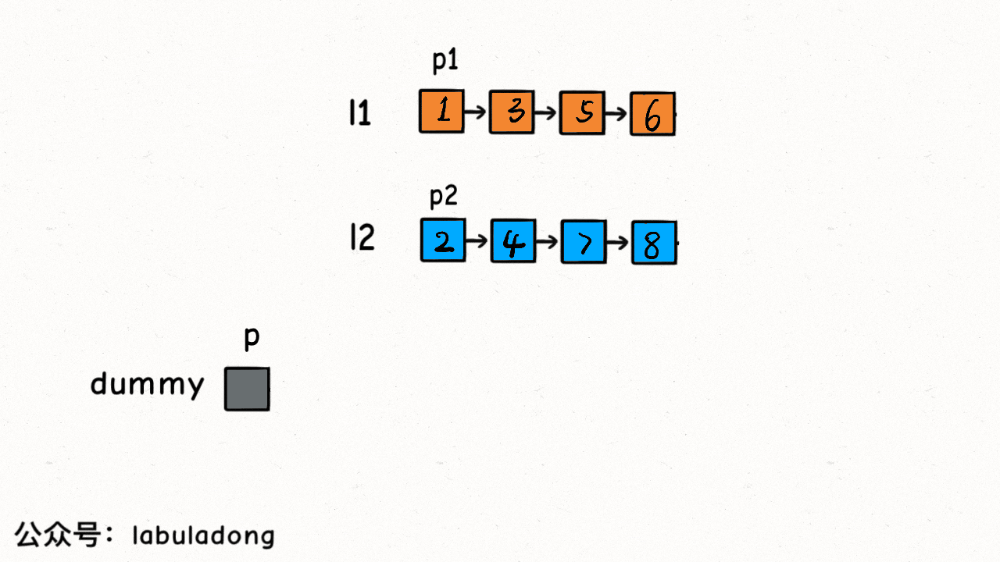
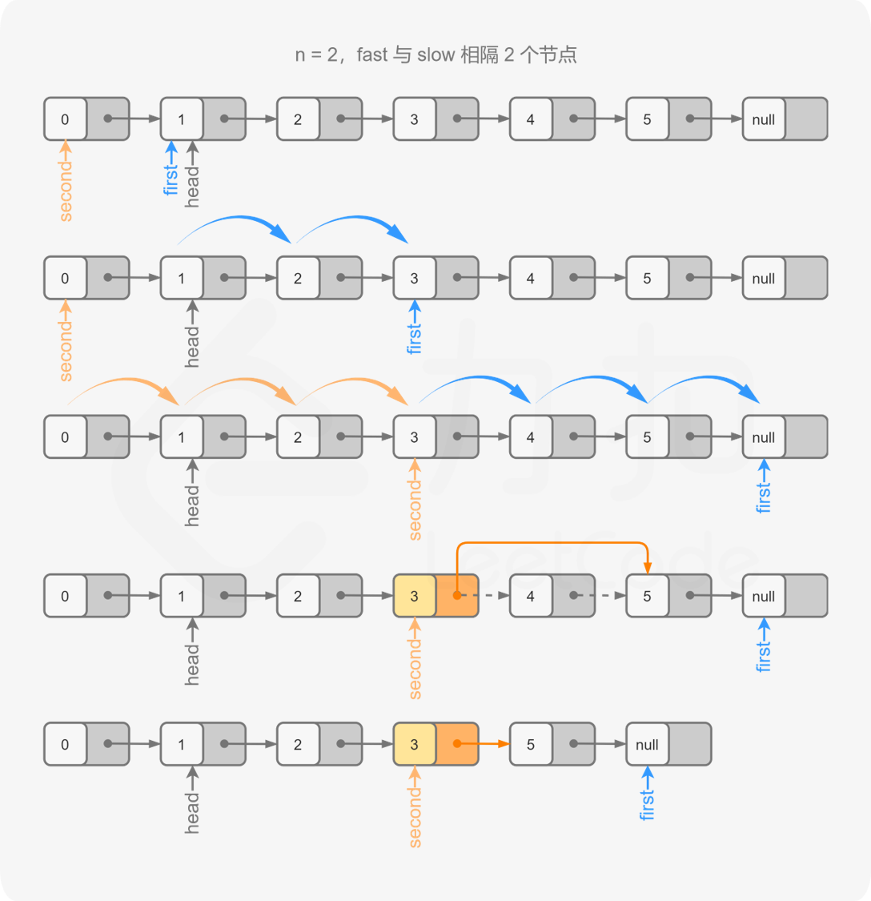
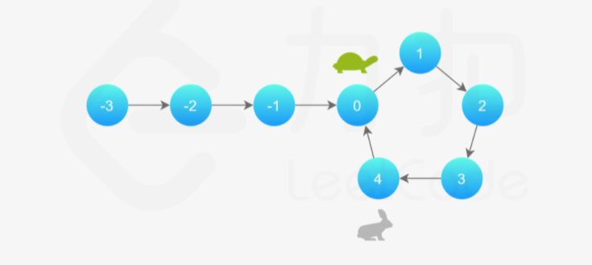

# 双指针-链表

## 21. 合并两个有序链表



这个算法的逻辑类似于「拉拉链」，`l1, l2` 类似于拉链两侧的锯齿，指针 `p` 就好像拉链的拉索，将两个有序链表合并。

**代码中还用到一个链表的算法题中是很常见的「虚拟头结点」技巧，也就是 dummy 节点**。你可以试试，如果不使用 `dummy` 虚拟节点，代码会复杂很多，而有了 `dummy` 节点这个占位符，可以避免处理空指针的情况，降低代码的复杂性。

```java
/**
 * Definition for singly-linked list.
 * public class ListNode {
 *     int val;
 *     ListNode next;
 *     ListNode() {}
 *     ListNode(int val) { this.val = val; }
 *     ListNode(int val, ListNode next) { this.val = val; this.next = next; }
 * }
 */
class Solution {

    public ListNode mergeTwoLists(ListNode list1, ListNode list2) {
       
        ListNode dummy = new ListNode(-1);
        ListNode p = dummy;

        ListNode p1 = list1;
        ListNode p2 = list2;

        while(p1 !=null && p2 !=null ){
             
             if (p1.val <= p2.val){

                  p.next = p1;
                  p1 = p1.next;
                      
             }else {

                 p.next = p2;
                 p2 = p2.next;
                
             }

             p = p.next; 
             
        }
        if (p1 !=null){
           p.next = p1;
        }

         if (p2 !=null){
           p.next = p2;
        }

        return dummy.next;

    }
}
```

## 23. 合并K个升序链表

```java
class Solution {
    // 主要是：要会用 PriorityQueue
    public ListNode mergeKLists(ListNode[] lists) {

        ListNode dummy  = new ListNode(-1);

        ListNode p = dummy;

        int len = lists.length;
        
        PriorityQueue<ListNode> pq = new PriorityQueue<ListNode>((v1,v2) -> v1.val-v2.val );

        for(int i=0; i< len; i++){

            ListNode head = lists[i];
            if (head !=null){
               pq.add(head);
            }

        }

        while(!pq.isEmpty()){

            ListNode head = pq.poll();

            p.next = head;
            if (head.next !=null){
                pq.add(head.next);
            }

            p = p.next;

        }

        return dummy.next;
    }
}
```

用到 [优先级队列（二叉堆）](https://labuladong.gitee.io/algo/2/21/55/ "优先级队列（二叉堆）") 这种数据结构，把链表节点放入一个最小堆，就可以每次获得 `k` 个节点中的最小节点：

## 19. 删除链表的倒数第 N 个结点

由于我们需要找到倒数第 nn 个节点，因此我们可以使用两个指针 p1 和 p2 同时对链表进行遍历，并且 p1 比 p2 超前 n 个节点。当 p1 遍历到链表的末尾时，p2 就恰好处于倒数第 n 个节点。

```java
class Solution {


    public ListNode removeNthFromEnd(ListNode head, int n) {

         ListNode dummy = new ListNode(-1);
         dummy.next = head;

         // 删除倒数第 n 个，要先找倒数第 n + 1 个节点
         ListNode x = findFromEnd(dummy, n + 1);
         // 删掉倒数第 n 个节点
         x.next = x.next.next;
         return dummy.next;

    }
    

    public ListNode findFromEnd(ListNode head,int n){

        ListNode p1 = head;
        for(int i=0; i<n; i++){
           
           if ( p1 !=null ){
               p1 = p1.next;       
           }

        }  

        ListNode p2 = head;

        while(p1 !=null){

            p1 = p1.next;
            p2 = p2.next;

        }

        return p2;

    }
}
```



对于边界条件如一个元素这种，可以在纸上画画图。

## 876. 链表的中间结点

思路：快速指针 让两个指针 `slow` 和 `fast` 分别指向链表头结点 `head`。

**每当慢指针 slow 前进一步，快指针 fast 就前进两步，这样，当 fast 走到链表末尾时，slow 就指向了链表中点**。

需要注意的是，如果链表长度为偶数，也就是说中点有两个的时候，我们这个解法返回的节点是靠后的那个节点。

```java
class Solution {
    public ListNode middleNode(ListNode head) {

        ListNode slow = head;
        ListNode fast = head;

        while(fast !=null && fast.next !=null){

            slow = slow.next;
            fast = fast.next.next;
            
        }

        return slow;

    }
}
```

## 141. 环形链表

### 方法一： 哈希表

**思路及算法**

最容易想到的方法是遍历所有节点，每次遍历到一个节点时，判断该节点此前是否被访问过。

具体地，我们可以使用哈希表来存储所有已经访问过的节点。每次我们到达一个节点，如果该节点已经存在于哈希表中，则说明该链表是环形链表，否则就将该节点加入哈希表中。重复这一过程，直到我们遍历完整个链表即可。

```java
public class Solution {
    public boolean hasCycle(ListNode head) {
        Set<ListNode> seen = new HashSet<ListNode>();
        while (head != null) {
            if (!seen.add(head)) {
                return true;
            }
            head = head.next;
        }
        return false;
    }
}
```

### 方法二：快慢指针

需要知道 [Floyd 判圈算法](https://zh.wikipedia.org/wiki/Floyd%E5%88%A4%E5%9C%88%E7%AE%97%E6%B3%95 "Floyd 判圈算法")



> 假想「乌龟」和「兔子」在链表上移动，「兔子」跑得快，「乌龟」跑得慢。当「乌龟」和「兔子」从链表上的同一个节点开始移动时，如果该链表中没有环，那么「兔子」将一直处于「乌龟」的前方；如果该链表中有环，那么「兔子」会先于「乌龟」进入环，并且一直在环内移动。等到「乌龟」进入环时，由于「兔子」的速度快，它一定会在某个时刻与乌龟相遇，即套了「乌龟」若干圈。

**有下面几个结论**：

*   如果从「同一个起点」（即使这个起点不在某个环上）同时开始以「不同速度」前进的2个指针最终相遇，那么可以判定存在一个环，且可以求出2者相遇处所在的环的起点与长度。

*   只要满足**快慢指针速度差为 1**，即可判断是否存在环（不一定慢1快2）

*   如果存在环，那么在某个环上以「不同速度」前进的2个指针必定会在某个时刻相遇（即便不同起点）

**应用**：

循环检测的应用包括测试伪随机数生成器和密码哈希函数的质量、计算数论算法、检测计算机程序中的无限循环和元胞自动机中的周期性配置、链表数据结构的自动形状分析以及死锁检测用于 DBMS 中的事务管理

**判断是否有环**：Floyd Cycle Detection Algorithm 有点类似于龟兔（我和别人在操场上）赛跑（跑步）。假如说赛道有环，那么最终跑得慢的（我）会被跑得快的（别人）套圈。如果别人成功跑到了终点，那么就没有环，如果我和别人在路上相遇了，就说明我被他套圈了，赛道是有环的，同时，**他比我多跑的长度是环的长度的整数倍。**

**求环的长度**：第一次相遇的时候，两个人都已经在环上了。两个人继续跑的话，在下一次相遇时候，快的人一定比慢的人多跑了一整圈。在第一次相遇和第二次相遇之间，快的人跑的比慢的人多跑了一整圈，也就是多跑了环的长度。

```java
public class Solution {
    public boolean hasCycle(ListNode head) {

        ListNode slow = head;
        ListNode fast = head;

        while(fast !=null && fast.next !=null){
            // 慢指针走一步，快指针走两步
            slow = slow.next;
            fast = fast.next.next;
            // 快慢指针相遇，说明含有环
            if (slow == fast){
                return true;
            }
        }
        return false;
        
    }
}
```

## 142. 环形链表 II

当快慢指针相遇时，让其中任一个指针指向头节点，然后让它俩以相同速度前进，再次相遇时所在的节点位置就是环开始的位置。

```java
public class Solution {
    public ListNode detectCycle(ListNode head) {

        ListNode slow = head;
        ListNode fast = head;

        while(fast !=null && fast.next !=null ){

            slow = slow.next;
            fast = fast.next.next;

            if (slow == fast){
                break;
            }

        }

        if (fast == null || fast.next ==null){
            return  null;
        }
        //有环
        // 重新指向头结点
        slow = head;  
        while(slow !=fast){
            // 快慢指针同步前进，相交点就是环起点
            slow =slow.next;
            fast = fast.next;
        }

        return slow;
        
    }
}
```

## 160. 相交链表

### 方法一：哈希表

用 `HashSet` 记录一个链表的所有节点，然后和另一条链表对比

```java
public class Solution {
    public ListNode getIntersectionNode(ListNode headA, ListNode headB) {
        Set<ListNode> visited = new HashSet<ListNode>();
        ListNode temp = headA;
        while (temp != null) {
            visited.add(temp);
            temp = temp.next;
        }
        temp = headB;
        while (temp != null) {
            if (visited.contains(temp)) {
                return temp;
            }
            temp = temp.next;
        }
        return null;
    }
} 
```

### 方法二：双指针

如果用两个指针 `p1` 和 `p2` 分别在两条链表上前进，并不能**同时**走到公共节点，也就无法得到相交节点 `c1`。

**解决这个问题的关键是，通过某些方式，让 p1 和 p2 能够同时到达相交节点 c1。**

所以，我们可以让 `p1` 遍历完链表 `A` 之后开始遍历链表 `B`，让 `p2` 遍历完链表 `B` 之后开始遍历链表 `A`，这样相当于`逻辑上`两条链表接在了一起。

如果这样进行拼接，就可以让 `p1` 和 `p2` 同时进入公共部分，也就是同时到达相交节点 `c1`：

```java
public class Solution {
    public ListNode getIntersectionNode(ListNode headA, ListNode headB) {

        
        ListNode p1 = headA;
        ListNode p2 = headB;

        //起点虽然不一样，但路程一样,终点一样,速度一样，必定同时到达！
        while(p1 !=p2 ){
           
           p1 = p1 == null ? headB : p1.next;
           p2 = p2 == null ? headA : p2.next;
         
        }

        return p1;
        
    }
}
```

## 参考

*   [https://labuladong.gitee.io/algo/2/18/17/](https://labuladong.gitee.io/algo/2/18/17/ "https://labuladong.gitee.io/algo/2/18/17/")
