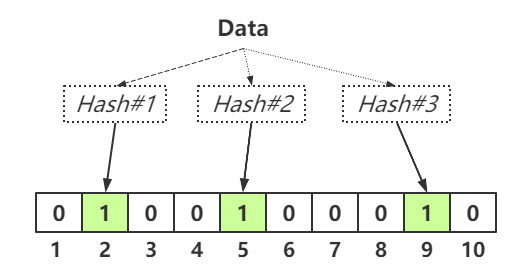
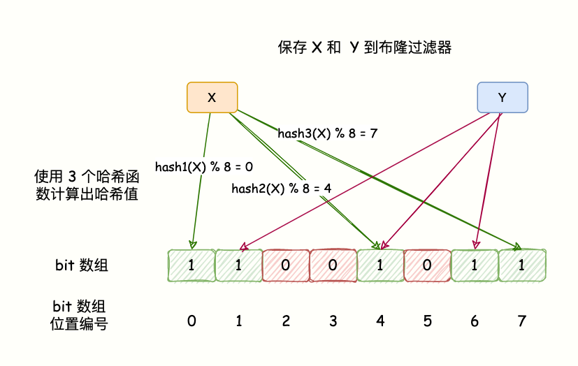

# 布隆过滤器

## what&#x20;

> **布隆过滤器**（英语：Bloom Filter）是1970年由布隆提出的。它实际上是一个很长的[二进制](https://zh.wikipedia.org/wiki/二进制 "二进制")向量和一系列随机[映射函数](https://zh.wikipedia.org/wiki/映射 "映射函数")。布隆过滤器可以用于检索一个元素是否在一个集合中。它的优点是空间效率和查询时间都远远超过一般的算法，缺点是有一定的误识别率和删除困难。



**布隆过滤器(Bloom Filter)是一种基于Hash的高效查找数据结构，它能够快速答复“某个元素是否存在”的问题。布隆过滤器只能用于添加元素与查询元素，不能够用于删除元素。**

## 原理

*   BloomFilter 是由一个固定大小的二进制向量或者位图（bitmap）和一系列映射函数组成的。在初始状态时，对于长度为 m 的位数组，它的所有位都被置为0。

*   加入元素时，采用 k 个相互独立的 Hash 函数计算，然后将元素 Hash 映射的 K 个位置全部设置为 1。

*   检测 key 是否存在，仍然用这 k 个 Hash 函数计算出 k 个位置，如果位置全部为 1，则表明 key 存在，否则不存在。

    查询某个变量的时候我们只要看看这些点是不是都是 1 就可以大概率知道集合中有没有它了

    *   如果这些点有任何一个 0，则被查询变量一定不在；

    *   如果都是 1，则被查询变量很**可能存在**

    为什么说是可能存在，而不是一定存在呢？那是因为映射函数本身就是散列函数，散列函数是会有碰撞的。



**删除问题**：布隆过滤器的每一个 bit 并不是独占的，很有可能多个元素共享了某一位。如果我们直接删除这一位的话，会影响其他的元素

### 总结

*   对于查询某个元素，只能判定某个元素**一定不存在**或者**有可能存在**，并不能判定某个元素**一定存在**

*   **布隆过滤器可以添加元素，但是不能删除元素**。因为删掉元素会导致误判率（误判率是指，BloomFilter 判断某个 key 存在，但它实际不存在的概率，因为它存的是 key 的 Hash 值，而非 key 的值。）增加。

## 实现

### JDK

```java
import java.util.BitSet;

public class MyBloomFilter {

    // 默认大小
    private static final int DEFAULT_SIZE = Integer.MAX_VALUE;

    // 最小的大小
    private static final int MIN_SIZE = 1000;

    // 大小为默认大小
    private int SIZE = DEFAULT_SIZE;

    // hash函数的种子因子
    private static final int[] HASH_SEEDS = new int[]{3, 5, 7, 11, 13, 17, 19, 23, 29, 31};

    // 位数组，0/1,表示特征
    private BitSet bitSet = null;

    // hash函数
    private HashFunction[] hashFunctions = new HashFunction[HASH_SEEDS.length];

    // 无参数初始化
    public MyBloomFilter() {
        // 按照默认大小
        init();
    }

    // 带参数初始化
    public MyBloomFilter(int size) {
        // 大小初始化小于最小的大小
        if (size >= MIN_SIZE) {
            SIZE = size;
        }
        init();
    }

    private void init() {
        // 初始化位大小
        bitSet = new BitSet(SIZE);
        // 初始化hash函数
        for (int i = 0; i < HASH_SEEDS.length; i++) {
            hashFunctions[i] = new HashFunction(SIZE, HASH_SEEDS[i]);
        }
    }

    // 添加元素，相当于把元素的特征添加到位数组
    public void add(Object value) {
        for (HashFunction f : hashFunctions) {
            // 将hash计算出来的位置为true
            bitSet.set(f.hash(value), true);
        }
    }

    // 判断元素的特征是否存在于位数组
    public boolean contains(Object value) {
        boolean result = true;
        for (HashFunction f : hashFunctions) {
            result = result && bitSet.get(f.hash(value));
            // hash函数只要有一个计算出为false，则直接返回
            if (!result) {
                return result;
            }
        }
        return result;
    }

    // hash函数
    public static class HashFunction {
        // 位数组大小
        private int size;
        // hash种子
        private int seed;

        public HashFunction(int size, int seed) {
            this.size = size;
            this.seed = seed;
        }

        // hash函数
        public int hash(Object value) {
            if (value == null) {
                return 0;
            } else {
                // hash值
                int hash1 = value.hashCode();
                // 高位的hash值
                int hash2 = hash1 >>> 16;
                // 合并hash值(相当于把高低位的特征结合)
                int combine = hash1 ^ hash1;
                // 相乘再取余
                return Math.abs(combine * seed) % size;
            }
        }

    }

    public static void main(String[] args) {
        Integer num1 = new Integer(12321);
        Integer num2 = new Integer(12345);
        MyBloomFilter myBloomFilter =new MyBloomFilter();
        System.out.println(myBloomFilter.contains(num1));
        System.out.println(myBloomFilter.contains(num2));

        myBloomFilter.add(num1);
        myBloomFilter.add(num2);

        System.out.println(myBloomFilter.contains(num1));
        System.out.println(myBloomFilter.contains(num2));

    }
}
```

### Redis

java 客户端：

*   [RedisBloom](https://github.com/RedisBloom/JRedisBloom "RedisBloom") 模块提供了一个可扩展的 Bloom filter&#x20;

*   [redisson](https://github.com/redisson/redisson "redisson")

    ```java
    import org.redisson.Redisson;
    import org.redisson.api.RBloomFilter;
    import org.redisson.api.RedissonClient;
    import org.redisson.config.Config;

    public class BloomFilterTest {
        public static void main(String[] args) {
            Config config = new Config();
            config.useSingleServer().setAddress("redis://localhost:6379");
            config.useSingleServer().setPassword("password");
            // 相当于创建了redis的连接
            RedissonClient redisson = Redisson.create(config);

            RBloomFilter<String> bloomFilter = redisson.getBloomFilter("myBloomFilter");
            //初始化,预计元素数量为100000000,期待的误差率为4%
            bloomFilter.tryInit(100000000,0.04);
            //将号码10086插入到布隆过滤器中
            bloomFilter.add("12345");

            System.out.println(bloomFilter.contains("123456"));//false
            System.out.println(bloomFilter.contains("12345"));//true
        }
    }
    ```

**redis 的实现：**

Redis 官方提供的布隆过滤器到了 Redis 4.0 提供了插件功能之后才正式登场。布隆过滤器作为一个插件加载到 Redis Server 中，给 Redis 提供了强大的布隆去重功能。

```bash
//下载编译安装Rebloom插件
wget https://github.com/RedisLabsModules/rebloom/archive/v1.1.1.tar.gz
//解压 tar zxvf v1.1.1.tar.gz
cd rebloom-1.1.1
make
//redis服启动添加对应参数
rebloom_module="/usr/local/rebloom/rebloom.so"
daemon --user ${REDIS_USER-redis} "$exec $REDIS_CONFIG --loadmodule $rebloom_module --daemonize yes --pidfile $pidfile"

//重启redis服务

//测试命令
bf.add test testValue
命令成功说明开启成功


```

主要命令有

*   bf.add 添加元素

*   bf.exists 查询元素是否存在

*   bf.madd 一次添加多个元素

*   bf.mexists 一次查询多个元素是否存在

### Guava

```java
import com.google.common.base.Charsets;
import com.google.common.hash.BloomFilter;
import com.google.common.hash.Funnels;

public class GuavaBloomFilter {
    public static void main(String[] args) {
        BloomFilter<String> bloomFilter = BloomFilter.create(
                Funnels.stringFunnel(Charsets.UTF_8),1000000,0.04);

        bloomFilter.put("Sam");

        System.out.println(bloomFilter.mightContain("Jane"));
        System.out.println(bloomFilter.mightContain("Sam"));
    }
}
```

## 应用场景

主要是解决大规模数据下不需要精确过滤的场景，如检查垃圾邮件地址，爬虫URL地址去重，解决缓存穿透问题等。

*   数据库防止穿库。 Google Bigtable，HBase 和 Cassandra 以及 Postgresql 使用BloomFilter来减少不存在的行或列的磁盘查找。避免代价高昂的磁盘查找会大大提高数据库查询操作的性能。

*   业务场景中判断用户是否阅读过某视频或文章，比如抖音或头条，当然会导致一定的误判，但不会让用户看到重复的内容。

*   缓存宕机、缓存击穿场景，一般判断用户是否在缓存中，如果在则直接返回结果，不在则查询db，如果来一波冷数据，会导致缓存大量击穿，造成雪崩，这时候可以用布隆过滤器当缓存的索引，只有在布隆过滤器中，才去查询缓存，如果没查询到，则穿透到db。如果不在布隆器中，则直接返回。

*   WEB拦截器，如果相同请求则拦截，防止重复被攻击。用户第一次请求，将请求参数放入布隆过滤器中，当第二次请求时，先判断请求参数是否被布隆过滤器命中。可以提高缓存命中率。Squid 网页代理缓存服务器在 cache digests 中就使用了布隆过滤器。Google Chrome浏览器使用了布隆过滤器加速安全浏览服务

*   Venti 文档存储系统也采用布隆过滤器来检测先前存储的数据。

*   SPIN 模型检测器也使用布隆过滤器在大规模验证问题时跟踪可达状态空间。

## 参考

*   [https://zh.wikipedia.org/wiki/布隆过滤器](https://zh.wikipedia.org/wiki/布隆过滤器 "https://zh.wikipedia.org/wiki/布隆过滤器")

*   [https://www.zhihu.com/question/38211640](https://www.zhihu.com/question/38211640 "https://www.zhihu.com/question/38211640")

*   [https://www.cnblogs.com/cbkj-xd/p/12863619.html](https://www.cnblogs.com/cbkj-xd/p/12863619.html "https://www.cnblogs.com/cbkj-xd/p/12863619.html")

*   [https://link.springer.com/article/10.1007/s00521-019-04397-1](https://link.springer.com/article/10.1007/s00521-019-04397-1 "https://link.springer.com/article/10.1007/s00521-019-04397-1")

*   [https://segmentfault.com/a/1190000039995197?utm\_source=sf-similar-article](https://segmentfault.com/a/1190000039995197?utm_source=sf-similar-article "https://segmentfault.com/a/1190000039995197?utm_source=sf-similar-article")
