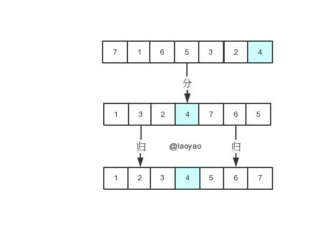
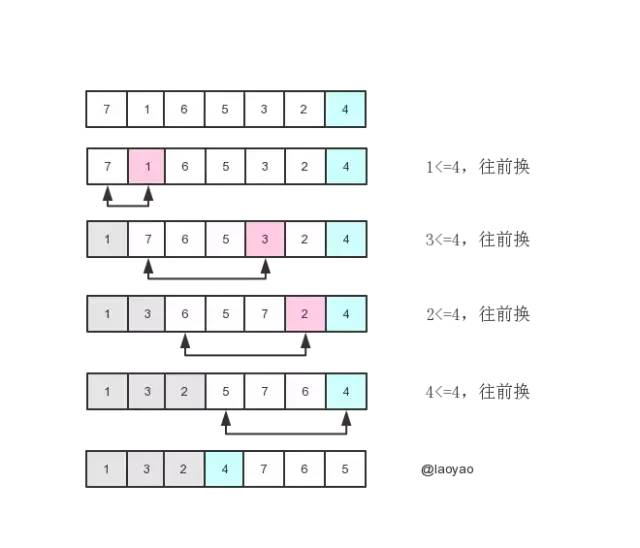
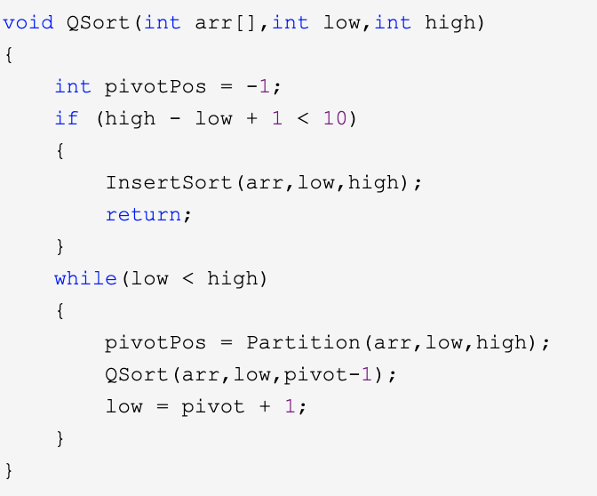
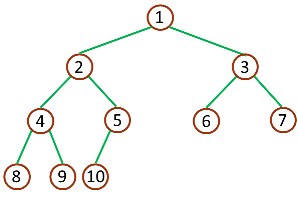
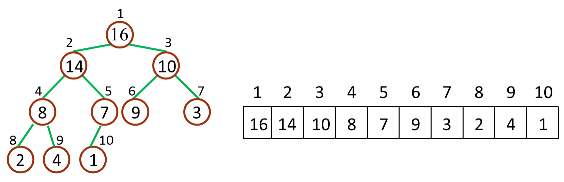
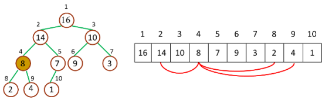
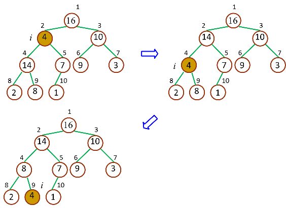

# 排序算法（十大经典排序算法）

## 前言

十种常见排序算法可以分为两大类：

*   比较类排序：通过比较来决定元素间的相对次序，由于其时间复杂度不能突破O(nlogn)，因此也称为非线性时间比较类排序。

*   非比较类排序：不通过比较来决定元素间的相对次序，它可以突破基于比较排序的时间下界，以线性时间运行，因此也称为线性时间非比较类排序。&#x20;


概括一下时间和空间复杂度： &#x20;


上图相关概念：

*   稳定：如果a原本在b前面，而a=b，排序之后a仍然在b的前面。

*   不稳定：如果a原本在b的前面，而a=b，排序之后 a 可能会出现在 b 的后面。

*   时间复杂度：对排序数据的总的操作次数。反映当n变化时，操作次数呈现什么规律。

*   空间复杂度：是指算法在计算机内执行时所需存储空间的度量，它也是数据规模n的函数。

## 冒泡排序（Bubble Sort）

冒泡排序是一种简单的排序算法。它重复地走访过要排序的数列，**一次比较两个元素**，如果它们的顺序错误就把它们交换过来。走访数列的工作是重复地进行直到没有再需要交换，也就是说该数列已经排序完成。这个算法的名字由来是因为越小的元素会经由交换慢慢“浮”到数列的顶端。冒泡排序还有一种优化算法，就是立一个flag，当在一趟序列遍历中元素没有发生交换，则证明该序列已经有序。但这种改进对于提升性能来说并没有什么太大作用。&#x20;

#### 算法描述

*   比较相邻的元素。如果第一个比第二个大，就交换它们两个；

*   对每一对相邻元素作同样的工作，从开始第一对到结尾的最后一对，这样在最后的元素应该会是最大的数；

*   针对所有的元素重复以上的步骤，除了最后一个；

*   重复步骤1\~3，直到排序完成。

**动图演示** &#x20;


#### 代码实现

```java

public class BubbleSort implements IArraySort {

    @Override
    public int[] sort(int[] sourceArray) throws Exception {
        // 对 arr 进行拷贝，不改变参数内容
        int[] arr = Arrays.copyOf(sourceArray, sourceArray.length);

        for (int i = 1; i < arr.length; i++) {
            // 设定一个标记，若为true，则表示此次循环没有进行交换，也就是待排序列已经有序，排序已经完成。
            boolean flag = true;

            for (int j = 0; j < arr.length - i; j++) {
                if (arr[j] > arr[j + 1]) {
                    int tmp = arr[j];
                    arr[j] = arr[j + 1];
                    arr[j + 1] = tmp;

                    flag = false;
                }
            }

            if (flag) {
                break;
            }
        }
        return arr;
    }
}
```

## 选择排序（Selection Sort）

选择排序(Selection-sort)是一种简单直观的排序算法。它的工作原理：首先在未排序序列中找到最小（大）元素，存放到排序序列的起始位置，然后，再从剩余未排序元素中继续寻找最小（大）元素，然后放到已排序序列的末尾。以此类推，直到所有元素均排序完毕。&#x20;

#### 算法描述

*   首先在未排序序列中找到最小（大）元素，存放到排序序列的起始位置

*   再从剩余未排序元素中继续寻找最小（大）元素，然后放到已排序序列的末尾。

*   重复第二步，直到所有元素均排序完毕。

**动图演示**


#### 代码实现

```java

public class SelectionSort implements IArraySort {

    @Override
    public int[] sort(int[] sourceArray) throws Exception {
        int[] arr = Arrays.copyOf(sourceArray, sourceArray.length);

        // 总共要经过 N-1 轮比较
        for (int i = 0; i < arr.length - 1; i++) {
            int min = i;

            // 每轮需要比较的次数 N-i
            for (int j = i + 1; j < arr.length; j++) {
                if (arr[j] < arr[min]) {
                    // 记录目前能找到的最小值元素的下标
                    min = j;
                }
            }

            // 将找到的最小值和i位置所在的值进行交换
            if (i != min) {
                int tmp = arr[i];
                arr[i] = arr[min];
                arr[min] = tmp;
            }

        }
        return arr;
    }
}
```

## 插入排序（Insertion Sort）

插入排序的代码实现虽然没有冒泡排序和选择排序那么简单粗暴，但它的原理应该是最容易理解的了，因为只要打过扑克牌的人都应该能够秒懂。插入排序是一种最简单直观的排序算法，它的工作原理是通过构建有序序列，对于未排序数据，在已排序序列中从后向前扫描，找到相应位置并插入。

#### 算法描述

*   从第一个元素开始，该元素可以认为已经被排序；

*   取出下一个元素，在已经排序的元素序列中从后向前扫描；

*   如果该元素（已排序）大于新元素，将该元素移到下一位置；

*   重复步骤3，直到找到已排序的元素小于或者等于新元素的位置；

*   将新元素插入到该位置后；

*   重复步骤2\~5。

**动图演示**


#### 代码实现

```java
public class InsertSort implements IArraySort {

    @Override
    public int[] sort(int[] sourceArray) throws Exception {
        // 对 arr 进行拷贝，不改变参数内容
        int[] arr = Arrays.copyOf(sourceArray, sourceArray.length);

        // 从下标为1的元素开始选择合适的位置插入，因为下标为0的只有一个元素，默认是有序的
        for (int i = 1; i < arr.length; i++) {

            // 记录要插入的数据
            int tmp = arr[i];

            // 从已经排序的序列最右边的开始比较，找到比其小的数
            int j = i;
            while (j > 0 && tmp < arr[j - 1]) {
                arr[j] = arr[j - 1];
                j--;
            }

            // 存在比其小的数，插入
            if (j != i) {
                arr[j] = tmp;
            }

        }
        return arr;
    }
}
```

## 希尔排序（Shell Sort）

希尔排序按其设计者希尔（Donald Shell）的名字命名，该算法由1959年公布。

希尔排序，也称**递减增量排序**算法，它是简单插入排序经过改进之后的一个更高效的版本。实际上，希尔排序就是插入排序的高级版。

希尔排序是把记录按下标的一定增量分组，对每组使用直接插入排序算法排序；随着增量逐渐减少，每组包含的关键词越来越多，当增量减至1时，整个文件恰被分成一组，算法便终止。它的做法不是每次一个元素挨一个元素的比较。而是初期选用大跨步（增量较大）间隔比较，使记录跳跃式接近它的排序位置；然后增量缩小；最后增量为 1 ，这样记录**移动次数大大减少**，提高了排序效率。希尔排序对增量序列的选择没有严格规定。

简单插入排序很循规蹈矩，不管数组分布是怎么样的，依然一步一步的对元素进行比较，移动，插入，比如\[5,4,3,2,1,0]这种倒序序列，数组末端的0要回到首位置很是费劲，比较和移动元素均需n-1次。而希尔排序在数组中采用跳跃式分组的策略，通过某个增量将数组元素划分为若干组，然后分组进行插入排序，随后逐步缩小增量，继续按组进行插入排序操作，直至增量为1。希尔排序通过这种策略使得整个数组在初始阶段达到从宏观上看基本有序，小的基本在前，大的基本在后。然后缩小增量，到增量为1时，其实多数情况下只需微调即可，不会涉及过多的数据移动。


再举个例子：

例如，假设有这样一组数\[ 13 14 94 33 82 25 59 94 65 23 45 27 73 25 39 10 ]，如果我们以步长为5开始进行排序，我们可以通过将这列表放在有5列的表中来更好地描述算法，这样他们就应该看起来是这样：

13 14 94 33 82 &#x20;
25 59 94 65 23 &#x20;
45 27 73 25 39 &#x20;
10 &#x20;

然后我们对每列进行排序：

10 14 73 25 23 &#x20;
13 27 94 33 39 &#x20;
25 59 94 65 82 &#x20;
45 &#x20;

将上述四行数字，依序接在一起时我们得到：\[ 10 14 73 25 23 13 27 94 33 39 25 59 94 65 82 45 ].这时10已经移至正确位置了，然后再以3为步长进行排序：

10 14 73 &#x20;
25 23 13 &#x20;
27 94 33 &#x20;
39 25 59 &#x20;
94 65 82 &#x20;
45 &#x20;

排序之后变为：

10 14 13 &#x20;
25 23 33 &#x20;
27 25 59 &#x20;
39 65 73 &#x20;
45 94 82 &#x20;
94 &#x20;

最后以1步长进行排序（此时就是简单的插入排序了）。

**总结来看：步长是多少，就分多少组（子序列）**

#### 算法描述

*   选择一个增量序列t1，t2，…，tk，其中ti>tj，tk=1；

*   按增量序列个数k，对序列进行k 趟排序；

*   每趟排序，根据对应的增量ti，将待排序列分割成若干长度为m 的子序列，分别对各子表进行直接插入排序。仅增量因子为1 时，整个序列作为一个表来处理，表长度即为整个序列的长度。

#### 动图演示


#### 代码实现

```java
public class ShellSort implements IArraySort {

    @Override
    public int[] sort(int[] sourceArray) throws Exception {
        // 对 arr 进行拷贝，不改变参数内容
        int[] arr = Arrays.copyOf(sourceArray, sourceArray.length);

        int gap = 1;
        while (gap < arr.length/3) {
            gap = gap * 3 + 1;
        }

        while (gap > 0) {
            for (int i = gap; i < arr.length; i++) {
                int tmp = arr[i];
                int j = i - gap;
                while (j >= 0 && arr[j] > tmp) {
                    arr[j + gap] = arr[j];
                    j -= gap;
                }
                arr[j + gap] = tmp;
            }
            gap = (int) Math.floor(gap / 3);
        }

        return arr;
    }
}
```

随着排序的进行，数组越来越接近有序，步长也越来越小，直到gap=1，此时希尔排序就变得跟插入排序一模一样了，但此时数组已经几乎完全有序了，对一个几乎有序的数组运行插入排序，其复杂度接近O(N)。整个过程看起来天衣无缝，**然而其中隐藏着一个难点，应该使用怎样的增量序列？**

必须要考虑的因素有两点：

*   当改变步长的时候，如何保证新的步长不会打乱之前排序的结果？

    这不会影响最终排序的正确性，因为只要步长在减小，数组永远都只会朝着更加有序的方向迈进，但这却是影响希尔排序效率的关键。因为这涉及到完成排序的过程中，算法做了多少无用功。

*   如何保证每一个步长都是有意义的？来看一个例子，假设有一个数组\[1,5,2,6,3,7,4,8]，使用步长序列\[4,2,1]对其进行排序，过程如图：

    

    这就相当于进行了一次低效的插入排序，因为在step=1之前，程序什么也没干，偶数位置永远不会与基数位置进行比较 &#x20;

    **目前已有的增量算法有以下几种**（ N为数组长度）： &#x20;


其中第一个它出自Shell本人且非常容易用代码表达，因此而流行，我看到现在的一些文章中的例子都还在使用它或它的变种。本文中代码实现部分为了方便演示，选择了很多例子中惯用的一个增量算法。

**希尔排序相对于前面三种排序复杂一些，没有那么直观，需要仔细思考，如果对照程序想不明白，最好Debug一下程序，看一下流程，你会发现其实内核还是插入排序只不过外面套了多个不同步长的子序列，进行了多次插入排序而已。**

## 归并排序（Merge Sort）

归并排序（MERGE-SORT）是利用**归并**的思想实现的排序方法，该算法采用经典的**分治**（divide-and-conquer）策略（分治法将问题**分(divide)成一些小的问题然后递归求解，而**治(conquer)的阶段则将分的阶段得到的各答案"修补"在一起，即分而治之)。将已有序的子序列合并，得到完全有序的序列；即先使每个子序列有序，再使子序列段间有序。若将两个有序表合并成一个有序表，称为2路归并。

作为一种典型的分而治之思想的算法应用，归并排序的实现由两种方法：

*   自上而下的递归（所有递归的方法都可以用迭代重写，所以就有了第 2 种方法）；

*   自下而上的迭代；

#### 分而治之


可以看到这种结构很像一棵完全二叉树，本文的归并排序我们采用递归去实现（也可采用迭代的方式去实现）

#### 算法描述

*   把长度为n的输入序列分成两个长度为n/2的子序列；

*   对这两个子序列分别采用归并排序；

*   将两个排序好的子序列合并成一个最终的排序序列。

#### 动图演示


#### 代码实现

```java
public class MergeSort   {

    public int[] sort(int[] sourceArray) throws Exception {
        // 对 arr 进行拷贝，不改变参数内容
        int[] arr = Arrays.copyOf(sourceArray, sourceArray.length);

        if (arr.length < 2) {
            return arr;
        }
        int middle = (int) Math.floor(arr.length / 2);

        int[] left = Arrays.copyOfRange(arr, 0, middle);
        int[] right = Arrays.copyOfRange(arr, middle, arr.length);

        return merge(sort(left), sort(right));
    }

    protected int[] merge(int[] left, int[] right) {
        int[] result = new int[left.length + right.length];
        int i = 0;
        while (left.length > 0 && right.length > 0) {
            if (left[0] <= right[0]) {
                result[i++] = left[0];
                left = Arrays.copyOfRange(left, 1, left.length);
            } else {
                result[i++] = right[0];
                right = Arrays.copyOfRange(right, 1, right.length);
            }
        }

        while (left.length > 0) {
            result[i++] = left[0];
            left = Arrays.copyOfRange(left, 1, left.length);
        }

        while (right.length > 0) {
            result[i++] = right[0];
            right = Arrays.copyOfRange(right, 1, right.length);
        }

        return result;
    }

}
```

归并排序是一种稳定的排序方法。和选择排序一样，归并排序的性能不受输入数据的影响，但表现比选择排序好的多，因为始终都是O(nlogn）的时间复杂度。代价是需要额外的内存空间。

关于动画演示，网上有许多比本文更漂亮的，大家可以搜索看一下，比如 [http://sorting.at/](http://sorting.at/ "http://sorting.at/")  有多种排序算法的动画演示，非常漂亮

## 快速排序（Quick Sort）

快速排序（有时称为分区交换排序）是一种有效的排序算法。由英国计算机科学家Tony Hoare于1959年开发并于1961年发表，它仍然是一种常用的排序算法。如果实施得当，它可以比主要竞争对手（合并排序和堆排序）快两到三倍。快速排序基本上被认为是相同数量级的所有排序算法中，平均性能最好的。

Quicksort是一种**分而治之**的算法。它通过从数组中选择一个“pivot”元素并将其他元素划分为两个子数组（根据它们是否小于或大于枢轴）来工作。然后将子数组递归排序。这种排序方式由于可以就地完成，所以需要少量额外的内存来执行排序。

在平均状况下，排序 n 个项目要 Ο(nlogn) 次比较。在最坏状况下则需要 Ο(n2) 次比较，但这种状况并不常见。事实上，快速排序通常明显比其他 Ο(nlogn) 算法更快，因为它的内部循环（inner loop）可以在大部分的架构上很有效率地被实现出来

其广泛应用的主要原因是高效.**快速排序经常会被作为面试题进行考察**，通常的考察思路是快排思想、编码实践之手写快排以及进一步对快排的优化。事实上在Java标准库中**Arrays类的sort**方法里源码也正是使用了优化后的快速排序，**java 8 中 Arrays.sort并不是单一的排序，而是插入排序，快速排序，归并排序三种排序的组合**，有兴趣的可以看看源码。


举个例子 如无序数组\[6 2 4 1 5 9]

*   先把第一项\[6]取出来,

    用\[6]依次与其余项进行比较, &#x20;

    如果比\[6]小就放\[6]前边,2 4 1 5都比\[6]小,所以全部放到\[6]前边 &#x20;

    如果比\[6]大就放\[6]后边,9比\[6]大,放到\[6]后边

    //***6出列后大喝一声,比我小的站前边,比我大的站后边,行动吧!霸气十足\~*** &#x20;

    一趟排完后变成下边这样:

    排序前 **6** 2 4 1 5 9    排序后 2 4 1 5 **6** 9

*   对前半拉\[2 4 1 5]继续进行快速排序 &#x20;

    重复第一步后变成下边这样:

    排序前 **2** 4 1 5       排序后 1 **2** 4 5

    前半拉排序完成,总的排序也完成

    排序前:\[6 2 4 1 5 9]   排序后:\[1 2 4 5 6 9]

*   排序结束 &#x20;

#### 算法描述

快速排序使用分治法来把一个串（list）分为两个子串（sub-lists）。具体算法描述如下：

*   从数列中挑出一个元素，称为 “基准”（pivot）；

*   重新排序数列，所有元素比基准值小的摆放在基准前面，所有元素比基准值大的摆在基准的后面（相同的数可以到任一边）。在这个分区退出之后，该基准就处于数列的中间位置。这个称为分区（partition）操作；

*   递归地（recursive）把小于基准值元素的子数列和大于基准值元素的子数列排序。

#### 动图演示


#### 代码实现

```java
import java.util.Arrays;

public class QuickSort {

  public int[] sort(int[] sourceArray) {
    // 对 arr 进行拷贝，不改变参数内容
    int[] arr = Arrays.copyOf(sourceArray, sourceArray.length);

    return quickSort(arr, 0, arr.length - 1);
  }

  private int[] quickSort(int[] arr, int left, int right) {

    if (left < right) {
      int partitionIndex = partition(arr, left, right);
      quickSort(arr, left, partitionIndex - 1);
      quickSort(arr, partitionIndex + 1, right);
    }
    return arr;

  }

  private int partition(int[] arr, int left, int right) {

    int pivot = arr[right];
    int index = left;
    for (int i = index; i <= right; i++) {

      if (arr[i] <= pivot) {
        int temp = arr[i];
        arr[i] = arr[index];
        arr[index] = temp;
        index++;
      }

    }
    return index - 1;

  }


}

```

为了便于理解 ，再举个例子，先把数组按最后一个元素4作为分界点，把数组一分为三。除了分界点之外，左子部分全是小于等于4的，右子部分全是大于4的，它们可以进一步递归排序。该算法的**核心**是：**如何把数组按分界点一分为三**？



具体过程是这样的，选取最后一个元素为分界点，然后遍历数组找小于等于分界点的元素，然后往数组前面交换。比如：



上图中，我们按顺序找小于等于4的元素，共1、2、3、4。然后分别与数组的前4个元素交换即可，结果自然是一分为三。

#### 基准的选择

*   基准普遍的有三种选择方法： &#x20;

    固定基准元，一般选取中间值或头部值或尾部值。如果输入序列是随机的，处理时间是可以接受的。如果数组已经有序时或部分有序，此时的分割就是一个非常不好的分割。因为每次划分只能使待排序序列减一，数组全部有序时，此时为最坏情况，快速排序沦为冒泡排序，时间复杂度为O(n^2)。所以此种方式要慎用。 &#x20;

*   随机基准元，这是一种相对安全的策略。由于基准元的位置是随机的，那么产生的分割也不会总是会出现劣质的分割。在整个数组数字全相等时，仍然是最坏情况，时间复杂度是O(n^2）。实际上，随机化快速排序得到理论最坏情况的可能性仅为1/(2^n）。所以随机化快速排序可以对于绝大多数输入数据达到O(nlogn）的期望时间复杂度。 &#x20;

*   三数取中，一般是分别取出数组的**头部元素，尾部元素和中部元素**， 在这三个数中取出中位数，作为基准元素。最佳的划分是将待排序的序列分成等长的子序列，最佳的状态我们可以使用序列的中间的值，也就是第N/2个数。可是，这很难算出来，并且会明显减慢快速排序的速度。这样的中值的估计可以通过随机选取三个元素并用它们的中值作为枢纽元而得到。事实上，随机性并没有多大的帮助，因此一般的做法是使用左端、右端和中心位置上的三个元素的中值作为枢纽元。显然使用三数中值分割法消除了预排序输入的不好情形。（简单来说，就是随机取三个数，取中位数）。

#### 优化思路

*   当待排序序列的长度分割到一定大小后，使用插入排序。 &#x20;

    jdk8的源码也是这么写的 （注意注释部分，这里INSERTION\_SORT\_THRESHOLD = 47）


原因：对于很小和部分有序的数组，快排不如插排好。当待排序序列的长度分割到一定大小后，继续分割的效率比插入排序要差，此时可以使用插排而不是快排。

*   合理选择pivot

    pivot选取的理想情况是：让分区中比 pivot 小的元素数量和比 pivot 大的元素数量差不多。较常用的做法是三数取中（ midian of three ），即从第一项、最后一项、中间一项中取中位数作为 pivot。当然这并不能完全避免最差情况的发生。所以很多时候会采取更小心、更严谨的 pivot 选择方案（对于大数组特别重要）。比如先把大数组平均切分成左中右三个部分，每个部分用三数取中得到一个中位数，再从得到的三个中位数中找出中位数。

*   优化递归操作

    快排函数在函数尾部有两次递归操作，我们可以对其使用尾递归优化（然而并不是所有语言都支持尾递归） &#x20;

    优点：如果待排序的序列划分极端不平衡，递归的深度将趋近于n，而栈的大小是很有限的，每次递归调用都会耗费一定的栈空间，函数的参数越多，每次递归耗费的空间也越多。

    优化后，可以缩减堆栈深度，由原来的O(n)缩减为O(logn)，将会提高性能。

    

*   改进划分的策略（可以参考 [https://segmentfault.com/a/1190000014960548）](https://segmentfault.com/a/1190000014960548） "https://segmentfault.com/a/1190000014960548）")

    jdk8 DualPivotQuicksort 使用了一种称为 五取样划分 的策略对数组进行划分，类似于 BFPRT 算法。

*   双枢轴（可以参考 [https://segmentfault.com/a/1190000014960548）](https://segmentfault.com/a/1190000014960548） "https://segmentfault.com/a/1190000014960548）")

    即将数组三切分(大于枢轴，等于枢轴，小于枢轴），可以证明这样是熵最优的并且更高效。为什么这样划分呢？因为统计表明对大规模数组进行排序时，数据重复的情况比较多，因此使用双枢轴可以有效避免相等元素之间的比较。以 Java 标准库为例，JDK 1.8 中的 DualPivotQuicksort 实现了一种 快速三向切分 的快速排序，它通过将相等元素聚集起来的方式使熵最优（原理：将相等元素聚集起来，不必再切分这些元素）。

*   其他未写到，或更加丧心病狂的方法

## 堆排序（Heap Sort）

堆排序（Heapsort）是指利用堆这种数据结构所设计的一种排序算法。堆积是一个近似**完全二叉树**的结构，并同时满足堆积的性质：即子结点的键值或索引总是小于（或者大于）它的父节点。堆排序可以说是一种利用堆的概念来排序的选择排序。分为两种方法：

*   **大顶堆**：每个节点的值都大于或等于其子节点的值，在堆排序算法中用于升序排列；

*   **小顶堆**：每个节点的值都小于或等于其子节点的值，在堆排序算法中用于降序排列；

堆排序的平均时间复杂度为 Ο(nlogn)。

#### 算法描述

*   将待排序序列构建成一个堆 H\[0……n-1]，根据（升序降序需求）选择大顶堆或小顶堆；

*   把堆首（最大值）和堆尾互换；

*   把堆的尺寸缩小 1，并调用 shift\_down(0)，目的是把新的数组顶端数据调整到相应位置；

*   重复步骤 2，直到堆的尺寸为 1。

#### 动图演示


**详解** &#x20;

下图是一棵深度为4的完全二叉树 &#x20;



堆（二叉堆）可以视为一棵完全的二叉树。完全二叉树的一个“优秀”的性质是，除了最底层之外，其余每一层都是满的，这使得堆可以利用数组来表示（普通的一般的二叉树通常用链表作为基本容器表示），每一个结点对应数组中的一个元素。

如下图，是一个堆和数组的相互关系。



对于给定的某个节点的下标i，可以很容易的计算出这个结点的父结点、孩子结点的下标：

*   Parent(i) = i/2       //  i  父节点的下标

*   Left(i) = 2i             //  i  左子节点的下标

*   Right(i) = 2i + 1    //  i  右子节点的下标



堆（二叉堆）又分为2种：最大堆（大顶堆）、最小堆（小顶堆）。

\*\*大顶堆  \*\*

*   堆中的最大元素值出现在根结点（堆顶）

*   堆中每个父节点的元素值都大于等于其孩子结点（如果存在）

    

**小顶堆**

*   堆中的最小元素值出现在根结点（堆顶）

*   堆中每个父节点的元素值都小于等于其孩子结点（如果存在）


**堆排序就是把最大堆堆顶的最大数取出，将剩余的堆继续调整为最大堆，再次将堆顶的最大数取出，这个过程持续到剩余数只有一个时结束**。在堆中定义以下几种操作：

*   堆调整

*   建堆

继续进行下面的讨论前，需要注意的一个问题是：数组都是 Zero-Based，这就意味着我们的堆数据结构模型要发生改变：


相应的，几个计算公式也要作出相应调整：

*   Parent(i) = (i-1)/2      //  i 父节点下标

*   Left(i) = 2i + 1           //   i 左子节点下标

*   Right(i) = 2i + 2        //   i  右子节点下标

### 堆调整

最大堆调整（Max‐Heapify）的作用是保持最大堆的性质，是创建最大堆的核心子程序，过程如图所示：



由于一次调整后，堆仍然违反堆性质，所以需要递归的测试，使得整个堆都满足堆性质。

```java
/**
   * 最大堆调整
   *
   * @param index 检查起始的下标
   * @param heapSize 堆大小
   */
  public void heapify(int[] array, int index, int heapSize) {
    int left = 2 * index + 1;// 左孩子的下标（如果存在的话）
    int right = 2 * index + 2;// 左孩子的下标（如果存在的话）
    int iMax = index;// 寻找3个节点中最大值节点的下标
    if (left < heapSize && array[left] > array[index]) {
      iMax = left;
    }
    if (right < heapSize && array[right] > array[iMax]) {
      iMax = right;
    }
    if (iMax != index) {
      swap(array, iMax, index);
      heapify(array, iMax, heapSize);
    }
  }

  public void swap(int[] array, int i, int j) {
    int temp = array[i];
    array[i] = array[j];
    array[j] = temp;
  }
```

递归在调用递归子函数的时候，会先将传给子函数的参数压栈，然后将当前指令的下一条指令的地址压栈，以便子函数执行完后返回到原函数中继续执行，在原函数继续执行之前还涉及到清理子函数的栈。因此，递归的效率比迭代低一点点。其实上面的调整堆也可以用迭代来实现：

```java

public void heapify(int[] array, int index, int heapSize) {
    int left, right, iMax;
    while (true) {
      left = 2 * index + 1;// 左孩子的下标（如果存在的话）
      right = 2 * index + 2;// 左孩子的下标（如果存在的话）
      iMax = index;// 寻找3个节点中最大值节点的下标
      if (left < heapSize && array[left] > array[index]) {
        iMax = left;
      }
      if (right < heapSize && array[right] > array[iMax]) {
        iMax = right;
      }
      if (iMax != index) {
        swap(array, iMax, index);
        index = iMax;
      } else {
        break;
      }
    }
  }
```

### 建堆

创建最大堆（Build-Max-Heap）的作用是将一个数组改造成一个最大堆，接受数组和堆大小两个参数，Build-Max-Heap 将自下而上的调用 Max-Heapify 来改造数组，建立最大堆。**因为 Max-Heapify 能够保证下标 i 的结点之后结点都满足最大堆的性质，所以自下而上的调用 Max-Heapify 能够在改造过程中保持这一性质**。如果最大堆的数量元素是 n，那么 Build-Max-Heap 从 Parent(n) 开始，往上依次调用 Max-Heapify。流程如下： &#x20;


### 堆排序

堆排序（Heap-Sort）先调用Build-Max-Heap将原数组改造为最大堆，这个时候堆顶元素最大，将其与堆底（当前堆对应数组的最后一个元素）交换，堆的大小减去1，当前堆堆底后面的元素已经排好序。然后，从堆顶元素开始检查，调用Max-Heapify保持最大堆性质，这样可以将第二大的元素调到堆顶，然后将其与当前堆堆底元素交换。重复这个过程n-1次，直到堆中只有1个元素为止。整个流程如下：


**完整代码实现**

```java
public class HeapSort implements IArraySort {

    @Override
    public int[] sort(int[] sourceArray) throws Exception {
        // 对 arr 进行拷贝，不改变参数内容
        int[] arr = Arrays.copyOf(sourceArray, sourceArray.length);

        int len = arr.length;

        buildMaxHeap(arr, len);

        for (int i = len - 1; i > 0; i--) {
            swap(arr, 0, i);
            len--;
            heapify(arr, 0, len);
        }
        return arr;
    }

    private void buildMaxHeap(int[] arr, int len) {
        for (int i = (int) Math.floor(len / 2); i >= 0; i--) {
            heapify(arr, i, len);
        }
    }

    private void heapify(int[] arr, int i, int len) {
        int left = 2 * i + 1;
        int right = 2 * i + 2;
        int largest = i;

        if (left < len && arr[left] > arr[largest]) {
            largest = left;
        }

        if (right < len && arr[right] > arr[largest]) {
            largest = right;
        }

        if (largest != i) {
            swap(arr, i, largest);
            heapify(arr, largest, len);
        }
    }

    private void swap(int[] arr, int i, int j) {
        int temp = arr[i];
        arr[i] = arr[j];
        arr[j] = temp;
    }

}

```

## 计数排序（Counting Sort） &#x20;

计数排序不是基于比较的排序算法，其核心在于将输入的数据值转化为键存储在额外开辟的数组空间中。作为一种线性时间复杂度的排序，计数排序要求输入的数据必须是有确定范围的整数。

计数排序是一个稳定的排序算法。当输入的元素是 n 个 0到 k 之间的整数时，时间复杂度是O(n+k)，空间复杂度也是O(n+k)，其排序速度快于任何比较排序算法。当k不是很大并且序列比较集中时，计数排序是一个很有效的排序算法。

#### 算法描述

*   找出待排序的数组中最大和最小的元素；

*   统计数组中每个值为i的元素出现的次数，存入数组C的第i项；

*   对所有的计数累加（从C中的第一个元素开始，每一项和前一项相加）；

*   反向填充目标数组：将每个元素i放在新数组的第C(i)项，每放一个元素就将C(i)减去1。

#### 动图演示


#### 代码实现

```java
public class CountingSort implements IArraySort {

    @Override
    public int[] sort(int[] sourceArray) throws Exception {
        // 对 arr 进行拷贝，不改变参数内容
        int[] arr = Arrays.copyOf(sourceArray, sourceArray.length);

        int maxValue = getMaxValue(arr);

        return countingSort(arr, maxValue);
    }

    private int[] countingSort(int[] arr, int maxValue) {
        int bucketLen = maxValue + 1;
        int[] bucket = new int[bucketLen];

        for (int value : arr) {
            bucket[value]++;
        }

        int sortedIndex = 0;
        for (int j = 0; j < bucketLen; j++) {
            while (bucket[j] > 0) {
                arr[sortedIndex++] = j;
                bucket[j]--;
            }
        }
        return arr;
    }

    private int getMaxValue(int[] arr) {
        int maxValue = arr[0];
        for (int value : arr) {
            if (maxValue < value) {
                maxValue = value;
            }
        }
        return maxValue;
    }

}
```

计数排序是一个稳定的排序算法。当输入的元素是 n 个 0到 k 之间的整数时，时间复杂度是O(n+k)，空间复杂度也是O(n+k)，其排序速度快于任何比较排序算法。当k不是很大并且序列比较集中时，计数排序是一个很有效的排序算法。

## 桶排序（Bucket Sort）

桶排序是计数排序的升级版。它利用了函数的映射关系，高效与否的关键就在于这个映射函数的确定。桶排序 (Bucket sort)的工作的原理：假设输入数据服从均匀分布，将数据分到有限数量的桶里，每个桶再分别排序（有可能再使用别的排序算法或是以递归方式继续使用桶排序进行排）。

为了使桶排序更加高效，我们需要做到这两点：

*   在额外空间充足的情况下，尽量增大桶的数量

*   使用的映射函数能够将输入的 N 个数据均匀的分配到 K 个桶中

同时，对于桶中元素的排序，选择何种比较排序算法对于性能的影响至关重要。

#### 算法描述

*   设置一个定量的数组当作空桶；

*   遍历输入数据，并且把数据一个一个放到对应的桶里去；

*   对每个不是空的桶进行排序；

*   从不是空的桶里把排好序的数据拼接起来。&#x20;

#### 动图演示


#### 代码实现

```java
public class BucketSort implements IArraySort {

    private static final InsertSort insertSort = new InsertSort();

    @Override
    public int[] sort(int[] sourceArray) throws Exception {
        // 对 arr 进行拷贝，不改变参数内容
        int[] arr = Arrays.copyOf(sourceArray, sourceArray.length);

        return bucketSort(arr, 5);
    }

    private int[] bucketSort(int[] arr, int bucketSize) throws Exception {
        if (arr.length == 0) {
            return arr;
        }

        int minValue = arr[0];
        int maxValue = arr[0];
        for (int value : arr) {
            if (value < minValue) {
                minValue = value;
            } else if (value > maxValue) {
                maxValue = value;
            }
        }

        int bucketCount = (int) Math.floor((maxValue - minValue) / bucketSize) + 1;
        int[][] buckets = new int[bucketCount][0];

        // 利用映射函数将数据分配到各个桶中
        for (int i = 0; i < arr.length; i++) {
            int index = (int) Math.floor((arr[i] - minValue) / bucketSize);
            buckets[index] = arrAppend(buckets[index], arr[i]);
        }

        int arrIndex = 0;
        for (int[] bucket : buckets) {
            if (bucket.length <= 0) {
                continue;
            }
            // 对每个桶进行排序，这里使用了插入排序
            bucket = insertSort.sort(bucket);
            for (int value : bucket) {
                arr[arrIndex++] = value;
            }
        }

        return arr;
    }

    /**
     * 自动扩容，并保存数据
     *
     * @param arr
     * @param value
     */
    private int[] arrAppend(int[] arr, int value) {
        arr = Arrays.copyOf(arr, arr.length + 1);
        arr[arr.length - 1] = value;
        return arr;
    }

}
```

什么时候最快? &#x20;

当输入的数据可以均匀的分配到每一个桶中。

什么时候最慢?

当输入的数据被分配到了同一个桶中。

## 基数排序（Radix Sort）

基数排序是一种非比较型整数排序算法，其原理是将整数按位数切割成不同的数字，然后按每个位数分别比较。由于整数也可以表达字符串（比如名字或日期）和特定格式的浮点数，所以基数排序也不是只能使用于整数。

基数排序是按照低位先排序，然后收集；再按照高位排序，然后再收集；依次类推，直到最高位。有时候有些属性是有优先级顺序的，先按低优先级排序，再按高优先级排序。最后的次序就是高优先级高的在前，高优先级相同的低优先级高的在前。

#### 算法描述

*   取得数组中的最大数，并取得位数；

*   arr为原始数组，从最低位开始取每个位组成radix数组；

*   对radix进行计数排序（利用计数排序适用于小范围数的特点）

#### 动图演示


#### 代码实现

```java
/**
 * 基数排序
 * 考虑负数的情况还可以参考： https://code.i-harness.com/zh-CN/q/e98fa9
 */
public class RadixSort implements IArraySort {

    @Override
    public int[] sort(int[] sourceArray) throws Exception {
        // 对 arr 进行拷贝，不改变参数内容
        int[] arr = Arrays.copyOf(sourceArray, sourceArray.length);

        int maxDigit = getMaxDigit(arr);
        return radixSort(arr, maxDigit);
    }

    /**
     * 获取最高位数
     */
    private int getMaxDigit(int[] arr) {
        int maxValue = getMaxValue(arr);
        return getNumLenght(maxValue);
    }

    private int getMaxValue(int[] arr) {
        int maxValue = arr[0];
        for (int value : arr) {
            if (maxValue < value) {
                maxValue = value;
            }
        }
        return maxValue;
    }

    protected int getNumLenght(long num) {
        if (num == 0) {
            return 1;
        }
        int lenght = 0;
        for (long temp = num; temp != 0; temp /= 10) {
            lenght++;
        }
        return lenght;
    }

    private int[] radixSort(int[] arr, int maxDigit) {
        int mod = 10;
        int dev = 1;

        for (int i = 0; i < maxDigit; i++, dev *= 10, mod *= 10) {
            // 考虑负数的情况，这里扩展一倍队列数，其中 [0-9]对应负数，[10-19]对应正数 (bucket + 10)
            int[][] counter = new int[mod * 2][0];

            for (int j = 0; j < arr.length; j++) {
                int bucket = ((arr[j] % mod) / dev) + mod;
                counter[bucket] = arrayAppend(counter[bucket], arr[j]);
            }

            int pos = 0;
            for (int[] bucket : counter) {
                for (int value : bucket) {
                    arr[pos++] = value;
                }
            }
        }

        return arr;
    }

    /**
     * 自动扩容，并保存数据
     *
     * @param arr
     * @param value
     */
    private int[] arrayAppend(int[] arr, int value) {
        arr = Arrays.copyOf(arr, arr.length + 1);
        arr[arr.length - 1] = value;
        return arr;
    }
}
```

### 基数排序 vs 计数排序 vs 桶排序

这三种排序算法都利用了桶的概念，但对桶的使用方法上有明显差异：

*   基数排序：根据键值的每位数字来分配桶；

*   计数排序：每个桶只存储单一键值；

*   桶排序：每个桶存储一定范围的数值；

## 参考&#x20;

*   [https://www.cnblogs.com/onepixel/p/7674659.html](https://www.cnblogs.com/onepixel/p/7674659.html "https://www.cnblogs.com/onepixel/p/7674659.html")

*   [https://sort.hust.cc/4.shellsort](https://sort.hust.cc/4.shellsort "https://sort.hust.cc/4.shellsort")

*   [https://en.wikipedia.org/wiki/Shellsort](https://en.wikipedia.org/wiki/Shellsort "https://en.wikipedia.org/wiki/Shellsort")

*   [https://www.cnblogs.com/chengxiao/p/6194356.html](https://www.cnblogs.com/chengxiao/p/6194356.html "https://www.cnblogs.com/chengxiao/p/6194356.html")

*   [https://www.kancloud.cn/maliming/leetcode/740190](https://www.kancloud.cn/maliming/leetcode/740190 "https://www.kancloud.cn/maliming/leetcode/740190")

*   [https://www.cnblogs.com/chengxiao/p/6104371.html](https://www.cnblogs.com/chengxiao/p/6104371.html "https://www.cnblogs.com/chengxiao/p/6104371.html")

*   [https://brilliant.org/wiki/sorting-algorithms/](https://brilliant.org/wiki/sorting-algorithms/ "https://brilliant.org/wiki/sorting-algorithms/")

*   [https://www.programcreek.com/2012/11/quicksort-array-in-java/](https://www.programcreek.com/2012/11/quicksort-array-in-java/ "https://www.programcreek.com/2012/11/quicksort-array-in-java/")

*   [https://juejin.im/post/5d75f77e5188253e4b2f0d3d](https://juejin.im/post/5d75f77e5188253e4b2f0d3d "https://juejin.im/post/5d75f77e5188253e4b2f0d3d")

*   [https://www.kancloud.cn/maliming/leetcode/740422](https://www.kancloud.cn/maliming/leetcode/740422 "https://www.kancloud.cn/maliming/leetcode/740422")

*   [http://lioncruise.github.io/2016/10/30/heap-sort/](http://lioncruise.github.io/2016/10/30/heap-sort/ "http://lioncruise.github.io/2016/10/30/heap-sort/")
