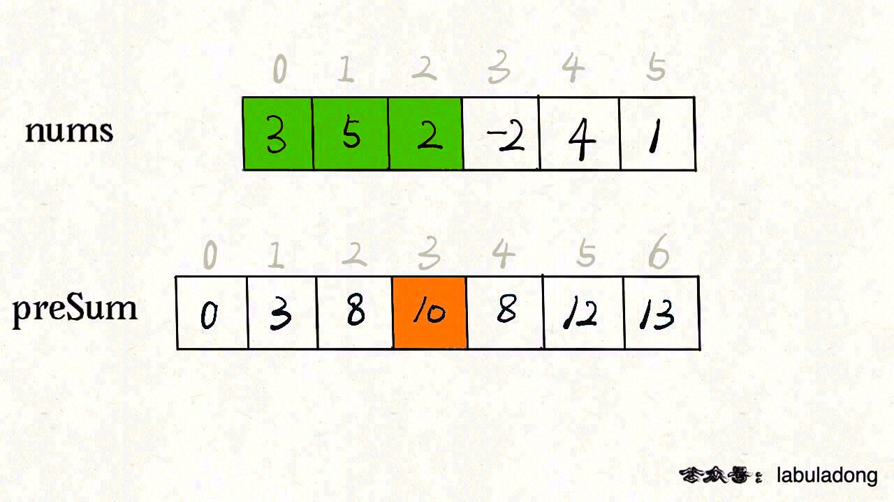
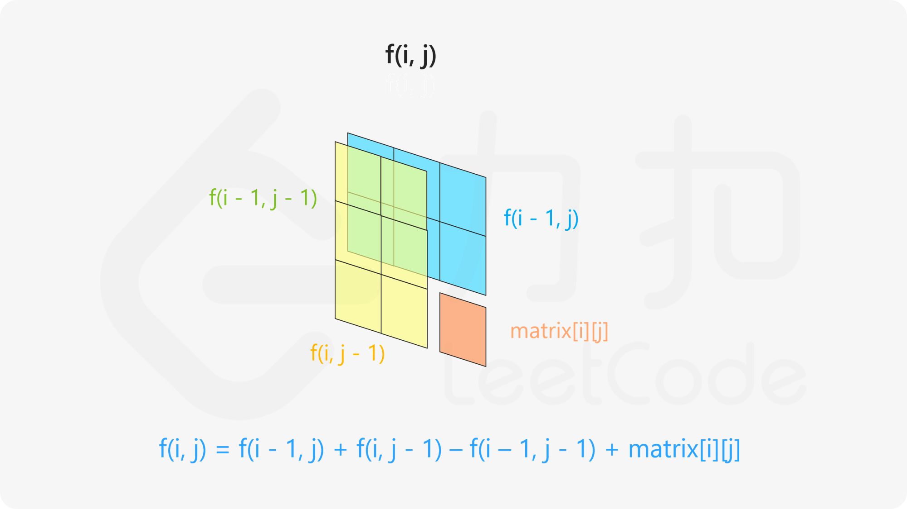
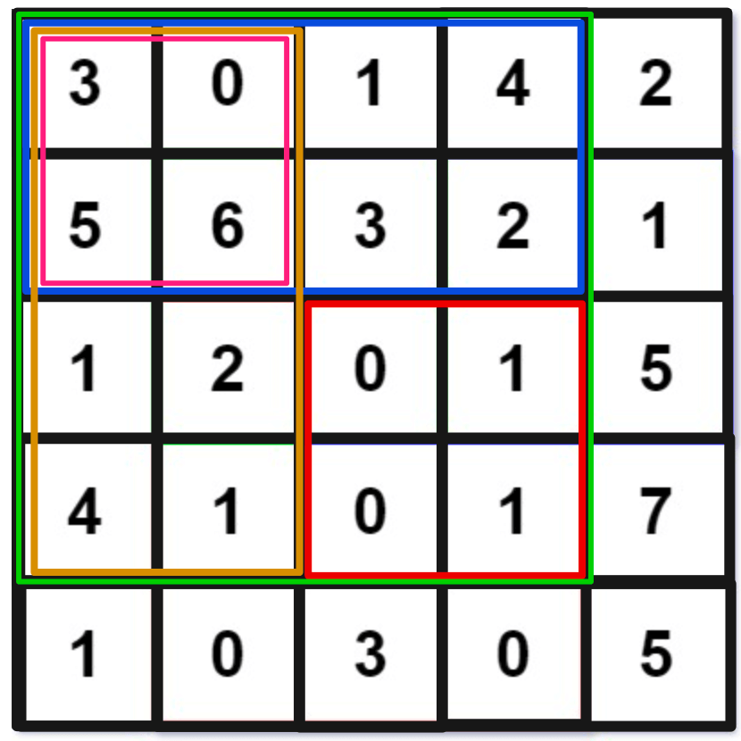
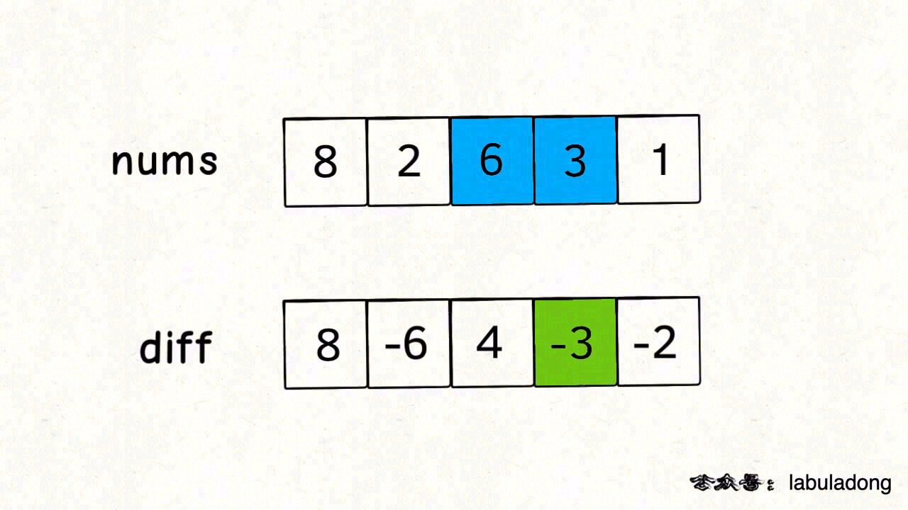
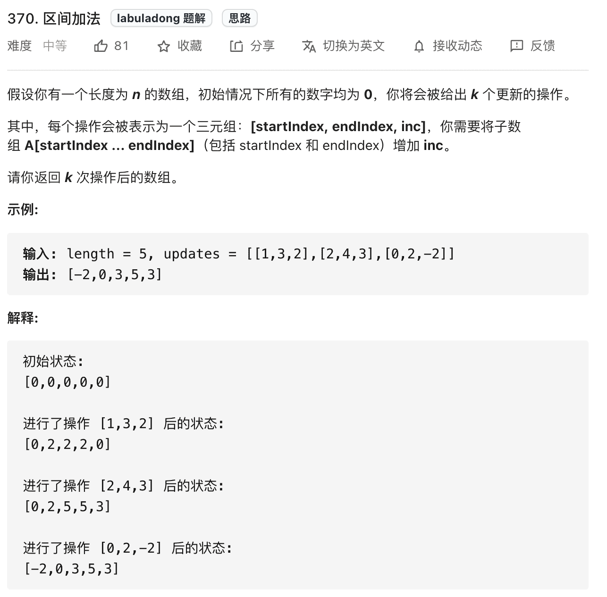
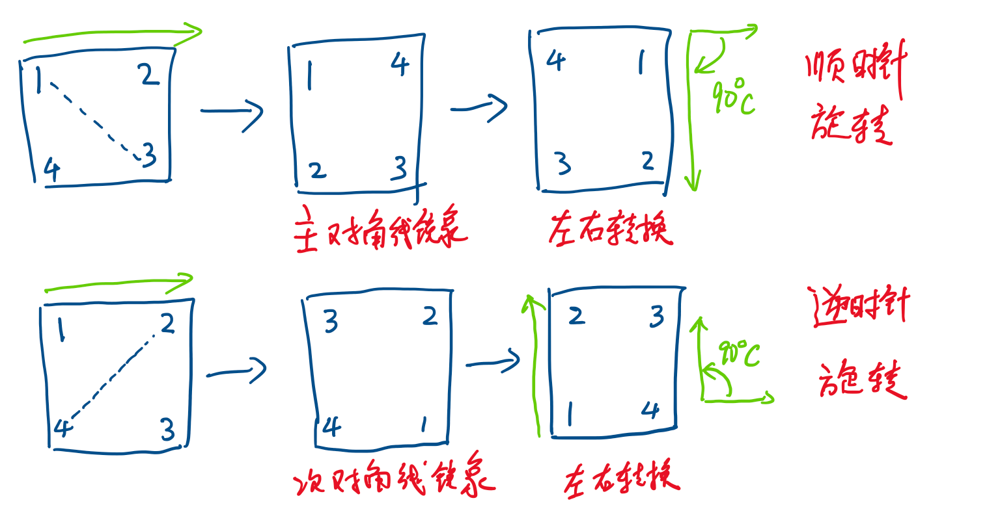
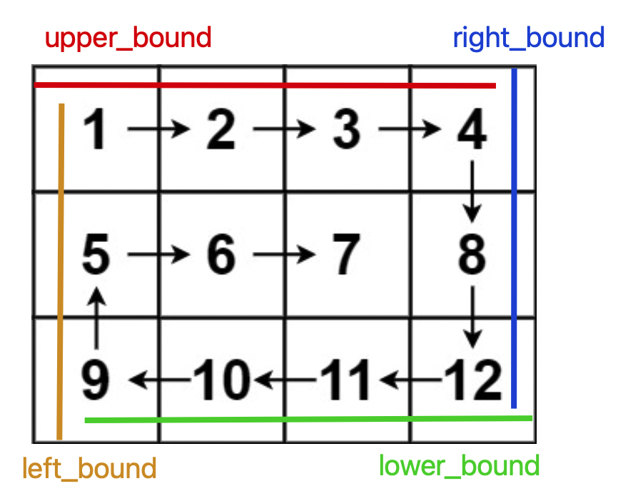

# 数组

## 前缀和

**前缀和主要适用的场景是原始数组不会被修改的情况下，频繁查询某个区间的累加和**。

### 303. 区域和检索 - 数组不可变

```java
class NumArray {
    // 前缀和数组
    private int[] preSum;

    /* 输入一个数组，构造前缀和 */
    public NumArray(int[] nums) {
        // preSum[0] = 0，便于计算累加和
        preSum = new int[nums.length + 1];
        // 计算 nums 的累加和
        for (int i = 1; i < preSum.length; i++) {
            preSum[i] = preSum[i - 1] + nums[i - 1];
        }
    }
    
    /* 查询闭区间 [left, right] 的累加和 */
    public int sumRange(int left, int right) {
        return preSum[right + 1] - preSum[left];
    }
}

/**
 * Your NumArray object will be instantiated and called as such:
 * NumArray obj = new NumArray(nums);
 * int param_1 = obj.sumRange(left,right);
 */ 
```



### 304. 二维区域和检索 - 矩阵不可变

**规律： 以左上角就是 \*\*\*\*\*\*\*\* 为原点到任意位置（**\*\*\*\***）的矩阵和为一个函数 f，那么可得:**

$$
 f(i,j）= f(i-1,j)+f(i,j-1)-f(i-1,j-1)+matrix[i][j]
$$

基本上就是相邻位置的运算。



如果以 `preSum[i][j]`表示的话，对应了以下的递推公式：

$$
preSum[i][j]=preSum[i−1][j]+preSum[i][j−1]−preSum[i−1][j−1]+matrix[i][j]
$$

**通过上面的函数可以计算出原点到所有位置的矩阵和，那么任意位置到任意位置的矩阵和也就好算了，因为有这样的规律：**

如果要求` [row1, col1][row1,col1]` 到 `[row2, col2][row2,col2]` 的子矩形的面积的话，用 preSum 对应了以下的递推公式：

$$
preSum[row2][col2]−preSum[row2][col1−1]−preSum[row1−1][col2]+preSum[row1−1][col1−1]
$$



**如果我想计算红色的这个子矩阵的元素之和，可以用 绿色矩阵 - 蓝色矩阵 - 橙色矩阵 +粉色矩阵 。而绿蓝橙粉这四个矩阵有一个共同的特点，就是左上角就是 \*\*\*\*\*\*\*\* 原点。**

```java
class NumMatrix {

    int[][] preSum;

    public NumMatrix(int[][] matrix) {

        int row = matrix.length;
        int col = matrix[0].length;

        preSum = new int[row+1][col+1];

        for(int i=0; i<row; i++){

            for(int j = 0; j<col; j++){

                preSum[i+1][j+1] = preSum[i+1][j]+preSum[i][j+1]-preSum[i][j]+matrix[i][j];

            }

        }

    }
    
    public int sumRegion(int row1, int col1, int row2, int col2) {

        return preSum[row2+1][col2+1]-preSum[row1][col2+1]-preSum[row2+1][col1]+preSum[row1][col1];

    }
}

/**
 * Your NumMatrix object will be instantiated and called as such:
 * NumMatrix obj = new NumMatrix(matrix);
 * int param_1 = obj.sumRegion(row1,col1,row2,col2);
 */
```

### 560. 和为 K 的子数组

思路：前缀和 + 哈希表优化

用哈希表，在记录前缀和的同时记录该前缀和出现的次数。

```java


// 为防止出现数组一k开头的情况，我们首先向map中加入(0,1)的数据

int subarraySum(int[] nums, int k) {
    int n = nums.length;
    // map：前缀和 -> 该前缀和出现的次数
    HashMap<Integer, Integer> 
        preSum = new HashMap<>();
    // base case
    preSum.put(0, 1);

    int res = 0, sum0_i = 0;
    for (int i = 0; i < n; i++) {
        sum0_i += nums[i];
        // 这是我们想找的前缀和 nums[0..j]
        int sum0_j = sum0_i - k;
        // 如果前面有这个前缀和，则直接更新答案
        if (preSum.containsKey(sum0_j))
            res += preSum.get(sum0_j);
        // 把前缀和 nums[0..i] 加入并记录出现次数
        preSum.put(sum0_i, 
            preSum.getOrDefault(sum0_i, 0) + 1);
    }
    return res;
}

```

## 差分数组

**差分数组的主要适用场景是频繁对原始数组的某个区间的元素进行增减**



构造一个 `diff` 差分数组，\*\*\*\*\*\* 就是 \*\*\*\*\*\*\*\* 和 \*\*\*\*\*\*\*\* 之差\*\*

```java
int[] diff = new int[nums.length];
// 构造差分数组
diff[0] = nums[0];
for (int i = 1; i < nums.length; i++) {
    diff[i] = nums[i] - nums[i - 1];
}
```

通过这个 `diff` 差分数组是可以反推出原始数组 `nums` 的，代码逻辑如下：

```java
int[] res = new int[diff.length];
// 根据差分数组构造结果数组
res[0] = diff[0];
for (int i = 1; i < diff.length; i++) {
    res[i] = res[i - 1] + diff[i];
}
```

如果你想对区间 `nums[i..j]` 的元素全部加 3，那么只需要让 `diff[i] += 3`，然后再让 `diff[j+1] -= 3`

&#x20;**回想 \*\*\*\*\*\*\*\* 数组反推 \*\*\*\*\*\*\*\* 数组的过程，**\*\*\*\*\*\* 意味着给 \*\*\*\*\*\*\*\* 所有的元素都加了 3，然后 \*\*\*\*\*\*\*\* 又意味着对于 \*\*\*\*\*\*\*\* 所有元素再减 3，那综合起来，是不是就是对 \*\*\*\*\*\*\*\* 中的所有元素都加 3 了\*\*？

只要花费 O(1) 的时间修改 `diff` 数组，就相当于给 `nums` 的整个区间做了修改。多次修改 `diff`，然后通过 `diff` 数组反推，即可得到 `nums` 修改后的结果。

现在我们把差分数组抽象成一个类，包含 `increment` 方法和 `result` 方法：

```java
// 差分数组工具类
class Difference {
    // 差分数组
    private int[] diff;
    
    /* 输入一个初始数组，区间操作将在这个数组上进行 */
    public Difference(int[] nums) {
        assert nums.length > 0;
        diff = new int[nums.length];
        // 根据初始数组构造差分数组
        diff[0] = nums[0];
        for (int i = 1; i < nums.length; i++) {
            diff[i] = nums[i] - nums[i - 1];
        }
    }

    /* 给闭区间 [i, j] 增加 val（可以是负数）*/
    public void increment(int i, int j, int val) {
        diff[i] += val;
        if (j + 1 < diff.length) {
            diff[j + 1] -= val;
        }
    }

    /* 返回结果数组 */
    public int[] result() {
        int[] res = new int[diff.length];
        // 根据差分数组构造结果数组
        res[0] = diff[0];
        for (int i = 1; i < diff.length; i++) {
            res[i] = res[i - 1] + diff[i];
        }
        return res;
    }
}
```

当 `j+1 >= diff.length` 时，说明是对 `nums[i]` 及以后的整个数组都进行修改，那么就不需要再给 `diff` 数组减 `val` 了。

### 370 区间加法



```java
int[] getModifiedArray(int length, int[][] updates) {
    // nums 初始化为全 0
    int[] nums = new int[length];
    // 构造差分解法
    Difference df = new Difference(nums);
    
    for (int[] update : updates) {
        int i = update[0];
        int j = update[1];
        int val = update[2];
        df.increment(i, j, val);
    }
    
    return df.result();
}
```

### 1109. 航班预订统计

```java
int[] corpFlightBookings(int[][] bookings, int n) {
    // nums 初始化为全 0
    int[] nums = new int[n];
    // 构造差分解法
    Difference df = new Difference(nums);

    for (int[] booking : bookings) {
        // 注意转成数组索引要减一哦
        int i = booking[0] - 1;
        int j = booking[1] - 1;
        int val = booking[2];
        // 对区间 nums[i..j] 增加 val
        df.increment(i, j, val);
    }
    // 返回最终的结果数组
    return df.result();
} 
```

### 1094. 拼车

```java
class Solution {
    boolean carPooling(int[][] trips, int capacity) {
    // 最多有 1001 个车站
    int[] nums = new int[1001];
    // 构造差分解法
    Difference df = new Difference(nums);
    
    for (int[] trip : trips) {
        // 乘客数量
        int val = trip[0];
        // 第 trip[1] 站乘客上车
        int i = trip[1];
        // 第 trip[2] 站乘客已经下车，
        // 即乘客在车上的区间是 [trip[1], trip[2] - 1]
        int j = trip[2] - 1;
        // 进行区间操作
        df.increment(i, j, val);
    }
    
    int[] res = df.result();
    
    // 客车自始至终都不应该超载
    for (int i = 0; i < res.length; i++) {
        if (capacity < res[i]) {
            return false;
        }
    }
    return true;
}
class Difference {
    // 差分数组
    private int[] diff;
    
    /* 输入一个初始数组，区间操作将在这个数组上进行 */
    public Difference(int[] nums) {
        assert nums.length > 0;
        diff = new int[nums.length];
        // 根据初始数组构造差分数组
        diff[0] = nums[0];
        for (int i = 1; i < nums.length; i++) {
            diff[i] = nums[i] - nums[i - 1];
        }
    }

    /* 给闭区间 [i,j] 增加 val（可以是负数）*/
    public void increment(int i, int j, int val) {
        diff[i] += val;
        if (j + 1 < diff.length) {
            diff[j + 1] -= val;
        }
    }

    /* 返回结果数组 */
    public int[] result() {
        int[] res = new int[diff.length];
        // 根据差分数组构造结果数组
        res[0] = diff[0];
        for (int i = 1; i < diff.length; i++) {
            res[i] = res[i - 1] + diff[i];
        }
        return res;
    }
}
} 
```

## 二维数组

### 48. 旋转图像

*   **我们可以先将 \*\*\*\*\*\*\*\* 矩阵 \*\*\*\*\*\*\*\* 按照左上到右下的对角线进行镜像对称**：

*   **然后再对矩阵的每一行进行反转**：

*   **发现结果就是 \*\*\*\*\*\*\*\* 顺时针旋转 90 度的结果**：



```java
class Solution {
    public void rotate(int[][] matrix) {

        int n = matrix.length;

        for(int i=0; i<n;i++){
          
          for(int j =i; j<n; j++){

              int temp = matrix[i][j];
              matrix[i][j] = matrix[j][i];
              matrix[j][i] = temp;

          }
        }


        for(int i=0; i<n; i++){
            
            int[] row = matrix[i];

            reverse(row);

        }

    }

    public void reverse(int[] row){

        int left=0;
        int right = row.length -1;

        while(left < right){

            int temp = row[left];
            row[left] = row[right];
            row[right] = temp;

            left++;
            right--;

        }

    }


} 
```

**如何将矩阵逆时针旋转 90 度呢**？

思路是类似的，只要通过另一条对角线镜像对称矩阵，然后再反转每一行，就得到了逆时针旋转矩阵的结果：

### 54. 螺旋矩阵

**解题的核心思路是按照右、下、左、上的顺序遍历数组，并使用四个变量圈定未遍历元素的边界**：



```java
List<Integer> spiralOrder(int[][] matrix) {
    int m = matrix.length, n = matrix[0].length;
    int upper_bound = 0, lower_bound = m - 1;
    int left_bound = 0, right_bound = n - 1;
    List<Integer> res = new LinkedList<>();
    // res.size() == m * n 则遍历完整个数组
    while (res.size() < m * n) {
        if (upper_bound <= lower_bound) {
            // 在顶部从左向右遍历
            for (int j = left_bound; j <= right_bound; j++) {
                res.add(matrix[upper_bound][j]);
            }
            // 上边界下移
            upper_bound++;
        }
        
        if (left_bound <= right_bound) {
            // 在右侧从上向下遍历
            for (int i = upper_bound; i <= lower_bound; i++) {
                res.add(matrix[i][right_bound]);
            }
            // 右边界左移
            right_bound--;
        }
        
        if (upper_bound <= lower_bound) {
            // 在底部从右向左遍历
            for (int j = right_bound; j >= left_bound; j--) {
                res.add(matrix[lower_bound][j]);
            }
            // 下边界上移
            lower_bound--;
        }
        
        if (left_bound <= right_bound) {
            // 在左侧从下向上遍历
            for (int i = lower_bound; i >= upper_bound; i--) {
                res.add(matrix[i][left_bound]);
            }
            // 左边界右移
            left_bound++;
        }
    }
    return res;
}
```

## 参考

*   [https://labuladong.gitee.io/algo/2/18/21/](https://labuladong.gitee.io/algo/2/18/21/ "https://labuladong.gitee.io/algo/2/18/21/")

*   [https://labuladong.gitee.io/algo/2/18/22/](https://labuladong.gitee.io/algo/2/18/22/ "https://labuladong.gitee.io/algo/2/18/22/")

*   [https://labuladong.github.io/algo/2/18/24/](https://labuladong.github.io/algo/2/18/24/ "https://labuladong.github.io/algo/2/18/24/")
