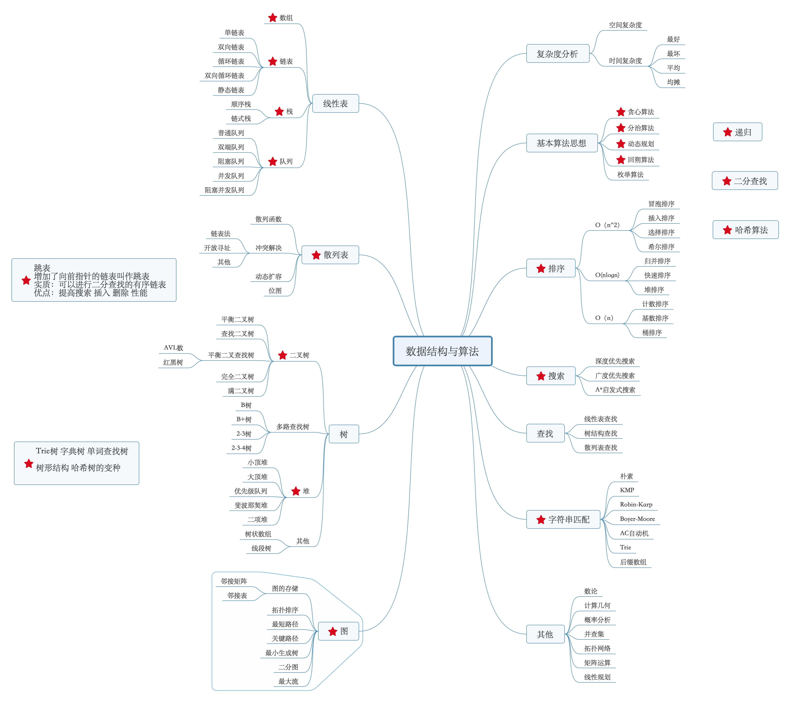

# 算法和数据结构

### 多线程

*   [生产者消费者模式实现](算法/生产者消费者模式实现/生产者消费者模式实现.md "生产者消费者模式实现")

## 参考

*   [http://programan.top/2018/11/13/数据结构与算法/#\&gid=1\&pid=1](http://programan.top/2018/11/13/数据结构与算法/#\&gid=1\&pid=1 "http://programan.top/2018/11/13/数据结构与算法/#\&gid=1\&pid=1")

[数据结构](数据结构/数据结构.md "数据结构")

[算法](算法/算法.md "算法")
