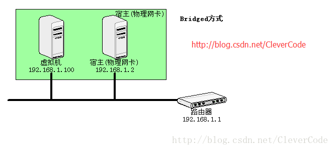
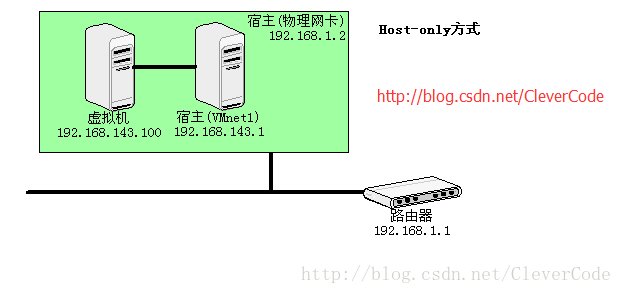
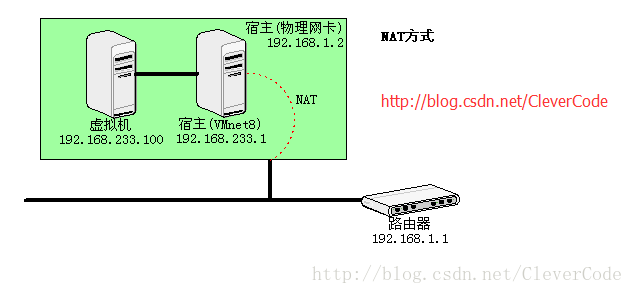

# 虚拟机

### VMware三种网络模式

*   **bridged(桥接模式)**

    *   用桥接模式的虚拟系统和宿主机器的关系，就像连接在同一个Hub上的两台电脑。想让它们相互通讯，你就需要为虚拟系统配置IP地址和子网掩码，否则就无法通信。

        

    *   如果你想利用VMWare在局域网内新建一个虚拟[服务器](https://cloud.tencent.com/product/cvm?from=10680 "服务器")，为局域网用户提供网络服务，就应该选择桥接模式

*   **host-only(主机模式)**

    *   在host-only模式中，所有的虚拟系统是可以相互通信的，但虚拟系统和真实的网络是被隔离开的。

    *   在host-only模式下，虚拟系统和宿主机器系统是可以相互通信的，相当于这两台机器通过双绞线互连

    *   如果你想利用VMWare创建一个与网内其他机器相隔离的虚拟系统，进行某些特殊的网络调试工作，可以选择host-only模式。

    *   这种方式下，虚拟机的网卡连接到宿主的 VMnet1 上，但系统并不为虚拟机提供任何路由服务，因此虚拟机只能和宿主机进行通信，而不能连接到实际网络上。

        

*   **NAT(网络地址转换模式)**

    *   使用NAT模式，就是让虚拟系统借助NAT(网络地址转换)功能，通过宿主机器所在的网络来访问公网

    *   使用NAT模式可以实现在虚拟 系统里访问互联网

    *   采用NAT模式最大的优势是虚拟系统接入互联网非常简单，你不需要进行任何其他的配置，只需要宿主机 器能访问互联网即可

    *   这种方式下，虚拟机的网卡连接到宿主的 VMnet8 上。此时系统的 VMWare NAT Service 服务就充当了路由器的作用，负责将虚拟机发到 VMnet8 的包进行地址转换之后发到实际的网络上，再将实际网络上返回的包进行地址转换后通过 VMnet8 发送给虚拟机。VMWare DHCP Service 负责为虚拟机提供 DHCP 服务。

        

## 参考

*   [https://cloud.tencent.com/developer/article/1184666](https://cloud.tencent.com/developer/article/1184666 "https://cloud.tencent.com/developer/article/1184666")
