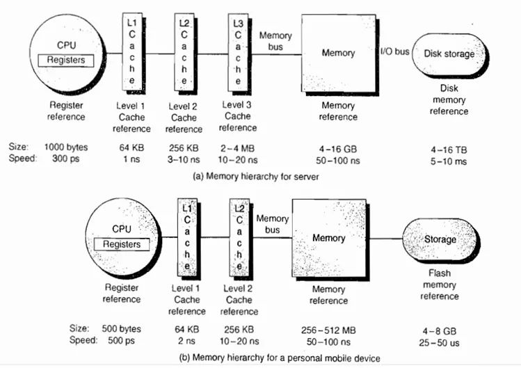

# 寄存器

## 什么是寄存器？

> 寄存器就是你的口袋。身上只有那么几个，只装最常用或者马上要用的东西。
>
> 内存就是你的背包。有时候拿点什么放到口袋里，有时候从口袋里拿出点东西放在背包里。
>
> 辅存就是你家里的抽屉。可以放很多东西，但存取不方便。
>
> 断电了就相当于你人没了，在家里复活，家里抽屉里东西还在，但包里口袋里的装备都爆没了

计算机的[存储层次](https://zh.wikipedia.org/wiki/存储层次 "存储层次")（memory hierarchy）之中，[寄存器](https://zh.wikipedia.org/wiki/寄存器 "寄存器")（register）最快，内存其次，最慢的是硬盘。

看一个计算机的存储体系

图中Registers就是寄存器

## 与java相关的

*   Java编译器输出的指令流，基本上是一种基于栈的指令集架构，而与之相对的另外一套常用的指令集架构是基于寄存器的指令集。早期的android，即android4.4之前使用的JVM是Dalvik VM，就是基于寄存器架构的。

*   基于栈的指令集主要的优点是可移植，寄存器由硬件直接提供，程序直接依赖这些硬件寄存器则不可避免地受到硬件的约束。 &#x20;

*   栈架构指令集的主要缺点是执行速度相对来说会稍慢一些。所有主流物理机的指令集都是寄存器架构

## 从头来说

假设我们做一个回向电路，把输出连回到输入，我们用OR门举例：

首先都输入0，那么输出将会是0 &#x20;

如果将A变成1，那么输出将会是1 &#x20;

一转眼的功夫输出回到B，那么B为1，OR门看到的结果是输入A、B都为1， &#x20;

1 OR 1 仍然为1，所以输出不变

如果将A变成0，0 OR 1 输出仍然是 1  &#x20;

**现在我们有个电路能记录1**,然而却有个小问题，就是无论怎么试，都无法从1变回0（如下两图） &#x20;

现在看一个相同电路，不过这次用AND 门

A、B均为1，  1 AND 1 为 1  &#x20;

如果之后A设置为0，由于是AND门，所以输出为0，B为0  &#x20;

**这个电路能记录0，和之前那个相反**,无论A设置什么值，电路始终输出0 &#x20;

现在我们有了能记录0和1的电路

为了做出有用的存储，我们将两个电路合起来，变成：AND-OR LATCH &#x20;

它有两个输入：

*   设置（set）   输入，将输出变成1

*   复位（reset）输入，将输出变成0

如果“设置”和“复位”都是0，电路会输出最后放入的内容，**也就是说它存住了1bit的信息！** 这就是存储。

之所以叫“LATCH(闩锁)”，是因为它“锁定”一个特定值并保持状态。将数据放入叫“写入”，将数据输出叫“读取”。好了，现在我们终于有办法存一个bit了。

麻烦的是用两条线来输入，也就是SET和RESET，有点儿麻烦，为了更易用，我们希望只有一条输入线，将它设为0或1来存储值。还需要一根线来“启用”。“启用”时允许写入，没“启用”时锁定。这条线叫“允许写入线”。加一些额外逻辑门，可以做出以下电路 ：

这个电路称为“门锁”，因为门可以打开或关上。这个电路稍微有些复杂了。 &#x20;

我们不想关心单独的逻辑门，我们封装一下，把“门锁”放到盒子里（一个能存单个bit的盒子）。来看下这个新组件：

我们来测试一下这个新组件，一切都从0开始，如果将输入从0变成1，或从1变成0，什么也不会发生，输出仍然是0 。因为WRITE ENABLE 是关闭的（0），来防止内容变化&#x20;

所以当WRITE ENABLE输入1，打开门后可以输入1，并将1存起来，这样输出也是1了。

我们可以关掉门（WRITE ENABLE =0），输出会保持1，此时输入随便是什么，输出都不会变（保持1）。

如果再次打开门（WRITE ENABLE =1），如果输入为0，输出也将是0：

最后关上门，输出会保持0 &#x20;

当然存1bit没什么大用，但我们没限制只能用一个组件，如果我们并排放8个，可以存8位，比如一个8bit数字。**一组这样的组件叫寄存器**。寄存器能存多少个Bit,叫“位宽”。早期电脑用8位寄存器，然后是16位，32位，如今很多计算机都有64位宽的寄存器了。

CPU中寄存器又分为指令寄存器（IR）、程序计数器（PC）、地址寄存器（AR）、数据寄存器（DR）、累加寄存器（AC）、程序状态字寄存器（PSW），这里就不深入讨论了

## 参考：

*   [https://www.zhihu.com/question/20539463](https://www.zhihu.com/question/20539463 "https://www.zhihu.com/question/20539463")

*   [http://www.ruanyifeng.com/blog/2013/10/register.html](http://www.ruanyifeng.com/blog/2013/10/register.html "http://www.ruanyifeng.com/blog/2013/10/register.html")

*   [http://www.ruanyifeng.com/blog/2013/10/register.html](http://www.ruanyifeng.com/blog/2013/10/register.html "http://www.ruanyifeng.com/blog/2013/10/register.html")

*   [https://www.youtube.com/watch?v=fpnE6UAfbtU](https://www.youtube.com/watch?v=fpnE6UAfbtU "https://www.youtube.com/watch?v=fpnE6UAfbtU")

*   [https://www.youtube.com/watch?v=cNN\_tTXABUA](https://www.youtube.com/watch?v=cNN_tTXABUA "https://www.youtube.com/watch?v=cNN_tTXABUA")

*   [https://www.youtube.com/watch?time\_continue=132\&v=TBADs7knuWM\&feature=emb\_logo](https://www.youtube.com/watch?time_continue=132\&v=TBADs7knuWM\&feature=emb_logo "https://www.youtube.com/watch?time_continue=132\&v=TBADs7knuWM\&feature=emb_logo")
