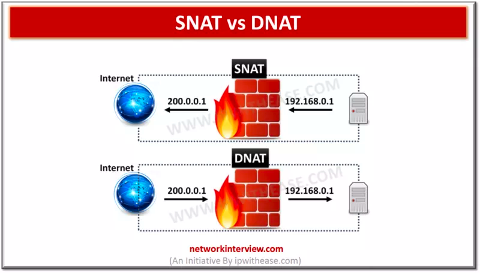

# NAT

**网络地址转换**（英语：**N**etwork **A**ddress **T**ranslation，缩写：**NAT**；又称**网络掩蔽**、**IP掩蔽**）在[计算机网络](https://zh.wikipedia.org/wiki/計算機網絡 "计算机网络")中是一种在IP[数据包](https://zh.wikipedia.org/wiki/封包 "数据包")通过[路由器](https://zh.wikipedia.org/wiki/路由器 "路由器")或[防火墙](https://zh.wikipedia.org/wiki/防火牆 "防火墙")时重写来源[IP地址](https://zh.wikipedia.org/wiki/IP地址 "IP地址")或目的IP地址的技术。这种技术被普遍使用在有多台主机但只通过一个公有IP地址访问[互联网](https://zh.wikipedia.org/wiki/網際網路 "互联网")的[私有网络](https://zh.wikipedia.org/wiki/私有网络 "私有网络")中。它是一个方便且得到了广泛应用的技术。当然，NAT也让主机之间的通信变得复杂，导致了通信效率的降低。

