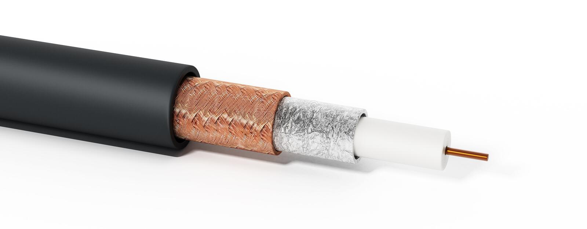
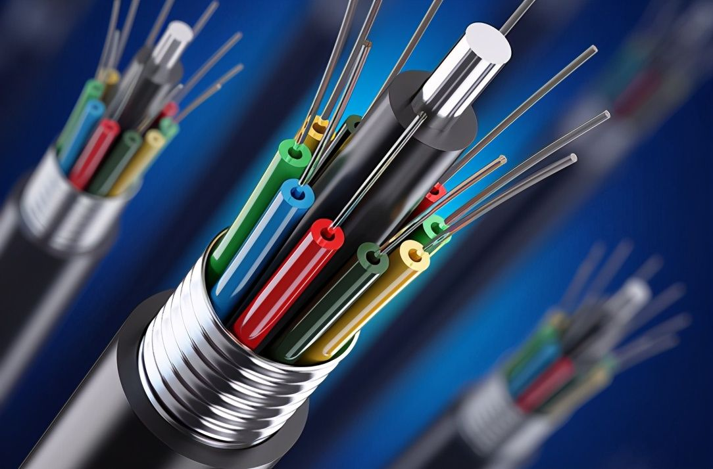
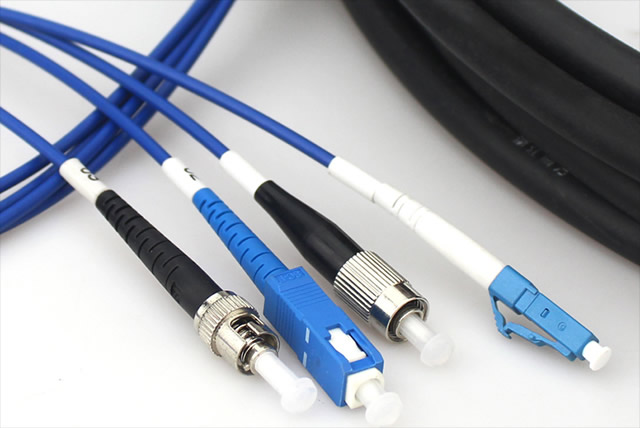

# 物理媒体

## Cable

有线电视电缆（铜轴电缆）

## DSL

### ADSL

非对称DSL ，上下行宽带不一样，一般下行带宽大

### SDSL

对称DSL，上下行宽带一致

### VDSL

<https://www.youtube.com/watch?v=qQYiwmamq38>

very high bit rate 高速 DSL，一般 企业用。

## 光纤

光的折射、反射、全反射

[https://www.ixigua.com/6607346214662832647?logTag=e0c952681f8a333a4b0b](https://www.ixigua.com/6607346214662832647?logTag=e0c952681f8a333a4b0b "https://www.ixigua.com/6607346214662832647?logTag=e0c952681f8a333a4b0b")

## 参考

*   [https://www.bilibili.com/video/BV1JV411t7ow?p=6](https://www.bilibili.com/video/BV1JV411t7ow?p=6 "https://www.bilibili.com/video/BV1JV411t7ow?p=6")

*   [https://zhuanlan.zhihu.com/p/359651022](https://zhuanlan.zhihu.com/p/359651022 "https://zhuanlan.zhihu.com/p/359651022")
