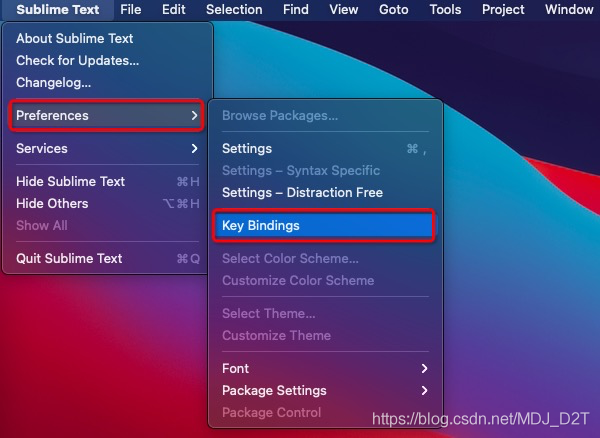

# Sublime

注意：以下操作都在Mac系统下

### 块选择（列选择模式）

快捷键：**按住Alt+鼠标左键进行选择**

### 替换换行

1、选中需要操作的行 &#x20;
2、Ctrl + H 调出替换栏 &#x20;
3、在 Find 栏中输入(同时按这三个键) Command + Shift + Enter ， Replace 栏不填 &#x20;
4、按Replace All

## Json Format

`Command+Shift+p`打开命令 安装  `pretty json`&#x20;

按`Ctrl+Command+J`就可格式化json数据了

如快捷键无效，需添加快捷键设置&#x20;



**添加以下内容**

```json
[

  { "keys": ["ctrl+command+j"], "command": "pretty_json" },

]
```
