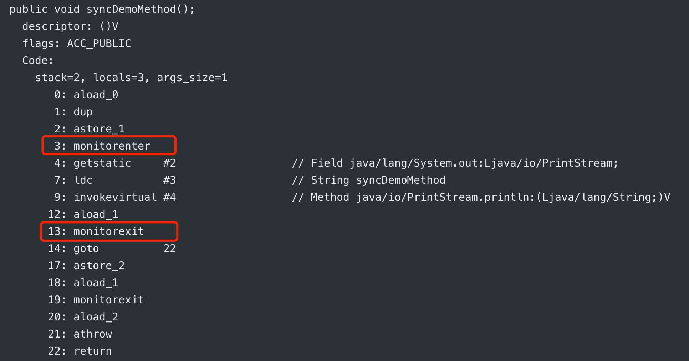
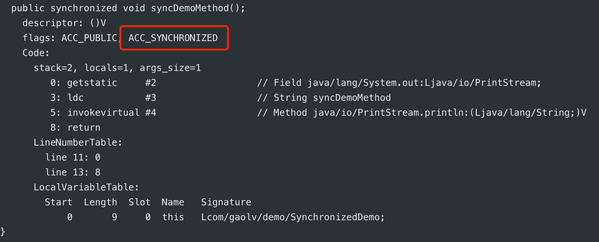

# synchronized 锁的是什么？

## 前知识&#x20;

*   对象头 [对象头（mark word）](../../JAVA%20技术栈/JVM/对象头（mark%20word）/对象头（mark%20word）.md "对象头（mark word）")

*   java中的锁[JAVA 中的锁](../../JAVA%20技术栈/JVM/JAVA%20中的锁/JAVA%20中的锁.md "JAVA 中的锁")

*   monitor 监视器 [moniter 监视器](../../JAVA%20技术栈/JVM/moniter%20监视器/moniter%20监视器.md "moniter 监视器")&#x20;

## Synchronized 原理

Synchronized是Java中解决并发问题的一种最常用的方法，也是最简单的一种方法。

Synchronized的作用主要有三个：

1.  确保线程互斥的访问同步代码

2.  保证共享变量的修改能够及时可见

3.  有效解决重排序问题。

从语法上讲，Synchronized总共有三种用法：

1.  修饰普通方法

2.  修饰静态方法

3.  修饰代码块

我们将下面这段代码反编译看一下：

```java
public class SynchronizedDemo {

    public void syncDemoMethod(){

        synchronized (this){
            System.out.println("syncDemoMethod");
        }

    }
}

```

```bash
# 编译生成class文件 -g 生成所有调试信息
javac -g synchronizedDemo.java
# 反编译出字节码指令 -v 输出附加信息
javap -v synchronizedDemo
```



synchronized 实现的原理就在上图中的两条字节码指令中。下面是这两条指令的文档：

*   [monitorenter](https://docs.oracle.com/javase/specs/jvms/se16/html/jvms-6.html#jvms-6.5.monitorenter "monitorenter")

*   [monitorexit](https://docs.oracle.com/javase/specs/jvms/se16/html/jvms-6.html#jvms-6.5.monitorexit "monitorexit")

### monitorenter

根据文档所述：

每个对象有一个监视器锁（monitor）。当且仅当 monitor 被占用时才会被锁定。执行monitorenter 指令的线程尝试获取monitor的所有权，过程如下：

*   如果monitor的进入数为0，则该线程进入monitor，然后将进入数设置为1，该线程即为monitor的所有者。

*   如果线程已经占有该monitor，只是重新进入，则进入monitor的进入数加1.

*   如果其他线程已经占用了monitor，则该线程进入阻塞状态，直到monitor的进入数为0，再重新尝试获取monitor的所有权。

### monitorexit

根据文档所述：

*   执行monitorexit的线程必须是objectref所对应的monitor的所有者。

*   指令执行时，monitor的进入数减1，如果减1后进入数为0，那线程退出monitor，不再是这个monitor的所有者。其他被这个monitor阻塞的线程可以尝试去获取这个 monitor 的所有权。&#x20;

### synchronized 方法

```java
public class SynchronizedDemo {

    public synchronized void syncDemoMethod() {

        System.out.println("syncDemoMethod");

    }
}

```



synchronized 方法的字节码指令没有中没有 `monitorenter` 和 `monitorexit` 。

syhchronized方法的同步是一种隐式的方式来实现 ：当方法调用时，调用指令将会检查方法的 `ACC_SYNCHRONIZED` 访问标志是否被设置，如果设置了，执行线程将先获取monitor，获取成功之后才能执行方法体，方法执行完后再释放monitor。在方法执行期间，其他任何线程都无法再获得同一个monitor对象

### 多线程访问场景总结

1.  当两个并发线程访问同一个对象object中的这个synchronized(this)同步代码块时，一个时间内只能有一个线程得到执行。另一个线程必须等待当前线程执行完这个代码块以后才能执行该代码块。

2.  当一个线程访问object的一个synchronized(this)同步代码块时，另一个线程仍然可以访问该object中的非synchronized(this)同步代码块。

3.  当一个线程访问object的一个synchronized(this)同步代码块时，其他线程对object中所有其它synchronized(this)同步代码块的访问将被阻塞。

4.  当一个线程访问object的一个synchronized(this)同步代码块时，它就获得了这个object的对象锁。其它线程对该object对象所有同步代码部分的访问都被暂时阻塞。

5.  以上规则对其它对象锁同样适用.

**需要特别说明：对于同一个类A，线程1争夺A对象实例的对象锁，线程2争夺类A的类锁，这两者不存在竞争关系。**

### synchronized阻塞线程的方式

*   synchronized同步块对同一条线程来说是可重入的，不会出现自己锁死自己的情况

*   synchronized同步块在已进入的线程执行完之前，会阻塞后面其他线程的进入，阻塞的方式是将Java的线程映射到操作系统的原生线程之上，通过操作系统来阻塞或唤醒一条线程。

借用操作系统意味着需要从用户态转换到核心态，状态转换会耗费很多的处理器时间，因此synchronized是一个重量级操作。通常，虚拟机自身会对其做一些优化，比如在通知操作系统阻塞线程之前加入一段自旋等待过程，避免频繁切入到核心态。

### 小结

数据同步需要依赖锁，那锁的同步又依赖谁？**synchronized给出的答案是在软件层面依赖JVM，而j.u.c.Lock给出的答案是在硬件层面依赖特殊的CPU指令。**

JVM规范规定JVM基于进入和退出Monitor对象来实现方法同步和代码块同步，但两者的实现细节不一样。

*   代码块同步是使用`monitorenter`和`monitorexit`字节码指令实现

*   方法同步是 根据该 `ACC_SYNCHRONIZED`标示符来实现

`monitorenter`指令是在编译后插入到同步代码块的开始位置，而`monitorexit`是插入到方法结束处和异常处， JVM要保证每个`monitorenter`必须有对应的monitorexit与之配对。

任何对象都有一个 `monitor` 与之关联，当且一个`monitor` 被持有后，它将处于锁定状态。线程执行到 `monitorenter` 指令时，将会尝试获取对象所对应的 `monitor` 的所有权，即尝试获得对象的锁。

## 总结

我们通过分析 JAVA对象的内存布局了解了`对象头`，顺藤摸瓜了解了 `markword`的结构 以及 objectMonitor(监视器)。

从 `markword` 中认识了与`锁` 相关的重要信息，了解到锁的类型和区别以及锁相关的优化和升级过程。

从 `ObjectMonitor` 了解到它是  `synchronized`  的核心实现，以及对于线程协作上的具体逻辑。

从 `synchronized` 所修饰的代码的字节码指令中分析出 `monitorenter` 和 `monitorexit`  指令，它又与我们上面了解到的 `objectMonitor` 密不可分。

同时总结出了 `synchronized ` 的使用场景以及线程协作时的常见问题  。利用总结的知识，围绕问题较全面地回答了 “**synchronized 锁的是什么？**”

## 参考

*   [https://www.zhihu.com/question/57794716](https://www.zhihu.com/question/57794716 "https://www.zhihu.com/question/57794716")

*   [https://www.cnblogs.com/paddix/p/5367116.html](https://www.cnblogs.com/paddix/p/5367116.html "https://www.cnblogs.com/paddix/p/5367116.html")
